```mermaid
sequenceDiagram
  participant B as Browser
  participant P as NextJs App Router
  participant M as Edge Middleware
  participant A as Auth Callback Route
  participant S as Supabase Auth/DB
  participant API as Route Handlers
  participant UI as React UI

  B->>P: GET /login
  P->>UI: render LoginPage
  UI->>S: signInWithOAuth(google, redirectTo=/auth/callback)
  S->>B: redirect to Google OAuth
  B->>S: Google OAuth flow
  S-->>A: GET /auth/callback?code
  A->>S: exchangeCodeForSession(code) (sets cookies) 
  A-->>B: redirect to /dashboard
  B->>M: GET /dashboard
  M->>S: auth.getUser() (validates cookie) 
  alt user exists
    M-->>B: allow
  else
    M-->>B: redirect to /login
  end
  B->>P: NextJs renders DashboardPage (SSR)
  P->>S: createServerClient() → initial bookmarks query
  UI->>hooks/useBookmarks: useEffect(fetch+subscribe)
  hooks->>S: channel('bookmarks').on('postgres_changes',…)
  S-->>hooks: WebSocket Real-time events
  hooks-->>UI: update state

  UI->>API: POST /api/bookmarks (…)
  API->>S: from('bookmarks').insert/update/delete (with user_id)
  S-->>API: data or error
  API-->>UI: JSON response
  S-->>hooks: emits change→ UI updates
```

# 1.1 Architecture & Data Flow (For Contributors)

This section provides a bird’s-eye view of NyxVaulta’s core architecture and how data flows through its layers. You’ll learn why we chose Next.js App Router for UI and route handling, how Supabase powers authentication, storage, and real-time updates, and why all mutations go through server-side route handlers.

## 1.1.1 High-Level Architecture

NyxVaulta uses a **containerized** design where the frontend, API layer, and backend services interact over well-defined boundaries.


## 1.1.2 Next.js App Router

The **App Router** orchestrates UI pages and server-side logic.

- Each folder under `/app` represents a route.
- Special files (`route.ts`) define serverless API handlers.
- **Middleware** guards authenticated routes at the edge for performance.

## 1.1.3 Supabase Integration

NyxVaulta leverages Supabase for authentication, storage, security, and realtime sync.

- **Auth**: Google OAuth via Supabase Auth handles login and secure sessions.
- **Database**: A `bookmarks` table in Postgres stores each user’s data.
- **RLS**: Row-Level Security enforces that `auth.uid() = user_id` .
- **Realtime**: Postgres changes stream over WebSockets for cross-tab updates.

## 1.1.4 API Routes for Mutations

Instead of direct client writes, all creates and updates go through **Next.js route handlers**. This enforces session checks and abstracts backend logic.

| Endpoint | Method | Purpose |
| --- | --- | --- |
| `/api/bookmarks` | POST | Create a new bookmark |
| `/api/bookmarks/[id]` | PATCH | Update fields of an existing record |


### POST /api/bookmarks

```api
{
    "title": "Create Bookmark",
    "description": "Adds a new bookmark for the authenticated user",
    "method": "POST",
    "baseUrl": "https://nyxvaulta.vercel.app",
    "endpoint": "/api/bookmarks",
    "headers": [
        {
            "key": "Content-Type",
            "value": "application/json",
            "required": true
        }
    ],
    "queryParams": [],
    "pathParams": [],
    "bodyType": "json",
    "requestBody": "{\n  \"title\": \"Next.js Docs\",\n  \"url\": \"https://nextjs.org\",\n  \"description\": \"Official documentation\",\n  \"tags\": [\"docs\",\"framework\"]\n}",
    "formData": [],
    "rawBody": "",
    "responses": {
        "200": {
            "description": "Bookmark created successfully",
            "body": "{\n  \"id\": \"uuid-1234\",\n  \"user_id\": \"user-uuid\",\n  \"title\": \"Next.js Docs\",\n  \"url\": \"https://nextjs.org\",\n  \"description\": \"Official documentation\",\n  \"tags\": [\"docs\",\"framework\"],\n  \"is_favorite\": false,\n  \"visit_count\": 0,\n  \"created_at\": \"2026-02-13T12:00:00Z\"\n}"
        },
        "400": {
            "description": "Validation error",
            "body": "{\n  \"error\": \"Title and URL are required\"\n}"
        },
        "401": {
            "description": "Unauthorized",
            "body": "{\n  \"error\": \"Unauthorized\"\n}"
        }
    }
}
```

This handler checks the session via `supabase.auth.getUser()`, validates inputs, then inserts into the `bookmarks` table .

### PATCH /api/bookmarks/[id]

```api
{
    "title": "Update Bookmark",
    "description": "Modifies existing bookmark fields",
    "method": "PATCH",
    "baseUrl": "https://nyxvaulta.vercel.app",
    "endpoint": "/api/bookmarks/{id}",
    "headers": [
        {
            "key": "Content-Type",
            "value": "application/json",
            "required": true
        }
    ],
    "queryParams": [],
    "pathParams": [
        {
            "key": "id",
            "value": "Bookmark UUID",
            "required": true
        }
    ],
    "bodyType": "json",
    "requestBody": "{\n  \"title\": \"Updated Title\",\n  \"is_favorite\": true\n}",
    "formData": [],
    "rawBody": "",
    "responses": {
        "200": {
            "description": "Bookmark updated successfully",
            "body": "{\n  \"id\": \"uuid-1234\",\n  \"user_id\": \"user-uuid\",\n  \"title\": \"Updated Title\",\n  \"is_favorite\": true,\n  \"updated_at\": \"2026-02-13T12:10:00Z\"\n}"
        },
        "401": {
            "description": "Unauthorized",
            "body": "{\n  \"error\": \"Unauthorized\"\n}"
        }
    }
}
```

The PATCH route merges provided fields, ensures the bookmark belongs to the user, and returns the updated row .

## 1.1.5 Custom Hooks & Realtime Sync

On the client, the `useBookmarks` hook encapsulates fetching, deletion, and realtime updates.

```typescript
import { createClient } from '@/lib/supabaseClient'
import { useEffect, useState } from 'react'
export function useBookmarks() {
  const [bookmarks, setBookmarks] = useState<Bookmark[]>([])
  const supabase = createClient()

  const fetchBookmarks = async () => {
    const { data, error } = await supabase
      .from('bookmarks')
      .select('*')
      .order('created_at', { ascending: false })
    if (data) setBookmarks(data)
  }

  useEffect(() => {
    fetchBookmarks()
    const channel = supabase
      .channel('bookmarks')
      .on('postgres_changes', {
        event: '*',
        schema: 'public',
        table: 'bookmarks'
      }, fetchBookmarks)
      .subscribe()
    return () => supabase.removeChannel(channel)
  }, [])

  const deleteBookmark = async (id: string) => {
    await supabase.from('bookmarks').delete().eq('id', id)
  }

  return { bookmarks, deleteBookmark, refetch: fetchBookmarks }
}
```

- **Initial fetch**: Retrieves all bookmarks ordered by creation date.
- **Realtime**: Subscribes to all table changes and refetches on any event.
- **Cleanup**: Removes the channel on unmount to prevent memory leaks .

## 1.1.6 Why Server-Side Mutations?

1. **Security**: Ensures every mutation checks a valid session.
2. **Separation of Concerns**: Keeps database logic on the server.
3. **SSR Compatibility**: Enables safe server-side rendering with `@supabase/ssr`.
4. **Centralized Validation**: Uniform error handling and data sanitization.

---

This high-level overview equips contributors with the understanding of NyxVaulta’s architectural pillars: Next.js for UI and routing, Supabase for Auth, storage, RLS, and realtime, and a clear separation between client logic and server-side mutations.

# 1.2 End-to-end flow: Browser → Next.js (App Router) → Supabase (Auth/DB/Realtime) and System Architecture & Request/Data Flow

This section traces a user’s journey from the browser through Next.js pages, middleware, API handlers, and Supabase services. It highlights how sessions are established via OAuth, how cookies and headers flow, and how real-time updates propagate from Postgres to the React UI.

---

### 1.2.1 Key Components and Boundaries

| Layer | Responsibility | Core Files |
| --- | --- | --- |
| **App Shell** | Defines HTML layout, global styles, and toaster notifications | `app/layout.tsx` |
| **Public Pages** | Landing and login flows | `app/page.tsx` (landing),<br>`app/login/page.tsx` |
| **Auth Callback** | Exchanges OAuth code for session; sets cookies | `app/auth/callback/route.ts` |
| **Edge Middleware** | Protects `/dashboard` and `/login` at the edge | `proxy.ts` |
| **Protected Page** | Renders dashboard UI; SSR-fetches initial data | `app/dashboard/page.tsx` |
| **API Route Handlers** | CRUD operations on `bookmarks` table with RLS enforcement | `app/api/bookmarks/route.ts` <br>`app/api/bookmarks/[id]/route.ts` |
| **Client Hooks & Utils** | Browser Supabase client, data fetching, and Realtime subscriptions | `lib/supabaseClient.ts` <br>`hooks/useBookmarks.ts` |
| **Server Utilities** | Server Supabase client with cookie support | `lib/supabaseServer.ts` |


---

### 1.2.2 Sequence Diagram: Authentication & Data Flow



---

### 1.2.3 Browser to Next.js Pages

- **Root Layout**
- Wraps all pages in `<html>` and `<body>`, injects `Toaster` for notifications .

- **Landing Page (**`**app/page.tsx**`**)**
- Public entry point; links to `/login`.

- **Login Page (**`**app/login/page.tsx**`**)**
- Client component invoking `supabase.auth.signInWithOAuth` with a dynamic `redirectTo` pointing to `/auth/callback` .
- Loading and toast feedback handled via Sonner.

---

### 1.2.4 OAuth Callback & Session Establishment

- **Callback Route (**`**app/auth/callback/route.ts**`**)**
- Reads `code` from `request.url`
- Uses `createServerClient` with Next.js `cookies()`
- Calls `supabase.auth.exchangeCodeForSession(code)`, which sets `sb-…` cookies in response .
- Redirects to `/dashboard` after cookie injection.

```ts
export async function GET(request: Request) {
  const code = new URL(request.url).searchParams.get('code')
  if (code) {
    const cookieStore = await cookies()
    const supabase = createServerClient(
      NEXT_PUBLIC_SUPABASE_URL,
      NEXT_PUBLIC_SUPABASE_ANON_KEY,
      { cookies: { getAll: cookieStore.getAll, setAll: cookieStore.set } }
    )
    await supabase.auth.exchangeCodeForSession(code)
  }
  return NextResponse.redirect(new URL('/dashboard', request.url))
}
```

---

### 1.2.5 Edge-level Route Protection

- **Middleware Proxy (**`**proxy.ts**`**)**
- Runs on `/dashboard/:path*` and `/login` via `matcher` .
- Instantiates `createServerClient` on each request, injecting and retrieving cookies.
- Redirects:
- **Unauthenticated** → `/login`
- **Authenticated** on `/login` → `/dashboard`

```ts
const supabase = createServerClient(url, key, { cookies: { get, set, remove } })
const { data: { user } } = await supabase.auth.getUser()
if (!user && path.startsWith('/dashboard')) redirect('/login')
if (user && path === '/login') redirect('/dashboard')
return NextResponse.next()
```

---

### 1.2.6 Protected Dashboard SSR Fetch

- **Dashboard Page (**`**app/dashboard/page.tsx**`**)**
- Runs server-side; calls `createServerClient` to fetch initial bookmark list.
- Renders UI with SSR data and hydrates to React.

---

### 1.2.7 API Route Handlers

- **Create Bookmark (**`**POST /api/bookmarks**`**)**
- Uses `createServerClient`, `auth.getUser()`, then `.from('bookmarks').insert({ …, user_id })` .

- **Update/Delete Bookmark (**`**PATCH/DELETE /api/bookmarks/[id]**`**)**
- Similar flow, applying `.eq('id', id).eq('user_id', user.id)` for RLS .

Each handler returns JSON and status codes for success or errors.

---

### 1.2.8 Client-side Hooks & Realtime Subscriptions

- **Browser Supabase Client (**`**lib/supabaseClient.ts**`**)**
- `createBrowserClient<Database>()` reads `NEXT_PUBLIC_SUPABASE_URL` and ANON key .

- `**useBookmarks**`** Hook**
- Fetches via `supabase.from('bookmarks').select()`
- Subscribes to changes with `supabase.channel('bookmarks').on('postgres_changes', …).subscribe()` .
- Cleans up channel on unmount to prevent leaks.

```ts
useEffect(() => {
  fetchBookmarks()
  const channel = supabase
    .channel('bookmarks')
    .on('postgres_changes', { event: '*', schema: 'public', table: 'bookmarks' }, fetchBookmarks)
    .subscribe()
  return () => { supabase.removeChannel(channel) }
}, [])
```

**Benefits**

- Instant sync across tabs/devices
- No polling; real-time via WebSockets
- RLS enforced on DB level for security

---

### 1.2.9 Summary of Data Flow

- **User clicks “Continue with Google”** → Browser → Supabase OAuth → callback `/auth/callback`
- **Callback** sets **cookies** → redirect to `/dashboard`
- **Browser requests** `/dashboard` → **middleware** validates session → **SSR** fetch
- **React UI** hydrates, calls `useBookmarks` → **Realtime** subscription
- **CRUD actions** call `/api/bookmarks*` → **Route Handlers** enforce RLS → DB writes
- **DB write events** propagate via **Supabase Realtime** → UI updates instantly

This design cleanly separates **public** and **protected** flows, uses **SSR** for initial rendering, leverages **edge middleware** for auth guards, and harnesses **Supabase Realtime** for instant UI synchronization—ensuring a secure, responsive user experience.

## 1.3 Architecture & Data Flow (For Contributors) - Authentication Guard / Middleware Proxy

This section explains how NyxVaulta protects its authenticated routes at the edge using a custom middleware proxy. You’ll learn how server-side cookies are bridged into Supabase’s SSR client, how user sessions are validated, and how requests are routed or redirected.

### 1.3.1 What It Does

- Acts as an **edge middleware** to guard `/dashboard` and `/login` routes.
- Bridges cookies between incoming requests and outgoing responses for SSR.
- Checks the authenticated user via Supabase’s `getUser()` API.
- Redirects unauthenticated users to **/login** and authenticated users away from **/login** to **/dashboard**.

### 1.3.2 Core Implementation

The heart of the mechanism lives in `proxy.ts`, using `@supabase/ssr` and Next.js’s edge API  :

```ts
import { createServerClient, type CookieOptions } from '@supabase/ssr'
import { NextResponse, type NextRequest } from 'next/server'

export async function proxy(request: NextRequest) {
  // Initialize a passthrough response preserving headers
  let response = NextResponse.next({ request: { headers: request.headers } })

  // Create Supabase SSR client with custom cookie handlers
  const supabase = createServerClient(
    process.env.NEXT_PUBLIC_SUPABASE_URL!,
    process.env.NEXT_PUBLIC_SUPABASE_ANON_KEY!,
    {
      cookies: {
        // Read cookie from incoming request
        get(name: string) {
          return request.cookies.get(name)?.value
        },
        // Set cookie on both request context and response
        set(name: string, value: string, options: CookieOptions) {
          request.cookies.set({ name, value, ...options })
          response = NextResponse.next({ request: { headers: request.headers } })
          response.cookies.set({ name, value, ...options })
        },
        // Remove cookie by clearing its value
        remove(name: string, options: CookieOptions) {
          request.cookies.set({ name, value: '', ...options })
          response = NextResponse.next({ request: { headers: request.headers } })
          response.cookies.set({ name, value: '', ...options })
        },
      },
    }
  )

  // Fetch current user session
  const {
    data: { user },
  } = await supabase.auth.getUser()

  // Redirect logic
  if (!user && request.nextUrl.pathname.startsWith('/dashboard')) {
    return NextResponse.redirect(new URL('/login', request.url))
  }
  if (user && request.nextUrl.pathname === '/login') {
    return NextResponse.redirect(new URL('/dashboard', request.url))
  }
  return response
}

// Only apply to dashboard and login routes
export const config = {
  matcher: ['/dashboard/:path*', '/login'],
}
```

### 1.3.3 SSR Cookie Bridging

This proxy uses a three-method cookie API to sync SSR sessions.

| Method | Purpose | Context |
| --- | --- | --- |
| **get** | Retrieve cookie by name from request | Incoming request |
| **set** | Store cookie on request & response | Both contexts |
| **remove** | Clear cookie value on request & response | Both contexts |


### 1.3.4 User Check & Redirect Rules

1. **Unauthenticated → /login**

If no `user` and path starts with `/dashboard`, redirect to **/login**.

1. **Authenticated → /dashboard**

If `user` exists and path is exactly `/login`, redirect to **/dashboard**.

1. **Otherwise**

Continue with the original request, passing through headers and body.

### 1.3.5 Matcher Configuration

The middleware only runs on the specified routes, avoiding unnecessary edge invocations and redirect loops :

```ts
export const config = {
  matcher: ['/dashboard/:path*', '/login'],
}
```

### 1.3.6 Request Flow Diagram


### 1.3.7 Common Failure Modes & Troubleshooting

| Issue | Symptom | Remedy |
| --- | --- | --- |
| **Infinite Redirect Loop** | `/login` ↔ `/dashboard` ping-pong | Clear cookies; ensure matcher only targets these routes; verify cookie bridging |
| **Missing Session** | Always treated as unauthenticated | Check `NEXT_PUBLIC_SUPABASE_URL/ANON_KEY` env vars; confirm Supabase callback sets cookies |
| **Cookie Not Persisting** | User logs in but loses session on refresh | Verify `set` and `remove` handlers update both `request.cookies` and `response.cookies` |
| **Unexpected Route Invocation** | Middleware runs on other pages | Adjust `matcher` scope to only relevant paths |


> **Tip:** Always test fresh sessions in an incognito window to isolate caching and cookie issues.

---

By following this guide, contributors can understand how the **Authentication Guard** works under the hood, maintain and extend it, and avoid common pitfalls.

## 1.4 Runtime Environments and Execution Contexts

This section explains where different parts of NyxVaulta run—**Client Components**, **Route Handlers**, and the **Edge-style proxy**—and why each execution context is chosen. We’ll cover security implications (use of anon key, cookie forwarding, user derivation) and performance considerations (edge redirects, cold starts).

### 1.4.1 Client Components :woman_technologist:

Client Components run entirely in the user’s browser. They use the `'use client'` directive to opt into client-side React features like hooks and browser APIs.

- **Files**
- `app/login/page.tsx`
- `app/dashboard/page.tsx`

- **Responsibilities**
- Render UI and handle user interactions
- Instantiate the **browser** Supabase client with

```js
    import { createClient } from '@/lib/supabaseClient'
    const supabase = createClient()
```

- Trigger OAuth sign-in (`supabase.auth.signInWithOAuth`)
- Fetch and display bookmarks via `useBookmarks()`

- **Security**
- Uses **public anon key** (`NEXT_PUBLIC_SUPABASE_ANON_KEY`)
- Limited privileges: RLS policies in database enforce row-level isolation

- **Why Browser?**
- Enables rich interactivity (forms, modals, real-time UI updates)
- Avoids unnecessary server round-trips for rendering

---

### 1.4.2 Server-side Route Handlers :computer:

Route Handlers in the App Router run on the **server** (Node.js) and expose HTTP endpoints for auth and CRUD operations.

- **Files**
- `app/auth/callback/route.ts`
- `app/api/bookmarks/route.ts` (POST)
- `app/api/bookmarks/[id]/route.ts` (PATCH)

- **Responsibilities**
- **OAuth callback**: Exchange code for session, set secure cookies
- **CRUD**: Validate session (`supabase.auth.getUser()`), enforce RLS
- Return JSON responses using `NextResponse.json`

- **Sample snippet**

```ts
  // app/api/bookmarks/route.ts
  const supabase = await createClient()
  const { data: { user } } = await supabase.auth.getUser()
  if (!user) return NextResponse.json({ error: 'Unauthorized' }, { status: 401 })
  // …insert bookmark…
```

- **Security**
- **Server-only anon key** used in `createServerClient`
- Cookies forwarded via Next.js headers; `supabase.auth.getUser()` derives user from cookie
- RLS in Postgres guarantees users only access their own rows

- **Why Server?**
- Protects OAuth secret exchange and cookie handling
- Keeps database credentials off the client
- Leverages Vercel Serverless for scalability

---

### 1.4.3 Edge Middleware-style Proxy :globe_with_meridians:

The `proxy()` function in `proxy.ts` runs on the **Vercel Edge Runtime**, acting as lightweight middleware.

- **File**
- `proxy.ts`

- **Matcher**

```ts
  export const config = {
    matcher: ['/dashboard/:path*', '/login'],
  }
```

- **Responsibilities**
- Forward request headers and cookies to `createServerClient`
- Call `supabase.auth.getUser()` to check session
- Perform **edge redirects**:
- Unauthenticated ➔ `/login`
- Authenticated at `/login` ➔ `/dashboard`

- **Code excerpt**

```ts
  const supabase = createServerClient(..., {
    cookies: { get, set, remove }
  })
  const { data: { user } } = await supabase.auth.getUser()
  if (!user && pathname.startsWith('/dashboard')) {
    return NextResponse.redirect(new URL('/login', request.url))
  }
```

- **Security**
- Runs before page rendering, blocking unauthorized access early
- Cookies never exposed to client code here
- Uses same RLS-protected client

- **Performance**
- **Edge Runtime** reduces latency by executing in Vercel’s global network
- Cold starts < 10 ms ensure swift redirects
- Offloads simple logic from heavier serverless functions

---

### 1.4.4 Execution Context Matrix

| Execution Context | Directive | Files | Runs On | Purpose |
| --- | --- | --- | --- | --- |
| Client Component | `'use client'` | `app/login/page.tsx`, `app/dashboard/page.tsx` | Browser | UI, user events, real‐time updates |
| Route Handler | — | `app/auth/callback/route.ts`, `app/api/**/*.ts` | Server (Node.js) | Auth exchange, CRUD, JSON responses |
| Edge Proxy (Middleware) | — | `proxy.ts` | Vercel Edge Runtime | Auth gating, early redirects |


---

### 1.4.5 Request/Data Flow Diagram


This overview clarifies how NyxVaulta splits logic across environments for **security**, **performance**, and **developer experience**.

# 2.1 Authentication, Sessions, and Route Protection

## **2.1.1 Google OAuth Integration**

The application leverages Supabase’s seamless integration with Google OAuth to handle user authentication in a highly secure and frictionless manner. By utilizing this approach, the platform eliminates any need for users to create or store traditional passwords, which significantly reduces security vulnerabilities related to password leakage, brute-force attacks, or improper storage. Instead, authentication is delegated entirely to Google’s trusted authentication framework. This not only benefits users by simplifying the login process, but it also removes the responsibility of managing sensitive credentials from the development team, thereby lowering the overall risk profile of the application.

## Authentication Flow Overview:

1. The end user lands on the platform’s authentication page and initiates the login process by clicking the “Continue with Google” button. This action indicates the user opts to authenticate using their Google account.
2. Immediately upon the user’s action, the application issues a redirect, navigating the user to Google’s secure OAuth 2.0 sign-in portal. Here, the user is presented with Google’s standard authentication UI and, if not already logged in, prompted to enter their Google account credentials. The user is then given the option to grant permission for the application to access their profile information.
3. Once the user completes Google’s sign-in and grants consent, Google processes the request and calls the predefined OAuth callback endpoint at `/auth/callback` on the application’s server. This endpoint receives an authorization code, which is then exchanged securely for access and refresh tokens.
4. The backend processes the authorization code received from Google, finalizes the authentication, and creates a session for the authenticated user. At this stage, the application injects authentication cookies into the user's browser using secure, HTTP-only cookies to maintain the user's session state in a protected manner, thereby enabling access to authenticated endpoints.
5. To complete the process, the authenticated user is automatically redirected to the `/dashboard` route of the application. Here, they can seamlessly access personalized resources and features that require authentication, with their identity now securely managed by the session established in the previous step.

## 2.1.2 Protected routes at the edge: `proxy.ts` cookie synchronization and redirect rules

This section covers how NyxVaulta protects the `/dashboard` and `/login` routes at the Vercel Edge, using a custom `proxy.ts` edge function. We’ll explore how it:

- Initializes a Supabase server client with SSR support
- Mirrors cookies between the incoming `Request` and the outgoing `NextResponse`
- Applies authorization rules to redirect users based on their session state
- Defines a `matcher` to scope the edge function
- Avoids redirect loops and how to troubleshoot them

---

### File location & role

`proxy.ts` lives at the project root (or in `src/`) and is configured as an Edge Function in `next.config.js` or via Vercel’s functions settings. Its sole purpose is to run *before* rendering any `/dashboard/*` or `/login` pages, ensuring only authenticated users access protected content.

---

### Supabase SSR client initialization

The edge function uses `createServerClient` from `@supabase/ssr` to hydrate a Supabase client on the edge, passing in custom cookie handlers:

```ts
import { createServerClient, type CookieOptions } from '@supabase/ssr'
import { NextResponse, type NextRequest } from 'next/server'

export async function proxy(request: NextRequest) {
  // Start with a passthrough response
  let response = NextResponse.next({ request: { headers: request.headers } })

  // Create Supabase client with cookie sync
  const supabase = createServerClient(
    process.env.NEXT_PUBLIC_SUPABASE_URL!,
    process.env.NEXT_PUBLIC_SUPABASE_ANON_KEY!,
    {
      cookies: {
        get(name) {
          return request.cookies.get(name)?.value
        },
        set(name, value, options: CookieOptions) {
          // Mirror into request and response
          request.cookies.set({ name, value, options })
          response = NextResponse.next({ request: { headers: request.headers } })
          response.cookies.set({ name, value, options })
        },
        remove(name, options: CookieOptions) {
          // Delete cookie in both contexts
          request.cookies.set({ name, value: '', options })
          response = NextResponse.next({ request: { headers: request.headers } })
          response.cookies.set({ name, value: '', options })
        },
      },
    }
  )
  // …
}
```

**What happens here**

- `**get**` reads existing cookies from the incoming request
- `**set**` writes cookies to both the request (for subsequent SSR) and the response (so the browser stores them)
- `**remove**` clears cookies in both contexts

---

### Cookie synchronization methods

| Method | Purpose | Where applied |
| --- | --- | --- |
| get | Read session cookies | `request.cookies` |
| set | Store new/updated cookie | `request.cookies` & `response.cookies` |
| remove | Clear a cookie | `request.cookies` & `response.cookies` |


---

### Authorization & redirect rules

After syncing cookies, the function fetches the current user session:

```ts
const { data: { user } } = await supabase.auth.getUser()
```

It then enforces two rules:

1. **Unauthenticated → **`**/dashboard**`

If there’s *no* active user and the request path starts with `/dashboard`, redirect to `/login`.

1. **Authenticated → **`**/login**`

If a user *is* active and the request path is exactly `/login`, redirect to `/dashboard`.

```ts
if (!user && request.nextUrl.pathname.startsWith('/dashboard')) {
  return NextResponse.redirect(new URL('/login', request.url))
}

if (user && request.nextUrl.pathname === '/login') {
  return NextResponse.redirect(new URL('/dashboard', request.url))
}

return response
```

This ensures:

- Guests cannot access any dashboard page
- Signed-in users cannot revisit the login page

---

### Matcher configuration

The edge function only runs on these paths:

```ts
export const config = {
  matcher: ['/dashboard/:path*', '/login'],
}
```

- `**/dashboard/:path***` covers `/dashboard` and all nested routes
- `**/login**` covers the login entry point

This scoping prevents the edge function from running on public pages like `/` or `/api`.

---

### Request flow diagram


---

### Preventing redirect loops

- **Scoped matcher**: only `/dashboard/*` and `/login` hit the function, so redirects don’t re-invoke on public pages.
- **Explicit path checks**: the code only redirects when the path matches exactly, avoiding mutual redirects.

---

### Troubleshooting

When misconfigured, you may see an **infinite redirect loop** between `/login` and `/dashboard`. Common causes include missing matcher settings or broken cookie sync.

```card
{
    "title": "Infinite Redirect Loop",
    "content": "Ensure `config.matcher` covers only `/dashboard/:path*` and `/login`, and that both `set` and `remove` cookie methods are invoked."
}
```

**Tip**: Verify your matcher in `proxy.ts`. It should read:

```ts
export const config = {
  matcher: ['/dashboard/:path*', '/login'],
}
```

If you still loop, clear cookies and redeploy.

---

By integrating `proxy.ts` at the edge, NyxVaulta delivers fast, secure session validation with seamless cookie handling and clear redirect rules—ensuring only authorized users see protected content.

## 2.2 Supabase client factories for SSR-safe auth (browser vs server)

NyxVaulta uses two specialized factories to initialize Supabase clients in both browser and server environments. These factories leverage the `@supabase/ssr` package to ensure secure, SSR-compatible authentication and seamless cookie bridging. Generics based on the `Database` interface add full TypeScript support.

### Environment variables

Both factories read the same env vars:

| Name | Purpose |
| --- | --- |
| `NEXT_PUBLIC_SUPABASE_URL` | Your Supabase project URL |
| `NEXT_PUBLIC_SUPABASE_ANON_KEY` | Supabase anon/public API key |


Ensure these are set in `.env.local` and in Vercel’s dashboard before deployment.

### Browser client factory

Used in React components and hooks for client-side interactions (e.g. login, realtime subscriptions).

```ts
// lib/supabaseClient.ts
import { createBrowserClient } from '@supabase/ssr'
import { Database } from './types'

export const createClient = () =>
  createBrowserClient<Database>(
    process.env.NEXT_PUBLIC_SUPABASE_URL!,
    process.env.NEXT_PUBLIC_SUPABASE_ANON_KEY!
  )
```

- `**createBrowserClient**` spins up a Supabase client that runs in the browser.
- The `<Database>` generic provides full type-safety for tables, rows, inserts, and updates.

### Server client factory

Used in Route Handlers, SSR pages, and the `/auth/callback` endpoint to perform authenticated server-side queries and manage cookies.

```ts
// lib/supabaseServer.ts
import { createServerClient, type CookieOptions } from '@supabase/ssr'
import { cookies } from 'next/headers'
import { Database } from './types'

export const createClient = async () => {
  const cookieStore = await cookies()
  return createServerClient<Database>(
    process.env.NEXT_PUBLIC_SUPABASE_URL!,
    process.env.NEXT_PUBLIC_SUPABASE_ANON_KEY!,
    {
      cookies: {
        getAll() {
          return cookieStore.getAll()
        },
        setAll(cookiesToSet) {
          cookiesToSet.forEach(({ name, value, options }) =>
            cookieStore.set(name, value, options)
          )
        },
      },
    }
  )
}
```

- `**createServerClient**` reads and writes session cookies via Next’s `cookies()` API.
- This bridges tokens set during OAuth code exchange into subsequent server requests.

### Why `@supabase/ssr`

- **SSR-compatible auth**: Ensures session cookies on the server are honored in server-rendered pages.
- **Cookie bridging**: Automatically handles reading/writing Supabase auth cookies.
- **Unified API**: Both factories expose the same `.auth` and `.from` methods, reducing boilerplate.

### Type safety with `Database` generics

The `Database` interface in `lib/types.ts` defines your schema:

```ts
export interface Database {
  public: {
    Tables: {
      bookmarks: {
        Row:    Bookmark
        Insert: Omit<Bookmark, 'id' | 'created_at' | 'visit_count'>
        Update: Partial<Omit<Bookmark, 'id' | 'user_id' | 'created_at'>>
      }
      folders: { /* … */ }
    }
  }
}
```

- Passing `<Database>` to both factories enforces:
- `.from('bookmarks').select()` returns `Bookmark[]`
- Inserts and updates require correct fields.

### Comparison

| Aspect | Browser (`createBrowserClient`) | Server (`createServerClient`) |
| --- | --- | --- |
| Environment | Client-side JS | Next.js Route Handlers / SSR pages |
| Auth flow | Uses in-memory tokens | Reads/writes HTTP cookies |
| Cookie handling | n/a | Uses Next’s `cookies()` API |
| SSR support | No | Yes (session available on server) |
| Type generics | `<Database>` enforced | `<Database>` enforced |


### Usage patterns

- **Client**

```ts
  const supabase = createClient()
  await supabase.auth.signInWithOAuth({ provider: 'google' })
  const { data } = await supabase.from('bookmarks').select('*')
```

- **Server**

```ts
  import { createClient } from '@/lib/supabaseServer'
  export async function GET() {
    const supabase = await createClient()
    const { data: { user } } = await supabase.auth.getUser()
    // …
  }
```

These factories abstract environment-specific details, secure your auth flows, and give you full TypeScript confidence when interacting with your Supabase database.

# 3.1 Frontend Implementation (UI Modules) – Loading and Error States

The **Loading** and **Error** modules under the `app/dashboard` route provide a consistent, route-level user experience during data fetches and runtime failures. These “segment boundaries” plug into Next.js App Router, ensuring that as users navigate to or interact with the dashboard, they see meaningful feedback rather than blank screens or uncaught exceptions.

---

## File Summary

| File | Purpose |
| --- | --- |
| **app/dashboard/loading.tsx** | Displays a centered spinner while the dashboard segment loads |
| **app/dashboard/error.tsx** | Catches render errors under `/dashboard`, shows message and retry button |


---

## Loading State

When a user navigates to or lazily loads the dashboard segment, Next.js will render this component until the segment is ready.

```tsx
// app/dashboard/loading.tsx
export default function Loading() {
  return (
    <div className="min-h-screen flex items-center justify-center">
      <div className="animate-spin rounded-full h-12 w-12 border-b-2 border-blue-600"></div>
    </div>
  )
}
```

- **Purpose**
- Provide immediate feedback during server-side rendering or client-side navigation.
- Prevent layout shifts by filling the full viewport.

- **What to include**
- A simple spinner or skeleton that roughly matches the eventual layout.
- Tailwind utility classes for centering and animation.

- **Extending**
- Replace with **skeleton cards** mimicking the dashboard’s stats grid.
- Wrap complex UI areas in inner `<Suspense>` boundaries with custom loaders.

```card
{
    "title": "Tip: Skeleton UX",
    "content": "Use skeleton rectangles matching card sizes to reduce perceived load time."
}
```

---

## Error Boundary

If any error is thrown during rendering or data fetching in the `/dashboard` segment, Next.js will render this fallback.

```tsx
// app/dashboard/error.tsx
'use client'
export default function Error({
  error,
  reset,
}: {
  error: Error & { digest?: string }
  reset: () => void
}) {
  return (
    <div className="min-h-screen flex items-center justify-center">
      <div className="card max-w-md text-center space-y-4">
        <h2 className="text-2xl font-bold text-red-600">Something went wrong!</h2>
        <p className="text-gray-600">{error.message}</p>
        <button onClick={reset} className="btn-primary">
          Try again
        </button>
      </div>
    </div>
  )
}
```

- **Purpose**
- Surface render or fetch errors at this route level.
- Give users context (`error.message`) and recovery via `reset()`.

- **What to include**
- A clear headline, concise error description, and a retry button.
- Minimal UI flair to keep focus on recovery.

- **Patterns for Recoverable UI**
- `**reset()**`: Calls the nearest boundary to re-render the segment.
- **Granular Boundaries**: If only part of the dashboard can fail (e.g., analytics widget), wrap that widget in its own error boundary.
- **Logging**: Integrate with Sentry or LogRocket inside the `Error` component to capture exceptions.

```card
{
    "title": "Best Practice",
    "content": "Keep error boundaries close to components that can fail, not only at the top level."
}
```

---

## State Flow Diagram


---

## Extending & Maintaining

- **Consistency Across Routes**
- Follow the same structure (`loading.tsx` + `error.tsx`) for other app segments (e.g., `app/bookmarks`).

- **Theming & Styling**
- Extract spinner or error card into shared components to unify look and feel.

- **Testing**
- Write tests to simulate slow network (`cy.intercept`) and error throws to validate fallback UIs.

- **Documentation**
- Update this section whenever the dashboard layout changes (e.g., new charts require skeletons).

By leveraging these route-level boundaries, NyxVaulta ensures that users always have visual feedback during loading and clear paths to recover from errors, resulting in a polished, resilient dashboard experience.

# 3.2 Frontend Implementation (UI Modules) – Dashboard Page Composition and State Management

This section details how the **Dashboard** page of NyxVaulta is built in the frontend. It covers how data flows from the Supabase-backed `useBookmarks` hook into local UI state, how filtering and sorting are memoized for performance, and how the page is composed from reusable UI modules.

---

## Data Source – useBookmarks Hook

The dashboard relies on the custom `useBookmarks` hook to fetch and keep bookmark data in sync.

- **Fetch & Subscription**: On mount, bookmarks are fetched and a Realtime channel is opened
- **State**: Exposes
- `bookmarks`: array of all bookmarks
- `loading`: boolean loading indicator
- `deleteBookmark(id)`: deletes a bookmark
- `refetch()`: manual reload

```ts
export function useBookmarks() {
  const [bookmarks, setBookmarks] = useState<Bookmark[]>([])
  const [loading, setLoading] = useState(true)
  const supabase = createClient()

  const fetchBookmarks = async () => { /* ... */ }
  useEffect(() => {
    fetchBookmarks()
    const channel = supabase
      .channel('bookmarks')
      .on('postgres_changes', { event: '*', schema: 'public', table: 'bookmarks' }, fetchBookmarks)
      .subscribe()
    return () => supabase.removeChannel(channel)
  }, [])

  const deleteBookmark = async (id: string) => { /* ... */ }
  return { bookmarks, loading, deleteBookmark, refetch: fetchBookmarks }
}
```

(see `hooks/useBookmarks.ts`)

---

## Local UI State

The dashboard holds three pieces of local state for controlling its search, sort, and favorite-only filters:

| State Variable | Type | Purpose |
| --- | --- | --- |
| `searchQuery` | `string` | Text to search in title, URL, description, tags |
| `sortBy` | `string` | Sort order: `'newest'`, `'oldest'`, `'title'`, `'title-desc'` |
| `showFavoritesOnly` | `boolean` | Toggle to filter only starred bookmarks |


```jsx
const [searchQuery, setSearchQuery] = useState('')
const [sortBy, setSortBy] = useState('newest')
const [showFavoritesOnly, setShowFavoritesOnly] = useState(false)
```

(from `app/dashboard/page.tsx`)

---

## Memoized Filtering & Sorting

To avoid expensive recalculations on every render, the filtered and sorted list is computed inside a `useMemo` hook:

- **Filter by search**: case-insensitive match against title, URL, description, tags
- **Filter favorites**: if `showFavoritesOnly` is `true`
- **Sort**: by creation date or title, ascending or descending

```ts
const filteredAndSortedBookmarks = useMemo(() => {
  let filtered = bookmarks

  if (searchQuery) {
    const q = searchQuery.toLowerCase()
    filtered = filtered.filter(b =>
      b.title.toLowerCase().includes(q) ||
      b.url.toLowerCase().includes(q) ||
      b.description?.toLowerCase().includes(q) ||
      b.tags?.some(tag => tag.toLowerCase().includes(q))
    )
  }

  if (showFavoritesOnly) {
    filtered = filtered.filter(b => b.is_favorite)
  }

  const sorted = [...filtered]
  switch (sortBy) {
    case 'newest':
      sorted.sort((a, b) => new Date(b.created_at).getTime() - new Date(a.created_at).getTime())
      break
    case 'oldest':
      sorted.sort((a, b) => new Date(a.created_at).getTime() - new Date(b.created_at).getTime())
      break
    case 'title':
      sorted.sort((a, b) => a.title.localeCompare(b.title))
      break
    case 'title-desc':
      sorted.sort((a, b) => b.title.localeCompare(a.title))
      break
  }

  return sorted
}, [bookmarks, searchQuery, sortBy, showFavoritesOnly])
```

(from `app/dashboard/page.tsx`)

---

## Component Composition & Rendering Flow

The dashboard pages stitches together the following UI modules in order:

1. **Navbar** – Sticky top bar with branding and sign-out button
2. **Header** – Title, subtitle and description
3. **Analytics Tiles** 📊 – Total bookmarks, favorites count, tag count, and “showing” count
4. **Search & Export** –
5. `SearchBar` for text queries
6. `ExportButton` (JSON/CSV)
7. **FilterControls** – Sort selector and favorites-only toggle
8. **BookmarkForm** – Add new bookmark modal/form
9. **Results Feedback** – Display count of found bookmarks when filters applied
10. **BookmarkList** – Renders each bookmark via `BookmarkItem`, with skeleton/loading and empty-state

```jsx
return (
  <div className="min-h-screen relative overflow-hidden">
    <div className="absolute inset-0 bg-gradient-to-br … blur-3xl" />

    <Navbar />

    <main className="max-w-6xl mx-auto px-4 py-12 space-y-8 relative z-10">
      {/* Header */}
      <motion.div {/* ... */}>
        <h1>Your Vault</h1>
        <p>Synced in real-time across all devices</p>
      </motion.div>

      {/* Analytics */}
      <motion.div className="grid grid-cols-2 md:grid-cols-4 gap-4 mb-8">
        {/* Total */}
        <div className="card text-center">
          <div className="text-3xl font-bold text-blue-400">
            {bookmarks.length}
          </div>
          <div className="text-sm text-gray-400 mt-1">Total</div>
        </div>
        {/* Favorites */}
        {/* ... */}
      </motion.div>

      {/* Search & Export */}
      <div className="flex justify-between items-center gap-4 flex-wrap">
        <SearchBar value={searchQuery} onChange={setSearchQuery} />
        <ExportButton bookmarks={bookmarks} />
      </div>

      {/* Sort & Favorites Toggle */}
      <FilterControls
        sortBy={sortBy}
        onSortChange={setSortBy}
        showFavoritesOnly={showFavoritesOnly}
        onToggleFavorites={() => setShowFavoritesOnly(!showFavoritesOnly)}
      />

      {/* New Bookmark Form */}
      <BookmarkForm onSuccess={refetch} />

      {/* Feedback */}
      {(searchQuery || showFavoritesOnly) && (
        <div className="text-sm text-gray-400">
          Found {filteredAndSortedBookmarks.length}
          {filteredAndSortedBookmarks.length !== 1 ? 's' : ''} bookmark
        </div>
      )}

      {/* List */}
      <BookmarkList
        bookmarks={filteredAndSortedBookmarks}
        loading={loading}
        onDelete={deleteBookmark}
        onUpdate={refetch}
      />
    </main>
  </div>
)
```

(references `app/dashboard/page.tsx`)

---

## Sub-Component Responsibilities

| Component | Responsibility |
| --- | --- |
| Navbar | Displays app title, user email, and sign-out button |
| SearchBar | Controlled input for search text |
| ExportButton | Triggers JSON/CSV download of all bookmarks |
| FilterControls | Dropdown to sort and button to toggle favorites filter |
| BookmarkForm | Form to add a new bookmark; calls `refetch` on success |
| BookmarkList | Handles loading, empty states, and maps bookmarks to items |
| BookmarkItem | Individual bookmark card; copy URL, favorite toggle, edit modal |


This composition ensures a clear separation of concerns, easy reusability, and optimal performance via memoization.

# 3.3 Frontend Implementation (UI Modules) – Bookmark Rendering, Editing, and Micro-interactions

This section dives into the **UI modules** responsible for presenting, editing, and interacting with bookmarks in NyxVaulta. We cover:

- How the list adapts during loading and when empty
- Individual bookmark controls (edit, delete, copy, favorite)
- The edit modal’s UX, form fields, buttons, and API integration

## BookmarkList Component 🗂️

The `BookmarkList` component orchestrates three states: **loading**, **empty**, and **populated**. It leverages Framer Motion for smooth entrance animations and Tailwind CSS for layout.

```tsx
// components/BookmarkList.tsx
export default function BookmarkList({
  bookmarks,
  loading,
  onDelete,
  onUpdate
}: Props) {
  if (loading) {
    return (
      <div className="space-y-4">
        {[1,2,3].map(i => (
          <div key={i} className="card animate-pulse">
            <div className="h-6 bg-white/10 rounded w-3/4 mb-3"></div>
            <div className="h-4 bg-white/10 rounded w-1/2"></div>
          </div>
        ))}
      </div>
    )
  }

  if (bookmarks.length === 0) {
    return (
      <motion.div
        initial={{ opacity: 0, scale: 0.95 }}
        animate={{ opacity: 1, scale: 1 }}
        className="card text-center py-16"
      >
        <svg className="w-24 h-24 mx-auto mb-6 text-gray-600" …/>
        <p className="text-gray-400 text-lg mb-2">No bookmarks yet</p>
        <p className="text-gray-500 text-sm">
          Add your first bookmark above to get started
        </p>
      </motion.div>
    )
  }

  return (
    <motion.div initial={{ opacity: 0 }} animate={{ opacity: 1 }} className="space-y-4">
      {bookmarks.map((bookmark, idx) => (
        <motion.div
          key={bookmark.id}
          initial={{ opacity: 0, y: 20 }}
          animate={{ opacity: 1, y: 0 }}
          transition={{ delay: idx * 0.1 }}
        >
          <BookmarkItem
            bookmark={bookmark}
            onDelete={onDelete}
            onUpdate={onUpdate}
          />
        </motion.div>
      ))}
    </motion.div>
  )
}
```

- **Loading State**: Displays three pulsing “skeleton” cards using `animate-pulse` to indicate data fetching.
- **Empty State**: Fades and scales in a centered card with an icon and prompt text .
- **Data State**: Staggers each bookmark’s entry by index, providing a cascading animation for a polished UX .

---

## BookmarkItem Component 🔖

Each `BookmarkItem` encapsulates display, micro-interactions, and controls for a single bookmark.

### State Hooks & Utility Functions

```ts
const [isEditOpen, setIsEditOpen] = useState(false)
const [showCopied, setShowCopied] = useState(false)
const [togglingFav, setTogglingFav] = useState(false)

const copyUrl = () => {
  navigator.clipboard.writeText(bookmark.url)
  setShowCopied(true)
  setTimeout(() => setShowCopied(false), 2000)
}

const toggleFavorite = async () => {
  try {
    setTogglingFav(true)
    const res = await fetch(`/api/bookmarks/${bookmark.id}`, {
      method: 'PATCH',
      headers: { 'Content-Type': 'application/json' },
      body: JSON.stringify({ is_favorite: !bookmark.is_favorite })
    })
    const data = await res.json()
    if (!res.ok) throw new Error(data.error)
    toast.success(bookmark.is_favorite ? 'Removed from favorites' : 'Added to favorites')
    onUpdate()
  } catch (e) {
    toast.error(e.message)
  } finally {
    setTogglingFav(false)
  }
}
```

- **isEditOpen**: Toggles the edit modal visibility.
- **showCopied**: Flags copy-to-clipboard feedback.
- **togglingFav**: Disables favorite toggle during API calls.
- **copyUrl()**: Writes URL to clipboard and shows feedback badge.
- **toggleFavorite()**: Sends a `PATCH` request, updates UI on success, and handles loading/toasts .

### Interactive Controls

| Control | Icon Color | Behavior |
| --- | --- | --- |
| ✏️ **Edit** | `text-gray-400 → hover:text-purple-300` | Opens the `EditModal` (`setIsEditOpen(true)`) with `whileHover` and `whileTap` effects. |
| 🗑️ **Delete** | `text-red-400 → hover:text-red-300` | Calls `onDelete(bookmark.id)`, with hover/tap scaling. |
| 📋 **Copy** | (Clipboard icon) | Invokes `copyUrl()`, shows “Copied!” badge for 2 seconds. |
| ⭐ **Favorite** | (Star icon) | Toggles `is_favorite` via API; button disabled during toggle. |


```tsx
<motion.button
  whileHover={{ scale: 1.1 }}
  whileTap={{ scale: 0.9 }}
  onClick={() => setIsEditOpen(true)}
  className="text-gray-400 hover:text-purple-300 px-2 py-1 rounded-lg glass hover:bg-purple-500/10 transition-all"
  title="Edit"
>
  <svg …>…</svg>
</motion.button>
<motion.button
  whileHover={{ scale: 1.1 }}
  whileTap={{ scale: 0.9 }}
  onClick={() => onDelete(bookmark.id)}
  className="text-red-400 hover:text-red-300 px-2 py-1 rounded-lg glass hover:bg-red-500/10 transition-all"
  title="Delete"
>
  <svg …>…</svg>
</motion.button>
```

All buttons use `whileHover`/`whileTap` for tactile feedback and Tailwind “glass” style .

---

## EditModal Component ✍️

The `EditModal` provides an overlay form to update a bookmark’s title, URL, and description.

```tsx
// components/EditModal.tsx
export default function EditModal({
  bookmark,
  isOpen,
  onClose,
  onSuccess
}: Props) {
  const [title, setTitle] = useState(bookmark.title)
  const [url, setUrl] = useState(bookmark.url)
  const [description, setDescription] = useState(bookmark.description || '')
  const [loading, setLoading] = useState(false)

  const handleSubmit = async (e: React.FormEvent) => {
    e.preventDefault()
    try {
      setLoading(true)
      const res = await fetch(`/api/bookmarks/${bookmark.id}`, {
        method: 'PATCH',
        headers: { 'Content-Type': 'application/json' },
        body: JSON.stringify({ title, url, description })
      })
      if (!res.ok) throw new Error('Failed to update')
      toast.success('Bookmark updated')
      onSuccess()
      onClose()
    } catch (e) {
      toast.error(e.message)
    } finally {
      setLoading(false)
    }
  }

  return (
    <AnimatePresence>
      {isOpen && (
        <>
          <motion.div
            initial={{ opacity: 0 }}
            animate={{ opacity: 1 }}
            exit={{ opacity: 0 }}
            onClick={onClose}
            className="fixed inset-0 bg-black/60 backdrop-blur-sm z-50"
          />
          <div className="fixed inset-0 flex items-center justify-center z-50 p-4">
            <motion.div
              initial={{ opacity: 0, scale: 0.95 }}
              animate={{ opacity: 1, scale: 1 }}
              exit={{ opacity: 0, scale: 0.95 }}
              className="card max-w-lg w-full"
            >
              <h2 className="text-2xl font-bold bg-gradient-to-r from-blue-400 to-purple-400 bg-clip-text text-transparent mb-6">
                Edit Bookmark
              </h2>
              <form onSubmit={handleSubmit} className="space-y-4">
                <input
                  type="text"
                  placeholder="Title"
                  value={title}
                  onChange={e => setTitle(e.target.value)}
                  className="input"
                  required
                />
                <input
                  type="url"
                  placeholder="URL"
                  value={url}
                  onChange={e => setUrl(e.target.value)}
                  className="input"
                  required
                />
                <textarea
                  placeholder="Description (optional)"
                  value={description}
                  onChange={e => setDescription(e.target.value)}
                  className="input min-h-[100px]"
                  rows={3}
                />
                <div className="flex gap-3">
                  <button
                    type="submit"
                    disabled={loading}
                    className="btn-primary flex-1"
                  >
                    {loading ? 'Saving...' : 'Save Changes'}
                  </button>
                  <button
                    type="button"
                    onClick={onClose}
                    className="btn-secondary"
                  >
                    Cancel
                  </button>
                </div>
              </form>
            </motion.div>
          </div>
        </>
      )}
    </AnimatePresence>
  )
}
```

- **Modal Backdrop**: Click outside to close.
- **Entrance/Exit**: Scales and fades via `initial`/`animate`/`exit`.
- **Form Fields**: Controlled inputs for `title`, `url`, `description`.
- **Action Buttons**: Primary “Save Changes” with loading state; secondary “Cancel” .

---

## Interaction Flow


This diagram illustrates the **edit** interaction: from opening the modal to the API call and final UI update.

---

**Key Takeaways:**

- The UI modules leverage **Framer Motion** for entrance and micro-interactions.
- **Tailwind CSS** ensures consistent styling and responsive design.
- Each component integrates tightly with the **API** routes (`/api/bookmarks`) for CRUD operations.
- Thoughtful loading, empty, and feedback states elevate the user experience.

## 4.1 Backend (API Routes, Authorization, and Validation)

### Bookmarks API: Create (POST /api/bookmarks)

This section covers the server-side implementation of the “Create Bookmark” endpoint. It outlines how the route retrieves the authenticated session, validates input, applies defaults, and inserts a new bookmark record—ensuring Row Level Security (RLS) compliance.

---

### 4.1.1. Server-Side Supabase Client :globe_with_meridians:

Every API route uses a server-bound Supabase client that forwards cookies, enabling SSR-compatible session handling.

```ts
// lib/supabaseServer.ts  
import { createServerClient } from '@supabase/ssr'  
import { cookies } from 'next/headers'  
import { Database } from './types'  

export const createClient = async () => {  
  const cookieStore = await cookies()  
  return createServerClient<Database>(  
    process.env.NEXT_PUBLIC_SUPABASE_URL!,  
    process.env.NEXT_PUBLIC_SUPABASE_ANON_KEY!,  
    {  
      cookies: {  
        getAll() { return cookieStore.getAll() },  
        setAll(cookiesToSet) {  
          cookiesToSet.forEach(({ name, value, options }) =>  
            cookieStore.set(name, value, options)  
          )  
        },  
      },  
    }  
  )  
}  
```

This client is used to retrieve the current user session securely on each request.

---

### 4.1.2. POST /api/bookmarks Handler :hammer:

```ts
// app/api/bookmarks/route.ts  
import { createClient } from '@/lib/supabaseServer'  
import { NextResponse } from 'next/server'  

export async function POST(request: Request) {
  try {
    const supabase = await createClient()
    // 1. Session retrieval
    const { data: { user } } = await supabase.auth.getUser()
    if (!user) {
      return NextResponse.json({ error: 'Unauthorized' }, { status: 401 })
    }

    // 2. Input parsing & validation
    const { title, url, description, tags, folder_id } = await request.json()
    if (!title || !url) {
      return NextResponse.json(
        { error: 'Title and URL are required' },
        { status: 400 }
      )
    }

    // 3. Insert with defaults + user_id for RLS
    const { data, error } = await supabase
      .from('bookmarks')
      .insert({
        title,
        url,
        description,
        tags,
        folder_id,
        user_id: user.id,
        visit_count: 0,
        is_favorite: false
      })
      .select()
      .single()

    if (error) throw error
    return NextResponse.json(data)

  } catch (error: any) {
    return NextResponse.json(
      { error: error.message },
      { status: 500 }
    )
  }
}
```

- **Session retrieval** uses the server client to call `supabase.auth.getUser()` and returns a `401 Unauthorized` if missing.
- **Validation** enforces presence of `title` and `url`, returning `400 Bad Request` on failure.
- **Defaults**: `visit_count` starts at `0`; `is_favorite` is `false`.
- **RLS Compatibility**: The user’s `id` is explicitly supplied as `user_id` so that the database’s INSERT policy (`WITH CHECK (auth.uid() = user_id)`) passes .

---

### 4.1.3. Request & Response Shapes :bookmark_tabs:

| Field | Type | Required | Description |
| --- | --- | --- | --- |
| title | string | Yes | Bookmark title |
| url | string | Yes | Target URL |
| description | string | No | Optional notes |
| tags | string[] | No | Array of tags |
| folder_id | string | No | Future folder grouping |


Response (201 Created):

```json
{
  "id": "uuid",
  "user_id": "uuid",
  "title": "My Site",
  "url": "https://example.com",
  "description": "Optional",
  "tags": ["work","design"],
  "folder_id": null,
  "visit_count": 0,
  "is_favorite": false,
  "created_at": "2026-02-13T12:34:56Z"
}
```

---

### 4.1.4. Endpoint Documentation

### POST Create Bookmark

```api
{
    "title": "Create Bookmark",
    "description": "Insert a new bookmark for the authenticated user",
    "method": "POST",
    "baseUrl": "https://your-app.vercel.app",
    "endpoint": "/api/bookmarks",
    "headers": [
        {
            "key": "Content-Type",
            "value": "application/json",
            "required": true
        },
        {
            "key": "Authorization",
            "value": "Bearer <token>",
            "required": false
        }
    ],
    "queryParams": [],
    "pathParams": [],
    "bodyType": "json",
    "requestBody": "{\n  \"title\": \"My Site\",\n  \"url\": \"https://example.com\",\n  \"description\": \"Notes\",\n  \"tags\": [\"tag1\",\"tag2\"]\n}",
    "formData": [],
    "rawBody": "",
    "responses": {
        "200": {
            "description": "Bookmark created successfully",
            "body": "{\n  \"id\": \"...\",\n  \"user_id\": \"...\",\n  \"title\": \"My Site\",\n  \"url\": \"https://example.com\",\n  \"created_at\": \"...\"\n}"
        },
        "400": {
            "description": "Validation failed (missing title or URL)",
            "body": "{ \"error\": \"Title and URL are required\" }"
        },
        "401": {
            "description": "User not authenticated",
            "body": "{ \"error\": \"Unauthorized\" }"
        },
        "500": {
            "description": "Server error",
            "body": "{ \"error\": \"Error message\" }"
        }
    }
}
```

---

### 4.1.5. Common Errors & Troubleshooting :hammer_and_wrench:

| Error | Cause | Solution |
| --- | --- | --- |
| new row violates row-level security policy | `user_id` mismatch or missing | Ensure `user.id` is passed for `user_id` in the INSERT |
| Unauthorized (401) | No valid session cookie | Verify Supabase session cookies are forwarded properly |
| Title and URL are required (400) | Missing required fields in request body | Include both `title` and `url` properties |
| permission denied for table bookmarks | RLS policies not enabled or misconfigured | Enable RLS: `ALTER TABLE bookmarks ENABLE ROW LEVEL SECURITY;` and verify policies |


> **Note:** If you encounter an RLS violation on insert, confirm your API route obtains the authenticated user and sets `user_id: user.id` exactly as in the example above .

---

This implementation ensures secure, validated bookmark creation, leveraging Supabase’s RLS for per-user data isolation and clear error handling for a robust backend experience.

## 4.2 Backend (API Routes, Authorization, and Validation) – Bookmarks API: Update (PATCH /api/bookmarks/[id])

The **PATCH /api/bookmarks/[id]** route enables **partial updates** to a user’s bookmark. It handles:

- Extracting the bookmark **ID** from route parameters.
- **Authenticating** and **authorizing** the user.
- **Validating** which fields to update.
- Enforcing **per-user access** via Supabase Row-Level Security.
- Returning the **updated bookmark** in JSON format.

---

### Route Implementation

This handler lives in `app/api/bookmarks/[id]/route.ts` and performs the core logic:

```ts
import { createClient } from '@/lib/supabaseServer'
import { NextResponse } from 'next/server'

export async function PATCH(
  request: Request,
  { params }: { params: Promise<{ id: string }> }
) {
  try {
    const { id } = await params
    const supabase = await createClient()
    const { data: { user } } = await supabase.auth.getUser()
    if (!user) {
      return NextResponse.json({ error: 'Unauthorized' }, { status: 401 })
    }

    const body = await request.json()
    const updateData: Record<string, any> = {}

    if ('title' in body)       updateData.title       = body.title
    if ('url' in body)         updateData.url         = body.url
    if ('description' in body) updateData.description = body.description
    if ('is_favorite' in body) updateData.is_favorite = body.is_favorite
    if ('tags' in body)        updateData.tags       = body.tags
    if ('folder_id' in body)   updateData.folder_id  = body.folder_id

    const { data, error } = await supabase
      .from('bookmarks')
      .update(updateData)
      .eq('id', id)
      .eq('user_id', user.id)
      .select()
      .single()

    if (error) throw error
    return NextResponse.json(data)
  } catch (error: any) {
    return NextResponse.json({ error: error.message }, { status: 500 })
  }
}
```

---

### Path Parameters

- **id** (string, required): UUID of the bookmark to update.

---

### Supported Fields for Partial Updates

Only the fields present in the request body are updated:

| Field | Type | Description | Required |
| --- | --- | --- | --- |
| title | string | The bookmark’s title | No |
| url | string | The bookmark’s URL | No |
| description | string | Optional notes about the bookmark | No |
| is_favorite | boolean | Star/unstar flag | No |
| tags | string[] | Array of user-defined tags | No |
| folder_id | string | UUID of parent folder (future use) | No |


---

### Request Processing Flow

1. **Extract Bookmark ID**

Await `params` to get `id` from the URL.

1. **Authenticate User**

Initialize Supabase server client and call `supabase.auth.getUser()`.

- If no user, return **401 Unauthorized**.

1. **Parse & Build **`**updateData**`

Read JSON body and add only provided fields to the `updateData` object.

1. **Enforce Per-User Scope**

Update the `bookmarks` table where both `id = {id}` and `user_id = user.id`.

1. **Return Updated Bookmark**

On success, return the updated row as JSON; on error, return **500** with error message.

---

### Authorization & Security 🛡️

- Uses **Supabase Auth** to verify the user session.
- Relies on **Row-Level Security** policies in Postgres to ensure users only affect their own data.
- Additional check on `user.id` in the `.eq('user_id', user.id)` filter protects against malicious ID tampering.

---

### Example: Toggling Favorite ⭐

Here’s how the client toggles the `is_favorite` flag:

```tsx
// components/BookmarkItem.tsx
const toggleFavorite = async () => {
  try {
    const response = await fetch(`/api/bookmarks/${bookmark.id}`, {
      method: 'PATCH',
      headers: { 'Content-Type': 'application/json' },
      body: JSON.stringify({ is_favorite: !bookmark.is_favorite }),
    })
    const data = await response.json()
    if (!response.ok) throw new Error(data.error)
    toast.success(bookmark.is_favorite ? 'Removed from favorites' : 'Added to favorites')
    onUpdate()
  } catch (err: any) {
    toast.error(err.message)
  }
}
```

---

### Example: Updating Tags 🏷️

To update the `tags` array:

```js
// Anywhere in client code
await fetch('/api/bookmarks/123e4567-e89b-12d3-a456-426614174000', {
  method: 'PATCH',
  headers: { 'Content-Type': 'application/json' },
  body: JSON.stringify({
    tags: ['work', 'design', 'inspiration'],
  }),
})
```

---

## API Reference

#### PATCH /api/bookmarks/{id}

```api
{
    "title": "Update Bookmark",
    "description": "Partially update a user's bookmark fields.",
    "method": "PATCH",
    "baseUrl": "https://your-app.vercel.app",
    "endpoint": "/api/bookmarks/{id}",
    "headers": [
        {
            "key": "Content-Type",
            "value": "application/json",
            "required": true
        },
        {
            "key": "Authorization",
            "value": "Bearer <token>",
            "required": true
        }
    ],
    "queryParams": [],
    "pathParams": [
        {
            "key": "id",
            "value": "Bookmark UUID",
            "required": true
        }
    ],
    "bodyType": "json",
    "requestBody": "{\n  \"title\": \"My New Title\",\n  \"is_favorite\": true\n}",
    "formData": [],
    "rawBody": "",
    "responses": {
        "200": {
            "description": "Successfully updated bookmark",
            "body": "{\n  \"id\": \"...\",\n  \"title\": \"My New Title\",\n  \"is_favorite\": true,\n  // other bookmark fields...\n}"
        },
        "401": {
            "description": "Unauthorized or session expired",
            "body": "{ \"error\": \"Unauthorized\" }"
        },
        "500": {
            "description": "Server error during update",
            "body": "{ \"error\": \"Detailed error message\" }"
        }
    }
}
```

---

```card
{
    "title": "Security Tip",
    "content": "Always verify user sessions in API routes and rely on database RLS policies for robust per-user authorization."
}
```

# 4.3 Backend (API Routes, Authorization, and Validation)

This section describes how NyxVaulta secures its backend through a **defense-in-depth** authorization model. We cover both database-level Row Level Security (RLS) policies and application-level checks in API routes to ensure user isolation and protect against unauthorized access.

## Authorization Model: RLS Policies + App-Level Checks

Every request in NyxVaulta must pass two layers of authorization:

- **API-Level Authentication**
- Each API route first verifies that the request comes from an authenticated user.
- **Database-Level RLS**
- Supabase enforces that every query on protected tables only affects rows where `auth.uid() = user_id`, preventing cross-user data leaks even if API checks are bypassed.

### Defense-in-Depth 🔒

- **1. API Route Guards**
- Routes use `supabase.auth.getUser()` (via `createServerClient`) to confirm a valid session.
- Missing or invalid sessions return `401 Unauthorized`.
- **2. App-Level Row Checks**
- Mutations include `.eq('user_id', user.id)` in their query chain as an extra check.
- **3. RLS Enforcement**
- Supabase rejects any SELECT/INSERT/UPDATE/DELETE where `auth.uid()` does not match the row’s `user_id`, at the database layer.

### Database RLS Policies

Supabase RLS ensures that each user can only see and modify their own bookmarks (and folders). Policies live in the SQL setup and migration scripts.

| Policy Name | Table | Action | Expression | Type |
| --- | --- | --- | --- | --- |
| Users can view own bookmarks | bookmarks | SELECT | `auth.uid() = user_id` | USING |
| Users can insert own bookmarks | bookmarks | INSERT | `auth.uid() = user_id` | WITH CHECK |
| Users can update own bookmarks | bookmarks | UPDATE | `auth.uid() = user_id` | USING |
| Users can delete own bookmarks | bookmarks | DELETE | `auth.uid() = user_id` | USING |
| Users can view own folders | folders | SELECT | `auth.uid() = user_id` | USING |
| Users can insert own folders | folders | INSERT | `auth.uid() = user_id` | WITH CHECK |
| Users can update own folders | folders | UPDATE | `auth.uid() = user_id` | USING |
| Users can delete own folders | folders | DELETE | `auth.uid() = user_id` | USING |


```sql
-- Enable RLS on bookmarks
ALTER TABLE bookmarks ENABLE ROW LEVEL SECURITY;

-- View policy
CREATE POLICY "Users can view own bookmarks"
  ON bookmarks FOR SELECT
  USING (auth.uid() = user_id);

-- Insert policy
CREATE POLICY "Users can insert own bookmarks"
  ON bookmarks FOR INSERT
  WITH CHECK (auth.uid() = user_id);

-- Update policy (added in enhanced migration)
CREATE POLICY "Users can update own bookmarks"
  ON bookmarks FOR UPDATE
  USING (auth.uid() = user_id);

-- Delete policy
CREATE POLICY "Users can delete own bookmarks"
  ON bookmarks FOR DELETE
  USING (auth.uid() = user_id);
```

<!-- Policies from initial setup and enhanced migration ,  -->

### App-Level Authorization Checks

On top of RLS, each Next.js API route performs:

1. **Session Validation**

```ts
   const { data: { user } } = await supabase.auth.getUser();
   if (!user) {
     return NextResponse.json({ error: 'Unauthorized' }, { status: 401 });
   }
```

1. **Scoped Queries**
2. Mutations chain `.eq('user_id', user.id)` to double-check ownership.
3. SELECT endpoints (if any) would similarly filter by `user_id`.

#### Create Bookmark (POST /api/bookmarks)

```api
{
    "title": "Create Bookmark",
    "description": "Create a new bookmark tied to the authenticated user",
    "method": "POST",
    "baseUrl": "https://<your-domain>.vercel.app",
    "endpoint": "/api/bookmarks",
    "headers": [
        {
            "key": "Content-Type",
            "value": "application/json",
            "required": true
        }
    ],
    "queryParams": [],
    "pathParams": [],
    "bodyType": "json",
    "requestBody": "{\n  \"title\": \"My Site\",\n  \"url\": \"https://example.com\",\n  \"description\": \"Useful site\",\n  \"tags\": [\"dev\",\"tools\"]\n}",
    "formData": [],
    "rawBody": "",
    "responses": {
        "200": {
            "description": "Bookmark created",
            "body": "{\n  \"id\": \"uuid\",\n  \"user_id\": \"uuid\",\n  \"title\": \"My Site\",\n  \"url\": \"https://example.com\",\n  \"created_at\": \"timestamp\"\n}"
        },
        "401": {
            "description": "Unauthorized",
            "body": "{ \"error\": \"Unauthorized\" }"
        },
        "500": {
            "description": "Server error",
            "body": "{ \"error\": \"Error message\" }"
        }
    }
}
```

#### Update Bookmark (PATCH /api/bookmarks/[id])

```api
{
    "title": "Update Bookmark",
    "description": "Modify an existing bookmark for the authenticated user",
    "method": "PATCH",
    "baseUrl": "https://<your-domain>.vercel.app",
    "endpoint": "/api/bookmarks/{id}",
    "headers": [
        {
            "key": "Content-Type",
            "value": "application/json",
            "required": true
        }
    ],
    "queryParams": [],
    "pathParams": [
        {
            "key": "id",
            "value": "Bookmark UUID",
            "required": true
        }
    ],
    "bodyType": "json",
    "requestBody": "{\n  \"title\": \"Updated Title\",\n  \"is_favorite\": true\n}",
    "formData": [],
    "rawBody": "",
    "responses": {
        "200": {
            "description": "Bookmark updated",
            "body": "{\n  \"id\": \"uuid\",\n  \"user_id\": \"uuid\",\n  \"title\": \"Updated Title\",\n  \"is_favorite\": true\n}"
        },
        "401": {
            "description": "Unauthorized",
            "body": "{ \"error\": \"Unauthorized\" }"
        },
        "404": {
            "description": "Not found or not owned by user",
            "body": "{ \"error\": \"Not Found\" }"
        },
        "500": {
            "description": "Server error",
            "body": "{ \"error\": \"Error message\" }"
        }
    }
}
```

 app/api/bookmarks/route.ts  app/api/bookmarks/[id]/route.ts.

---

By combining **Supabase RLS** with **explicit session checks** and **scoped queries**, NyxVaulta prevents any unauthorized data access—even if someone bypasses the client logic, the database will still enforce user isolation.

# 5.1 Data Model, Database Security (RLS), and Realtime

## Domain types and the typed Supabase schema contract

This section describes how NyxVaulta models bookmarks and folders in TypeScript, and how those types map to your Postgres schema via Supabase’s strongly-typed client. You’ll learn:

- How **domain interfaces** represent your tables
- The **Database** contract that powers type safety
- How SQL migrations align with your TypeScript types
- How client and server code import and use these types

---

### 🎯 Domain Types

NyxVaulta defines two core domain interfaces in `lib/types.ts`:

```typescript
export interface Bookmark {
  id: string
  user_id: string
  title: string
  url: string
  description?: string
  folder_id?: string
  tags?: string[]
  favicon_url?: string
  visit_count: number
  last_visited?: string
  is_favorite: boolean
  created_at: string
}

export interface Folder {
  id: string
  user_id: string
  name: string
  color: string
  created_at: string
}
```

Each field aligns with a column in your Supabase tables. Optional properties (`?`) correspond to columns added in later migrations (e.g. `description`).

| Interface | Field | Type | Description |
| --- | --- | --- | --- |
| Bookmark | `id` | `string` | Primary key (UUID) |
| `user_id` | `string` | Foreign key → `auth.users.id` |  |
| `title` | `string` | Bookmark title |  |
| `url` | `string` | Target URL |  |
| `description?` | `string` | Optional notes |  |
| `folder_id?` | `string` | Optional FK → `folders.id` |  |
| `tags?` | `string[]` | Tag list |  |
| `favicon_url?` | `string` | Optional site icon URL |  |
| `visit_count` | `number` | How many times visited |  |
| `last_visited?` | `string` | Timestamp of last visit |  |
| `is_favorite` | `boolean` | Starred flag |  |
| `created_at` | `string` | Creation timestamp |  |
| Folder | `id` | `string` | Primary key (UUID) |
| `user_id` | `string` | FK → `auth.users.id` |  |
| `name` | `string` | Folder name |  |
| `color` | `string` | Hex or CSS color |  |
| `created_at` | `string` | Creation timestamp |  |


---

### ⚙️ Typed Supabase Schema Contract

Supabase’s client can leverage a generic `Database` interface for end-to-end type safety. In `lib/types.ts`, NyxVaulta defines:

```typescript
export interface Database {
  public: {
    Tables: {
      bookmarks: {
        Row:    Bookmark
        Insert: Omit<Bookmark, 'id' | 'created_at' | 'visit_count'>
        Update: Partial<Omit<Bookmark, 'id' | 'user_id' | 'created_at'>>
      }
      folders: {
        Row:    Folder
        Insert: Omit<Folder, 'id' | 'created_at'>
        Update: Partial<Omit<Folder, 'id' | 'user_id' | 'created_at'>>
      }
    }
  }
}
```

- **Row** matches a full record returned from Supabase
- **Insert** omits auto-generated fields (`id`, `created_at`) and counters
- **Update** allows partial updates, excluding immutable fields (e.g. `user_id`)

---

### 🗄️ Alignment with SQL Migrations

NyxVaulta evolves its database via two SQL scripts:

1. **Base Setup** (`supabase-setup.sql`)
2. Creates `bookmarks` with only essential columns
3. Enables RLS and basic policies
4. Publishes table for Realtime

```sql
   CREATE TABLE IF NOT EXISTS bookmarks (
     id         UUID PRIMARY KEY DEFAULT uuid_generate_v4(),
     user_id    UUID REFERENCES auth.users(id) ON DELETE CASCADE NOT NULL,
     title      TEXT NOT NULL,
     url        TEXT NOT NULL,
     created_at TIMESTAMPTZ DEFAULT NOW()
   );
   ALTER TABLE bookmarks ENABLE ROW LEVEL SECURITY;
   -- Policies here...
   ALTER PUBLICATION supabase_realtime ADD TABLE bookmarks;
```

1. **Enhanced Migration** (`supabase-migration-enhanced.sql`)
2. Adds columns: `description`, `folder_id`, `tags`, `favicon_url`, `visit_count`, `last_visited`, `is_favorite`
3. Creates `folders` table with RLS policies
4. Updates `bookmarks` with an UPDATE policy for edits
5. Adds indexes for performance

```sql
   ALTER TABLE bookmarks
     ADD COLUMN IF NOT EXISTS description TEXT,
     ADD COLUMN IF NOT EXISTS folder_id UUID,
     ADD COLUMN IF NOT EXISTS tags TEXT[],
     ADD COLUMN IF NOT EXISTS favicon_url TEXT,
     ADD COLUMN IF NOT EXISTS visit_count INT DEFAULT 0,
     ADD COLUMN IF NOT EXISTS last_visited TIMESTAMPTZ,
     ADD COLUMN IF NOT EXISTS is_favorite BOOLEAN DEFAULT FALSE;

   CREATE TABLE IF NOT EXISTS folders (
     id         UUID PRIMARY KEY DEFAULT uuid_generate_v4(),
     user_id    UUID REFERENCES auth.users(id) ON DELETE CASCADE NOT NULL,
     name       TEXT NOT NULL,
     color      TEXT DEFAULT '#3B82F6',
     created_at TIMESTAMPTZ DEFAULT NOW()
   );
   ALTER TABLE folders ENABLE ROW LEVEL SECURITY;
   -- Folder policies...
   DROP POLICY IF EXISTS "Users can update own bookmarks" ON bookmarks;
   CREATE POLICY "Users can update own bookmarks"
     ON bookmarks FOR UPDATE
     USING (auth.uid() = user_id);
   ALTER PUBLICATION supabase_realtime ADD TABLE folders;
```

---

### 📦 Usage in Client & Server

By importing `Database` and passing it to `createBrowserClient` or `createServerClient`, your entire Supabase client becomes type-safe:

```typescript
// lib/supabaseClient.ts
import { createBrowserClient } from '@supabase/ssr'
import { Database } from './types'

export const createClient = () =>
  createBrowserClient<Database>(
    process.env.NEXT_PUBLIC_SUPABASE_URL!,
    process.env.NEXT_PUBLIC_SUPABASE_ANON_KEY!
  )
```

In a React hook, you can import the `Bookmark` interface to strongly type UI state:

```typescript
// hooks/useBookmarks.ts
import { Bookmark } from '@/lib/types'
const [bookmarks, setBookmarks] = useState<Bookmark[]>([])
```

This approach ensures that any `.select('*')`, `.insert(...)`, or `.update(...)` call is validated against your TS interfaces at compile time.

---

### 📈 Entity Relationship Diagram


This diagram shows how each `Folder` can contain many `Bookmark` records, while `user_id` enforces ownership isolation at the database level.

---

**Key Takeaways**

- Domain interfaces mirror your database tables.
- The `Database` contract unlocks full TS support in Supabase queries.
- SQL migrations must stay in sync with your TS types for seamless DX.
- Importing `Bookmark` in UI and passing `Database` to your client/server clients enforces consistency across the stack.

# 5.2 Schema and Migrations: Bookmarks, Folders & Indexes

This section defines the Postgres schema and migrations for **NyxVaulta**’s bookmark and folder management. It covers the initial setup, enhanced migrations, security policies (RLS), real-time publications, and performance indexes.

## 5.2.1 Initial Schema Setup :file_cabinet:

The **supabase-setup.sql** script creates the core `bookmarks` table, secures it with Row Level Security (RLS), publishes it for real-time updates, and adds basic indexes.

```sql
-- Run in Supabase SQL Editor
CREATE TABLE IF NOT EXISTS bookmarks (
  id          UUID PRIMARY KEY DEFAULT uuid_generate_v4(),
  user_id     UUID REFERENCES auth.users(id) ON DELETE CASCADE NOT NULL,
  title       TEXT NOT NULL,
  url         TEXT NOT NULL,
  created_at  TIMESTAMP WITH TIME ZONE DEFAULT NOW()
);

ALTER TABLE bookmarks ENABLE ROW LEVEL SECURITY;

-- RLS Policies
CREATE POLICY "Users can view own bookmarks"
  ON bookmarks FOR SELECT
  USING (auth.uid() = user_id);
CREATE POLICY "Users can insert own bookmarks"
  ON bookmarks FOR INSERT
  WITH CHECK (auth.uid() = user_id);
CREATE POLICY "Users can delete own bookmarks"
  ON bookmarks FOR DELETE
  USING (auth.uid() = user_id);

-- Real-time publication
ALTER PUBLICATION supabase_realtime ADD TABLE bookmarks;

-- Performance indexes
CREATE INDEX IF NOT EXISTS bookmarks_user_id_idx ON bookmarks(user_id);
CREATE INDEX IF NOT EXISTS bookmarks_created_at_idx ON bookmarks(created_at DESC);
```

Key points:

- **RLS** ensures users only access their own rows.
- **Realtime** makes `INSERT`/`UPDATE`/`DELETE` events available via Supabase Realtime.
- Indexes on `user_id` and `created_at` speed up fetching by user and sorting by date.

## 5.2.2 Enhanced Migration: Extended Columns & Folders :gear:

The **supabase-migration-enhanced.sql** script evolves the schema with new bookmark fields, a `folders` table, folder RLS policies, and additional indexes.

```sql
-- Run in Supabase SQL Editor
ALTER TABLE bookmarks
  ADD COLUMN IF NOT EXISTS description   TEXT,
  ADD COLUMN IF NOT EXISTS folder_id     UUID,
  ADD COLUMN IF NOT EXISTS tags          TEXT[],
  ADD COLUMN IF NOT EXISTS favicon_url   TEXT,
  ADD COLUMN IF NOT EXISTS visit_count   INTEGER DEFAULT 0,
  ADD COLUMN IF NOT EXISTS last_visited  TIMESTAMP WITH TIME ZONE,
  ADD COLUMN IF NOT EXISTS is_favorite   BOOLEAN DEFAULT false;

CREATE TABLE IF NOT EXISTS folders (
  id         UUID PRIMARY KEY DEFAULT uuid_generate_v4(),
  user_id    UUID REFERENCES auth.users(id) ON DELETE CASCADE NOT NULL,
  name       TEXT NOT NULL,
  color      TEXT DEFAULT '#3B82F6',
  created_at TIMESTAMP WITH TIME ZONE DEFAULT NOW()
);

ALTER TABLE folders ENABLE ROW LEVEL SECURITY;

-- Folder policies
CREATE POLICY "Users can view own folders"
  ON folders FOR SELECT
  USING (auth.uid() = user_id);
CREATE POLICY "Users can insert own folders"
  ON folders FOR INSERT
  WITH CHECK (auth.uid() = user_id);
CREATE POLICY "Users can update own folders"
  ON folders FOR UPDATE
  USING (auth.uid() = user_id);
CREATE POLICY "Users can delete own folders"
  ON folders FOR DELETE
  USING (auth.uid() = user_id);

-- Update policy for bookmark edits
DROP POLICY IF EXISTS "Users can update own bookmarks" ON bookmarks;
CREATE POLICY "Users can update own bookmarks"
  ON bookmarks FOR UPDATE
  USING (auth.uid() = user_id);

-- Real-time publication
ALTER PUBLICATION supabase_realtime ADD TABLE folders;

-- Performance indexes
CREATE INDEX IF NOT EXISTS bookmarks_folder_id_idx    ON bookmarks(folder_id);
CREATE INDEX IF NOT EXISTS bookmarks_tags_idx         ON bookmarks USING GIN(tags);
CREATE INDEX IF NOT EXISTS bookmarks_is_favorite_idx  ON bookmarks(is_favorite);
CREATE INDEX IF NOT EXISTS folders_user_id_idx        ON folders(user_id);
```

Enhancements:

- **New bookmark columns** support descriptions, tagging, favorites, count tracking, and grouping .
- **Folders** enable organization; each folder is secured by its own RLS policies.
- **GIN index** on `tags` and single-column indexes on `folder_id` and `is_favorite` accelerate filtering and search.

## 5.2.3 Column Reference Tables

### bookmarks Table

| Column | Type | Default | Description |
| --- | --- | --- | --- |
| **id** | UUID | `uuid_generate_v4()` | Primary key |
| **user_id** | UUID | — | References `auth.users.id` |
| **title** | TEXT | — | Bookmark title |
| **url** | TEXT | — | Bookmark URL |
| **description** | TEXT | *NULL* | Optional notes |
| **tags** | TEXT[] | *NULL* | Tagged keywords |
| **is_favorite** | BOOLEAN | `false` | Favorite flag |
| **folder_id** | UUID | *NULL* | References `folders.id` |
| **favicon_url** | TEXT | *NULL* | Link to favicon |
| **visit_count** | INTEGER | `0` | Times visited |
| **last_visited** | TIMESTAMP WITH TIME ZONE | *NULL* | Last visit timestamp |
| **created_at** | TIMESTAMP WITH TIME ZONE | `NOW()` | Creation time |


### folders Table

| Column | Type | Default | Description |
| --- | --- | --- | --- |
| **id** | UUID | `uuid_generate_v4()` | Primary key |
| **user_id** | UUID | — | References `auth.users.id` |
| **name** | TEXT | — | Folder name |
| **color** | TEXT | `'#3B82F6'` | UI accent color |
| **created_at** | TIMESTAMP WITH TIME ZONE | `NOW()` | Creation time |


## 5.2.4 Entity Relationship Diagram


## 5.2.5 Applying Migrations Safely :check_mark_button:

1. **Open Supabase Dashboard** → **SQL Editor**.
2. **Create a new query**, paste **supabase-setup.sql**, and click **Run**.
3. Once the core schema is live, paste **supabase-migration-enhanced.sql** in a fresh query and **Run**.
4. Verify tables, policies, and indexes under **Database → Tables** and **Database → Indexes**.

## 5.2.6 Future-Prepared Fields :package:

> **Tip:** Always run in a staging environment first to catch errors without impacting production data.

The following bookmark columns are flagged as “prepared for future” in **FEATURES.md**:

- `folder_id`
- `favicon_url`
- `visit_count`, `last_visited`

These fields enable upcoming features (folder UI, favicon display, visit analytics).

# 5.3 Data Model, Database Security (RLS), and Realtime

This section explains how NyxVaulta uses PostgreSQL Row Level Security (RLS) to isolate user data. We cover policy definitions for both **bookmarks** and **folders**, and show how API route handlers reinforce these protections.

### Row Level Security policies and per-user isolation guarantees

NyxVaulta enables RLS on sensitive tables to ensure each user can only access their own data. Policies use `auth.uid()` to compare the authenticated user’s ID with the `user_id` column.

#### 5.3.1 Enabling RLS

Before defining policies, RLS must be enabled on each table:

```sql
-- Enable RLS on bookmarks
ALTER TABLE bookmarks ENABLE ROW LEVEL SECURITY;
-- Enable RLS on folders
ALTER TABLE folders ENABLE ROW LEVEL SECURITY;
```

These commands appear in the initial setup and migration scripts  .

#### 5.3.2 RLS Policies for Bookmarks

Below is a summary of all RLS policies that enforce per-user isolation on the `bookmarks` table:

| Policy Name | Operation | Clause |
| --- | --- | --- |
| Users can view own bookmarks | SELECT | `USING (auth.uid() = user_id)` |
| Users can insert own bookmarks | INSERT | `WITH CHECK (auth.uid() = user_id)` |
| Users can update own bookmarks | UPDATE | `USING (auth.uid() = user_id)` |
| Users can delete own bookmarks | DELETE | `USING (auth.uid() = user_id)` |


Example for the **SELECT** policy:

```sql
CREATE POLICY "Users can view own bookmarks"
  ON bookmarks FOR SELECT
  USING (auth.uid() = user_id);
```

All bookmark policies are defined in `supabase-setup.sql` and updated in `supabase-migration-enhanced.sql`  .

#### 5.3.3 RLS Policies for Folders

The `folders` table uses identical fall-through policies to isolate each user’s folders:

| Policy Name | Operation | Clause |
| --- | --- | --- |
| Users can view own folders | SELECT | `USING (auth.uid() = user_id)` |
| Users can insert own folders | INSERT | `WITH CHECK (auth.uid() = user_id)` |
| Users can update own folders | UPDATE | `USING (auth.uid() = user_id)` |
| Users can delete own folders | DELETE | `USING (auth.uid() = user_id)` |


All folder policies are defined together in `supabase-migration-enhanced.sql` .

#### 5.3.4 API Route Handlers Integration

In addition to database policies, NyxVaulta’s API routes derive `user_id` from the authenticated session. This prevents any client-side tampering:

```ts
// app/api/bookmarks/route.ts
export async function POST(request: Request) {
  const supabase = await createClient();
  const { data: { user } } = await supabase.auth.getUser();
  if (!user) return NextResponse.json({ error: 'Unauthorized' }, { status: 401 });

  const { title, url, description, tags, folder_id } = await request.json();
  const { data, error } = await supabase
    .from('bookmarks')
    .insert({
      title,
      url,
      description,
      tags,
      folder_id,
      user_id: user.id,      // ← Enforced here
      visit_count: 0,
      is_favorite: false
    })
    .select()
    .single();

  if (error) throw error;
  return NextResponse.json(data);
}
```

```ts
// app/api/bookmarks/[id]/route.ts
export async function PATCH( request: Request, { params }) {
  const { id } = await params;
  const supabase = await createClient();
  const { data: { user } } = await supabase.auth.getUser();
  if (!user) return NextResponse.json({ error: 'Unauthorized' }, { status: 401 });

  const body = await request.json();
  const { data, error } = await supabase
    .from('bookmarks')
    .update(body)
    .eq('id', id)
    .eq('user_id', user.id)      // ← Double-check
    .select()
    .single();

  if (error) throw error;
  return NextResponse.json(data);
}
```

These handlers ensure the `user_id` passed to the database always matches the authenticated user .

#### 5.3.5 Complementary Security and Troubleshooting

By combining RLS and API-level checks, NyxVaulta enforces a defense-in-depth strategy:

- **Database**: Blocks any query unless `auth.uid()` equals the row’s `user_id`.
- **API**: Prevents unauthorized or malformed requests before they reach the database.

If you encounter permission errors such as **new row violates row-level security policy**, consult the RLS troubleshooting guide in `TROUBLESHOOTING.md` for quick fixes .

```card
{
    "title": "RLS Troubleshooting",
    "content": "See TROUBLESHOOTING.md for RLS errors like permission denied or row-level violations."
}
```

This combination of **server-side validation** and **database policies** guarantees that users cannot access or mutate data belonging to others, even if they craft custom API requests.

### 5.4 Supabase Realtime Configuration and Subscription Behavior

This section describes how NyxVaulta enables **instant cross-tab synchronization** via Supabase Realtime. You’ll learn how to configure database publications, subscribe on the client, and handle common failure modes.

---

#### 5.4.1 Publication Setup in Postgres

Before clients can receive realtime events, Supabase’s `supabase_realtime` publication must include your tables. Run these in the SQL editor:

```sql
-- Enable Realtime for bookmarks
ALTER PUBLICATION supabase_realtime
  ADD TABLE bookmarks;

-- Enable Realtime for folders (prepared for future use)
ALTER PUBLICATION supabase_realtime
  ADD TABLE folders;
```

These commands ensure Postgres streams **INSERT**, **UPDATE**, and **DELETE** events on those tables to connected WebSocket clients  .

---

#### 5.4.2 Client-Side Subscription via `useBookmarks` Hook :high_voltage:

NyxVaulta encapsulates realtime logic in the `useBookmarks` hook. On mount, it:

1. **Fetches** current bookmarks.
2. **Subscribes** to `postgres_changes` on `public.bookmarks`.
3. **Refetches** on any event (`INSERT`, `UPDATE`, `DELETE`).
4. **Cleans up** the channel on unmount.

```typescript
'use client'
import { createClient } from '@/lib/supabaseClient'
import { useEffect, useState } from 'react'
import { toast } from 'sonner'
import { Bookmark } from '@/lib/types'

export function useBookmarks() {
  const supabase = createClient()
  const [bookmarks, setBookmarks] = useState<Bookmark[]>([])
  const [loading, setLoading] = useState(true)

  const fetchBookmarks = async () => {
    try {
      const { data, error } = await supabase
        .from('bookmarks')
        .select('*')
        .order('created_at', { ascending: false })
      if (error) throw error
      setBookmarks(data || [])
    } catch (err: any) {
      toast.error(err.message)
    } finally {
      setLoading(false)
    }
  }

  useEffect(() => {
    fetchBookmarks()

    const channel = supabase
      .channel('bookmarks')
      .on(
        'postgres_changes',
        { schema: 'public', table: 'bookmarks', event: '*' },
        () => fetchBookmarks()
      )
      .subscribe()

    return () => { supabase.removeChannel(channel) }
  }, [])

  const deleteBookmark = async (id: string) => { /* … */ }

  return { bookmarks, loading, deleteBookmark, refetch: fetchBookmarks }
}
```

This pattern avoids polling and leverages Supabase’s WebSocket channel for live updates .

---

#### 5.4.3 Operational Failure Modes and Mitigations :cross_mark:

Even with correct setup, two common issues may arise. The table below summarizes errors, causes, and remedies:

| Error | Cause | Mitigation Steps |
| --- | --- | --- |
| Bookmarks don’t sync between tabs | Publication missing for `bookmarks` (or `folders`) | Re-run SQL: <br/>```sql<br/>ALTER PUBLICATION supabase_realtime ADD TABLE bookmarks;<br/>ALTER PUBLICATION supabase_realtime ADD TABLE folders;<br/>``` |
| “WebSocket connection failed” | Realtime not enabled in Supabase replication panel | 1. In Supabase Dashboard → Database → Replication<br/>2. Enable Realtime for **bookmarks** and **folders** |


> **Note:** Always verify that your `**NEXT_PUBLIC_SUPABASE_URL**` and `**NEXT_PUBLIC_SUPABASE_ANON_KEY**` environment variables are set in Vercel (Production, Preview, Development) to avoid WebSocket authentication errors .

---

#### 5.4.4 Key Takeaways :clipboard:

- **Database-side**: Must add each table to the `supabase_realtime` publication.
- **Client-side**: Use `supabase.channel(...).on('postgres_changes', …)` for automatic sync.
- **Failure handling**: Consult the troubleshooting table and ensure RLS policies remain intact (so only authorized changes stream).

This configuration provides seamless, low-latency bookmark updates across tabs and devices, forming the heart of NyxVaulta’s realtime experience.

# 5.5 Data Model & Database Schema – TypeScript Types and Supabase Table Typing

This section details how NyxVaulta defines its core data models in TypeScript and maps them to Supabase tables. We’ll explore the `Bookmark`, `Folder`, and `Database` interfaces, plus the specialized `Insert` and `Update` typings that ensure type-safe CRUD operations across clients and API routes.

## 📑 TypeScript Interfaces for Core Models

Each database table has a corresponding TypeScript interface. These definitions mirror the SQL schema and enforce strict types throughout the app.

### Bookmark Interface

Defines the shape of a user’s bookmark record.

| Field | Type | Description |
| --- | --- | --- |
| **id** | `string` | Primary key; UUID |
| **user_id** | `string` | References `auth.users(id)` |
| **title** | `string` | Bookmark title |
| **url** | `string` | Destination URL |
| **description** | `string?` | Optional details |
| **folder_id** | `string?` | Optional FK to a folder |
| **tags** | `string[]?` | Optional list of tags |
| **favicon_url** | `string?` | Optional icon URL |
| **visit_count** | `number` | Times visited |
| **last_visited** | `string?` | ISO timestamp of last visit |
| **is_favorite** | `boolean` | Marked as favorite |
| **created_at** | `string` | ISO timestamp of creation |


```ts
export interface Bookmark {
  id: string
  user_id: string
  title: string
  url: string
  description?: string
  folder_id?: string
  tags?: string[]
  favicon_url?: string
  visit_count: number
  last_visited?: string
  is_favorite: boolean
  created_at: string
}
```

### Folder Interface

Represents a user-defined container for bookmarks.

| Field | Type | Description |
| --- | --- | --- |
| **id** | `string` | Primary key; UUID |
| **user_id** | `string` | References `auth.users(id)` |
| **name** | `string` | Folder name |
| **color** | `string` | UI accent color |
| **created_at** | `string` | ISO timestamp of creation |


```ts
export interface Folder {
  id: string
  user_id: string
  name: string
  color: string
  created_at: string
}
```

## 🗄️ Supabase Database Interface

The `Database` interface ties TypeScript types to Supabase’s table definitions, enabling fully typed queries.

```ts
export interface Database {
  public: {
    Tables: {
      bookmarks: {
        Row: Bookmark
        Insert: Omit<Bookmark, 'id' | 'created_at' | 'visit_count'>
        Update: Partial<Omit<Bookmark, 'id' | 'user_id' | 'created_at'>>
      }
      folders: {
        Row: Folder
        Insert: Omit<Folder, 'id' | 'created_at'>
        Update: Partial<Omit<Folder, 'id' | 'user_id' | 'created_at'>>
      }
    }
  }
}
```

### ✏️ Insert and Update Typings

- **Insert**: Omits fields managed by the database (`id`, `created_at`, `visit_count`).
- **Update**: Makes all updatable fields optional and prevents changes to immutable keys (`id`, `user_id`, `created_at`).

This pattern leverages TypeScript’s `Omit` and `Partial` utilities to guard against invalid payloads in both frontend components and API routes.

## 🔌 Type-Safe Supabase Clients

To propagate our `Database` types into Supabase’s client, we wrap the vanilla `createBrowserClient` and `createServerClient` functions with generics.

### Browser Client

Used in React hooks and client-side code:

```ts
import { createBrowserClient } from '@supabase/ssr'
import { Database } from './types'

export const createClient = () =>
  createBrowserClient<Database>(
    process.env.NEXT_PUBLIC_SUPABASE_URL!,
    process.env.NEXT_PUBLIC_SUPABASE_ANON_KEY!
  )
```

### Server Client

Used in Next.js API routes and middleware, with cookie forwarding:

```ts
import { createServerClient, type CookieOptions } from '@supabase/ssr'
import { cookies } from 'next/headers'
import { Database } from './types'

export const createClient = async () => {
  const cookieStore = await cookies()
  return createServerClient<Database>(
    process.env.NEXT_PUBLIC_SUPABASE_URL!,
    process.env.NEXT_PUBLIC_SUPABASE_ANON_KEY!,
    {
      cookies: {
        getAll() {
          return cookieStore.getAll()
        },
        setAll(cookiesToSet) {
          cookiesToSet.forEach(({ name, value, options }) =>
            cookieStore.set(name, value, options)
          )
        },
      },
    }
  )
}
```

## 📈 Entity Relationship Diagram

Visualizing the relationship between **bookmarks** and **folders** helps clarify foreign-key links.


## 🎯 Benefits & Developer Experience

- **Compile-Time Safety**: Invalid fields in inserts/updates surface as errors before runtime.
- **Autocompletion**: Editors can suggest column names and types.
- **Single Source of Truth**: Synchronizes SQL schema with client and server code.

```card
{
    "title": "Type-Safety Benefits",
    "content": "Compile-time validation of queries prevents runtime errors and enhances developer productivity across components and API routes."
}
```

# 5.6 Data Model & Database Schema – Schema Evolution: Initial Setup vs Enhanced Migration

A clear understanding of how the database schema evolves ensures smooth feature rollouts and maintains data integrity. This section contrasts the **minimum viable schema** established by `supabase-setup.sql` with the **enhanced schema** introduced by `supabase-migration-enhanced.sql`.

## Initial Setup (`supabase-setup.sql`)

The initial setup focuses on core bookmark storage and user-level isolation.

**Key Components:**

- A single **bookmarks** table
- Row Level Security (RLS) policies for user isolation
- Real-time updates on bookmark changes
- Basic indexing for performance

### Bookmarks Table

| Column | Type | Constraints |
| --- | --- | --- |
| **id** | UUID | Primary Key, `DEFAULT uuid_generate_v4()` |
| **user_id** | UUID | Foreign Key → `auth.users(id)`, `NOT NULL`, `ON DELETE CASCADE` |
| **title** | TEXT | `NOT NULL` |
| **url** | TEXT | `NOT NULL` |
| **created_at** | TIMESTAMP WITH TIME ZONE | `DEFAULT NOW()` |


```sql
CREATE TABLE IF NOT EXISTS bookmarks (
  id         UUID PRIMARY KEY DEFAULT uuid_generate_v4(),
  user_id    UUID REFERENCES auth.users(id) ON DELETE CASCADE NOT NULL,
  title      TEXT NOT NULL,
  url        TEXT NOT NULL,
  created_at TIMESTAMP WITH TIME ZONE DEFAULT NOW()
);
ALTER TABLE bookmarks ENABLE ROW LEVEL SECURITY;
```

### RLS Policies

Enforce that users can only interact with their own bookmarks.

```sql
-- View own bookmarks
CREATE POLICY "Users can view own bookmarks"
  ON bookmarks FOR SELECT
  USING (auth.uid() = user_id);

-- Insert own bookmarks
CREATE POLICY "Users can insert own bookmarks"
  ON bookmarks FOR INSERT
  WITH CHECK (auth.uid() = user_id);

-- Delete own bookmarks
CREATE POLICY "Users can delete own bookmarks"
  ON bookmarks FOR DELETE
  USING (auth.uid() = user_id);
```

### Real-time & Indexing

```sql
-- Enable realtime for bookmarks
ALTER PUBLICATION supabase_realtime ADD TABLE bookmarks;

-- Basic index for user lookup
CREATE INDEX IF NOT EXISTS bookmarks_user_id_idx
  ON bookmarks(user_id);
```

> **Why index **`**user_id**`**?** To speed up queries fetching a user’s bookmarks on dashboard load.

---

## Enhanced Migration (`supabase-migration-enhanced.sql`)

As features grow, the schema evolves to support tags, folders, favorites, analytics, and more.

**Enhancements Introduced:**

- **Rich metadata** for bookmarks
- **Folders** for organization
- **New indexes** tailored to search and filters
- **Edit** capability via UPDATE policy
- **Real-time** support for folders

### Expanded Bookmarks Table

New columns to support advanced features and future growth:

| Column | Type | Default / Notes |
| --- | --- | --- |
| **description** | TEXT | — |
| **folder_id** | UUID | Links to `folders.id` |
| **tags** | TEXT[] | Array of tags |
| **favicon_url** | TEXT | — |
| **visit_count** | INTEGER | `DEFAULT 0` |
| **last_visited** | TIMESTAMP WITH TIME ZONE | — |
| **is_favorite** | BOOLEAN | `DEFAULT false` |


```sql
ALTER TABLE bookmarks
  ADD COLUMN IF NOT EXISTS description TEXT,
  ADD COLUMN IF NOT EXISTS folder_id UUID,
  ADD COLUMN IF NOT EXISTS tags TEXT[],
  ADD COLUMN IF NOT EXISTS favicon_url TEXT,
  ADD COLUMN IF NOT EXISTS visit_count INTEGER DEFAULT 0,
  ADD COLUMN IF NOT EXISTS last_visited TIMESTAMP WITH TIME ZONE,
  ADD COLUMN IF NOT EXISTS is_favorite BOOLEAN DEFAULT false;
```

### Folders Table

> **Future-ready columns** like `favicon_url` and `visit_count` pave the way for analytics and richer UI.

A new entity to group bookmarks logically.

```sql
CREATE TABLE IF NOT EXISTS folders (
  id         UUID PRIMARY KEY DEFAULT uuid_generate_v4(),
  user_id    UUID REFERENCES auth.users(id) ON DELETE CASCADE NOT NULL,
  name       TEXT NOT NULL,
  color      TEXT DEFAULT '#3B82F6',
  created_at TIMESTAMP WITH TIME ZONE DEFAULT NOW()
);
ALTER TABLE folders ENABLE ROW LEVEL SECURITY;
```

#### Folders RLS Policies

```sql
CREATE POLICY "Users can view own folders"
  ON folders FOR SELECT
  USING (auth.uid() = user_id);

CREATE POLICY "Users can insert own folders"
  ON folders FOR INSERT
  WITH CHECK (auth.uid() = user_id);

CREATE POLICY "Users can update own folders"
  ON folders FOR UPDATE
  USING (auth.uid() = user_id);

CREATE POLICY "Users can delete own folders"
  ON folders FOR DELETE
  USING (auth.uid() = user_id);
```

### Bookmark UPDATE Policy

Enable in-place editing of bookmarks:

```sql
DROP POLICY IF EXISTS "Users can update own bookmarks" ON bookmarks;
CREATE POLICY "Users can update own bookmarks"
  ON bookmarks FOR UPDATE
  USING (auth.uid() = user_id);
```

### Real-time & Indexing

```sql
-- Realtime support for folders
ALTER PUBLICATION supabase_realtime ADD TABLE folders;

-- Indexes for enhanced queries
CREATE INDEX IF NOT EXISTS bookmarks_folder_id_idx
  ON bookmarks(folder_id);
CREATE INDEX IF NOT EXISTS bookmarks_tags_idx
  ON bookmarks USING GIN(tags);
CREATE INDEX IF NOT EXISTS bookmarks_is_favorite_idx
  ON bookmarks(is_favorite);
CREATE INDEX IF NOT EXISTS folders_user_id_idx
  ON folders(user_id);
```

**Index Rationale:**

- **GIN(tags):** Accelerates searches on tag arrays.
- **is_favorite:** Optimizes “favorites only” filters.
- **folder_id:** Speeds up folder-based groupings.
- **folders_user_id_idx:** Ensures fast retrieval of a user’s folders.

---

## Schema Relationship Diagram


This evolution—from a **minimal bookmarks table** to a **feature-rich schema**—lays the groundwork for NyxVaulta’s advanced organization, search, analytics, and real-time capabilities.

## Merged Files List
- 1. 1.1.md (6.9 KB)
- 2. 1.2.md (6.7 KB)
- 3. 1.3.md (5 KB)
- 4. 1.4.md (4.7 KB)
- 5. 2.1.md (7.8 KB)
- 6. 2.2.md (4.1 KB)
- 7. 3.1.md (4.1 KB)
- 8. 3.2.md (6.7 KB)
- 9. 3.3.md (9.3 KB)
- 10. 4.1.md (6.1 KB)
- 11. 4.2.md (5.8 KB)
- 12. 4.3.md (6.1 KB)
- 13. 5.1.md (6.6 KB)
- 14. 5.2.md (6.6 KB)
- 15. 5.3.md (4.5 KB)
- 16. 5.4.md (3.8 KB)
- 17. 5.5.md (5.2 KB)
- 18. 5.6.md (5.9 KB)


## 1. 1.1.md

```md
# 1.1 Architecture & Data Flow (For Contributors)

This section provides a bird’s-eye view of NyxVaulta’s core architecture and how data flows through its layers. You’ll learn why we chose Next.js App Router for UI and route handling, how Supabase powers authentication, storage, and real-time updates, and why all mutations go through server-side route handlers.

## 1.1.1 High-Level Architecture

NyxVaulta uses a **containerized** design where the frontend, API layer, and backend services interact over well-defined boundaries.


## 1.1.2 Next.js App Router

The **App Router** orchestrates UI pages and server-side logic.

- Each folder under `/app` represents a route.
- Special files (`route.ts`) define serverless API handlers.
- **Middleware** guards authenticated routes at the edge for performance.

## 1.1.3 Supabase Integration

NyxVaulta leverages Supabase for authentication, storage, security, and realtime sync.

- **Auth**: Google OAuth via Supabase Auth handles login and secure sessions.
- **Database**: A `bookmarks` table in Postgres stores each user’s data.
- **RLS**: Row-Level Security enforces that `auth.uid() = user_id` .
- **Realtime**: Postgres changes stream over WebSockets for cross-tab updates.

## 1.1.4 API Routes for Mutations

Instead of direct client writes, all creates and updates go through **Next.js route handlers**. This enforces session checks and abstracts backend logic.

| Endpoint | Method | Purpose |
| --- | --- | --- |
| `/api/bookmarks` | POST | Create a new bookmark |
| `/api/bookmarks/[id]` | PATCH | Update fields of an existing record |


### POST /api/bookmarks

```api
{
    "title": "Create Bookmark",
    "description": "Adds a new bookmark for the authenticated user",
    "method": "POST",
    "baseUrl": "https://nyxvaulta.vercel.app",
    "endpoint": "/api/bookmarks",
    "headers": [
        {
            "key": "Content-Type",
            "value": "application/json",
            "required": true
        }
    ],
    "queryParams": [],
    "pathParams": [],
    "bodyType": "json",
    "requestBody": "{\n  \"title\": \"Next.js Docs\",\n  \"url\": \"https://nextjs.org\",\n  \"description\": \"Official documentation\",\n  \"tags\": [\"docs\",\"framework\"]\n}",
    "formData": [],
    "rawBody": "",
    "responses": {
        "200": {
            "description": "Bookmark created successfully",
            "body": "{\n  \"id\": \"uuid-1234\",\n  \"user_id\": \"user-uuid\",\n  \"title\": \"Next.js Docs\",\n  \"url\": \"https://nextjs.org\",\n  \"description\": \"Official documentation\",\n  \"tags\": [\"docs\",\"framework\"],\n  \"is_favorite\": false,\n  \"visit_count\": 0,\n  \"created_at\": \"2026-02-13T12:00:00Z\"\n}"
        },
        "400": {
            "description": "Validation error",
            "body": "{\n  \"error\": \"Title and URL are required\"\n}"
        },
        "401": {
            "description": "Unauthorized",
            "body": "{\n  \"error\": \"Unauthorized\"\n}"
        }
    }
}
```

This handler checks the session via `supabase.auth.getUser()`, validates inputs, then inserts into the `bookmarks` table .

### PATCH /api/bookmarks/[id]

```api
{
    "title": "Update Bookmark",
    "description": "Modifies existing bookmark fields",
    "method": "PATCH",
    "baseUrl": "https://nyxvaulta.vercel.app",
    "endpoint": "/api/bookmarks/{id}",
    "headers": [
        {
            "key": "Content-Type",
            "value": "application/json",
            "required": true
        }
    ],
    "queryParams": [],
    "pathParams": [
        {
            "key": "id",
            "value": "Bookmark UUID",
            "required": true
        }
    ],
    "bodyType": "json",
    "requestBody": "{\n  \"title\": \"Updated Title\",\n  \"is_favorite\": true\n}",
    "formData": [],
    "rawBody": "",
    "responses": {
        "200": {
            "description": "Bookmark updated successfully",
            "body": "{\n  \"id\": \"uuid-1234\",\n  \"user_id\": \"user-uuid\",\n  \"title\": \"Updated Title\",\n  \"is_favorite\": true,\n  \"updated_at\": \"2026-02-13T12:10:00Z\"\n}"
        },
        "401": {
            "description": "Unauthorized",
            "body": "{\n  \"error\": \"Unauthorized\"\n}"
        }
    }
}
```

The PATCH route merges provided fields, ensures the bookmark belongs to the user, and returns the updated row .

## 1.1.5 Custom Hooks & Realtime Sync

On the client, the `useBookmarks` hook encapsulates fetching, deletion, and realtime updates.

```typescript
import { createClient } from '@/lib/supabaseClient'
import { useEffect, useState } from 'react'
export function useBookmarks() {
  const [bookmarks, setBookmarks] = useState<Bookmark[]>([])
  const supabase = createClient()

  const fetchBookmarks = async () => {
    const { data, error } = await supabase
      .from('bookmarks')
      .select('*')
      .order('created_at', { ascending: false })
    if (data) setBookmarks(data)
  }

  useEffect(() => {
    fetchBookmarks()
    const channel = supabase
      .channel('bookmarks')
      .on('postgres_changes', {
        event: '*',
        schema: 'public',
        table: 'bookmarks'
      }, fetchBookmarks)
      .subscribe()
    return () => supabase.removeChannel(channel)
  }, [])

  const deleteBookmark = async (id: string) => {
    await supabase.from('bookmarks').delete().eq('id', id)
  }

  return { bookmarks, deleteBookmark, refetch: fetchBookmarks }
}
```

- **Initial fetch**: Retrieves all bookmarks ordered by creation date.
- **Realtime**: Subscribes to all table changes and refetches on any event.
- **Cleanup**: Removes the channel on unmount to prevent memory leaks .

## 1.1.6 Why Server-Side Mutations?

1. **Security**: Ensures every mutation checks a valid session.
2. **Separation of Concerns**: Keeps database logic on the server.
3. **SSR Compatibility**: Enables safe server-side rendering with `@supabase/ssr`.
4. **Centralized Validation**: Uniform error handling and data sanitization.

---

This high-level overview equips contributors with the understanding of NyxVaulta’s architectural pillars: Next.js for UI and routing, Supabase for Auth, storage, RLS, and realtime, and a clear separation between client logic and server-side mutations.
```

## 2. 1.2.md

```md
# 1.2 End-to-end flow: Browser → Next.js (App Router) → Supabase (Auth/DB/Realtime) and System Architecture & Request/Data Flow

This section traces a user’s journey from the browser through Next.js pages, middleware, API handlers, and Supabase services. It highlights how sessions are established via OAuth, how cookies and headers flow, and how real-time updates propagate from Postgres to the React UI.

---

### 1.2.1 Key Components and Boundaries

| Layer | Responsibility | Core Files |
| --- | --- | --- |
| **App Shell** | Defines HTML layout, global styles, and toaster notifications | `app/layout.tsx` |
| **Public Pages** | Landing and login flows | `app/page.tsx` (landing),<br>`app/login/page.tsx` |
| **Auth Callback** | Exchanges OAuth code for session; sets cookies | `app/auth/callback/route.ts` |
| **Edge Middleware** | Protects `/dashboard` and `/login` at the edge | `proxy.ts` |
| **Protected Page** | Renders dashboard UI; SSR-fetches initial data | `app/dashboard/page.tsx` |
| **API Route Handlers** | CRUD operations on `bookmarks` table with RLS enforcement | `app/api/bookmarks/route.ts` <br>`app/api/bookmarks/[id]/route.ts` |
| **Client Hooks & Utils** | Browser Supabase client, data fetching, and Realtime subscriptions | `lib/supabaseClient.ts` <br>`hooks/useBookmarks.ts` |
| **Server Utilities** | Server Supabase client with cookie support | `lib/supabaseServer.ts` |


---

### 1.2.2 Sequence Diagram: Authentication & Data Flow


---

### 1.2.3 Browser to Next.js Pages

- **Root Layout**
- Wraps all pages in `<html>` and `<body>`, injects `Toaster` for notifications .

- **Landing Page (**`**app/page.tsx**`**)**
- Public entry point; links to `/login`.

- **Login Page (**`**app/login/page.tsx**`**)**
- Client component invoking `supabase.auth.signInWithOAuth` with a dynamic `redirectTo` pointing to `/auth/callback` .
- Loading and toast feedback handled via Sonner.

---

### 1.2.4 OAuth Callback & Session Establishment

- **Callback Route (**`**app/auth/callback/route.ts**`**)**
- Reads `code` from `request.url`
- Uses `createServerClient` with Next.js `cookies()`
- Calls `supabase.auth.exchangeCodeForSession(code)`, which sets `sb-…` cookies in response .
- Redirects to `/dashboard` after cookie injection.

```ts
export async function GET(request: Request) {
  const code = new URL(request.url).searchParams.get('code')
  if (code) {
    const cookieStore = await cookies()
    const supabase = createServerClient(
      NEXT_PUBLIC_SUPABASE_URL,
      NEXT_PUBLIC_SUPABASE_ANON_KEY,
      { cookies: { getAll: cookieStore.getAll, setAll: cookieStore.set } }
    )
    await supabase.auth.exchangeCodeForSession(code)
  }
  return NextResponse.redirect(new URL('/dashboard', request.url))
}
```

---

### 1.2.5 Edge-level Route Protection

- **Middleware Proxy (**`**proxy.ts**`**)**
- Runs on `/dashboard/:path*` and `/login` via `matcher` .
- Instantiates `createServerClient` on each request, injecting and retrieving cookies.
- Redirects:
- **Unauthenticated** → `/login`
- **Authenticated** on `/login` → `/dashboard`

```ts
const supabase = createServerClient(url, key, { cookies: { get, set, remove } })
const { data: { user } } = await supabase.auth.getUser()
if (!user && path.startsWith('/dashboard')) redirect('/login')
if (user && path === '/login') redirect('/dashboard')
return NextResponse.next()
```

---

### 1.2.6 Protected Dashboard SSR Fetch

- **Dashboard Page (**`**app/dashboard/page.tsx**`**)**
- Runs server-side; calls `createServerClient` to fetch initial bookmark list.
- Renders UI with SSR data and hydrates to React.

---

### 1.2.7 API Route Handlers

- **Create Bookmark (**`**POST /api/bookmarks**`**)**
- Uses `createServerClient`, `auth.getUser()`, then `.from('bookmarks').insert({ …, user_id })` .

- **Update/Delete Bookmark (**`**PATCH/DELETE /api/bookmarks/[id]**`**)**
- Similar flow, applying `.eq('id', id).eq('user_id', user.id)` for RLS .

Each handler returns JSON and status codes for success or errors.

---

### 1.2.8 Client-side Hooks & Realtime Subscriptions

- **Browser Supabase Client (**`**lib/supabaseClient.ts**`**)**
- `createBrowserClient<Database>()` reads `NEXT_PUBLIC_SUPABASE_URL` and ANON key .

- `**useBookmarks**`** Hook**
- Fetches via `supabase.from('bookmarks').select()`
- Subscribes to changes with `supabase.channel('bookmarks').on('postgres_changes', …).subscribe()` .
- Cleans up channel on unmount to prevent leaks.

```ts
useEffect(() => {
  fetchBookmarks()
  const channel = supabase
    .channel('bookmarks')
    .on('postgres_changes', { event: '*', schema: 'public', table: 'bookmarks' }, fetchBookmarks)
    .subscribe()
  return () => { supabase.removeChannel(channel) }
}, [])
```

**Benefits**

- Instant sync across tabs/devices
- No polling; real-time via WebSockets
- RLS enforced on DB level for security

---

### 1.2.9 Summary of Data Flow

- **User clicks “Continue with Google”** → Browser → Supabase OAuth → callback `/auth/callback`
- **Callback** sets **cookies** → redirect to `/dashboard`
- **Browser requests** `/dashboard` → **middleware** validates session → **SSR** fetch
- **React UI** hydrates, calls `useBookmarks` → **Realtime** subscription
- **CRUD actions** call `/api/bookmarks*` → **Route Handlers** enforce RLS → DB writes
- **DB write events** propagate via **Supabase Realtime** → UI updates instantly

This design cleanly separates **public** and **protected** flows, uses **SSR** for initial rendering, leverages **edge middleware** for auth guards, and harnesses **Supabase Realtime** for instant UI synchronization—ensuring a secure, responsive user experience.
```

## 3. 1.3.md

```md
## 1.3 Architecture & Data Flow (For Contributors) - Authentication Guard / Middleware Proxy

This section explains how NyxVaulta protects its authenticated routes at the edge using a custom middleware proxy. You’ll learn how server-side cookies are bridged into Supabase’s SSR client, how user sessions are validated, and how requests are routed or redirected.

### 1.3.1 What It Does

- Acts as an **edge middleware** to guard `/dashboard` and `/login` routes.
- Bridges cookies between incoming requests and outgoing responses for SSR.
- Checks the authenticated user via Supabase’s `getUser()` API.
- Redirects unauthenticated users to **/login** and authenticated users away from **/login** to **/dashboard**.

### 1.3.2 Core Implementation

The heart of the mechanism lives in `proxy.ts`, using `@supabase/ssr` and Next.js’s edge API  :

```ts
import { createServerClient, type CookieOptions } from '@supabase/ssr'
import { NextResponse, type NextRequest } from 'next/server'

export async function proxy(request: NextRequest) {
  // Initialize a passthrough response preserving headers
  let response = NextResponse.next({ request: { headers: request.headers } })

  // Create Supabase SSR client with custom cookie handlers
  const supabase = createServerClient(
    process.env.NEXT_PUBLIC_SUPABASE_URL!,
    process.env.NEXT_PUBLIC_SUPABASE_ANON_KEY!,
    {
      cookies: {
        // Read cookie from incoming request
        get(name: string) {
          return request.cookies.get(name)?.value
        },
        // Set cookie on both request context and response
        set(name: string, value: string, options: CookieOptions) {
          request.cookies.set({ name, value, ...options })
          response = NextResponse.next({ request: { headers: request.headers } })
          response.cookies.set({ name, value, ...options })
        },
        // Remove cookie by clearing its value
        remove(name: string, options: CookieOptions) {
          request.cookies.set({ name, value: '', ...options })
          response = NextResponse.next({ request: { headers: request.headers } })
          response.cookies.set({ name, value: '', ...options })
        },
      },
    }
  )

  // Fetch current user session
  const {
    data: { user },
  } = await supabase.auth.getUser()

  // Redirect logic
  if (!user && request.nextUrl.pathname.startsWith('/dashboard')) {
    return NextResponse.redirect(new URL('/login', request.url))
  }
  if (user && request.nextUrl.pathname === '/login') {
    return NextResponse.redirect(new URL('/dashboard', request.url))
  }
  return response
}

// Only apply to dashboard and login routes
export const config = {
  matcher: ['/dashboard/:path*', '/login'],
}
```

### 1.3.3 SSR Cookie Bridging

This proxy uses a three-method cookie API to sync SSR sessions.

| Method | Purpose | Context |
| --- | --- | --- |
| **get** | Retrieve cookie by name from request | Incoming request |
| **set** | Store cookie on request & response | Both contexts |
| **remove** | Clear cookie value on request & response | Both contexts |


### 1.3.4 User Check & Redirect Rules

1. **Unauthenticated → /login**

If no `user` and path starts with `/dashboard`, redirect to **/login**.

1. **Authenticated → /dashboard**

If `user` exists and path is exactly `/login`, redirect to **/dashboard**.

1. **Otherwise**

Continue with the original request, passing through headers and body.

### 1.3.5 Matcher Configuration

The middleware only runs on the specified routes, avoiding unnecessary edge invocations and redirect loops :

```ts
export const config = {
  matcher: ['/dashboard/:path*', '/login'],
}
```

### 1.3.6 Request Flow Diagram


### 1.3.7 Common Failure Modes & Troubleshooting

| Issue | Symptom | Remedy |
| --- | --- | --- |
| **Infinite Redirect Loop** | `/login` ↔ `/dashboard` ping-pong | Clear cookies; ensure matcher only targets these routes; verify cookie bridging |
| **Missing Session** | Always treated as unauthenticated | Check `NEXT_PUBLIC_SUPABASE_URL/ANON_KEY` env vars; confirm Supabase callback sets cookies |
| **Cookie Not Persisting** | User logs in but loses session on refresh | Verify `set` and `remove` handlers update both `request.cookies` and `response.cookies` |
| **Unexpected Route Invocation** | Middleware runs on other pages | Adjust `matcher` scope to only relevant paths |


> **Tip:** Always test fresh sessions in an incognito window to isolate caching and cookie issues.

---

By following this guide, contributors can understand how the **Authentication Guard** works under the hood, maintain and extend it, and avoid common pitfalls.
```

## 4. 1.4.md

```md
## 1.4 Runtime Environments and Execution Contexts

This section explains where different parts of NyxVaulta run—**Client Components**, **Route Handlers**, and the **Edge-style proxy**—and why each execution context is chosen. We’ll cover security implications (use of anon key, cookie forwarding, user derivation) and performance considerations (edge redirects, cold starts).

### 1.4.1 Client Components :woman_technologist:

Client Components run entirely in the user’s browser. They use the `'use client'` directive to opt into client-side React features like hooks and browser APIs.

- **Files**
- `app/login/page.tsx`
- `app/dashboard/page.tsx`

- **Responsibilities**
- Render UI and handle user interactions
- Instantiate the **browser** Supabase client with

```js
    import { createClient } from '@/lib/supabaseClient'
    const supabase = createClient()
```

- Trigger OAuth sign-in (`supabase.auth.signInWithOAuth`)
- Fetch and display bookmarks via `useBookmarks()`

- **Security**
- Uses **public anon key** (`NEXT_PUBLIC_SUPABASE_ANON_KEY`)
- Limited privileges: RLS policies in database enforce row-level isolation

- **Why Browser?**
- Enables rich interactivity (forms, modals, real-time UI updates)
- Avoids unnecessary server round-trips for rendering

---

### 1.4.2 Server-side Route Handlers :computer:

Route Handlers in the App Router run on the **server** (Node.js) and expose HTTP endpoints for auth and CRUD operations.

- **Files**
- `app/auth/callback/route.ts`
- `app/api/bookmarks/route.ts` (POST)
- `app/api/bookmarks/[id]/route.ts` (PATCH)

- **Responsibilities**
- **OAuth callback**: Exchange code for session, set secure cookies
- **CRUD**: Validate session (`supabase.auth.getUser()`), enforce RLS
- Return JSON responses using `NextResponse.json`

- **Sample snippet**

```ts
  // app/api/bookmarks/route.ts
  const supabase = await createClient()
  const { data: { user } } = await supabase.auth.getUser()
  if (!user) return NextResponse.json({ error: 'Unauthorized' }, { status: 401 })
  // …insert bookmark…
```

- **Security**
- **Server-only anon key** used in `createServerClient`
- Cookies forwarded via Next.js headers; `supabase.auth.getUser()` derives user from cookie
- RLS in Postgres guarantees users only access their own rows

- **Why Server?**
- Protects OAuth secret exchange and cookie handling
- Keeps database credentials off the client
- Leverages Vercel Serverless for scalability

---

### 1.4.3 Edge Middleware-style Proxy :globe_with_meridians:

The `proxy()` function in `proxy.ts` runs on the **Vercel Edge Runtime**, acting as lightweight middleware.

- **File**
- `proxy.ts`

- **Matcher**

```ts
  export const config = {
    matcher: ['/dashboard/:path*', '/login'],
  }
```

- **Responsibilities**
- Forward request headers and cookies to `createServerClient`
- Call `supabase.auth.getUser()` to check session
- Perform **edge redirects**:
- Unauthenticated ➔ `/login`
- Authenticated at `/login` ➔ `/dashboard`

- **Code excerpt**

```ts
  const supabase = createServerClient(..., {
    cookies: { get, set, remove }
  })
  const { data: { user } } = await supabase.auth.getUser()
  if (!user && pathname.startsWith('/dashboard')) {
    return NextResponse.redirect(new URL('/login', request.url))
  }
```

- **Security**
- Runs before page rendering, blocking unauthorized access early
- Cookies never exposed to client code here
- Uses same RLS-protected client

- **Performance**
- **Edge Runtime** reduces latency by executing in Vercel’s global network
- Cold starts < 10 ms ensure swift redirects
- Offloads simple logic from heavier serverless functions

---

### 1.4.4 Execution Context Matrix

| Execution Context | Directive | Files | Runs On | Purpose |
| --- | --- | --- | --- | --- |
| Client Component | `'use client'` | `app/login/page.tsx`, `app/dashboard/page.tsx` | Browser | UI, user events, real‐time updates |
| Route Handler | — | `app/auth/callback/route.ts`, `app/api/**/*.ts` | Server (Node.js) | Auth exchange, CRUD, JSON responses |
| Edge Proxy (Middleware) | — | `proxy.ts` | Vercel Edge Runtime | Auth gating, early redirects |


---

### 1.4.5 Request/Data Flow Diagram


This overview clarifies how NyxVaulta splits logic across environments for **security**, **performance**, and **developer experience**.
```

## 5. 2.1.md

```md
# 2.1 Authentication, Sessions, and Route Protection

## **2.1.1 Google OAuth Integration**

The application leverages Supabase’s seamless integration with Google OAuth to handle user authentication in a highly secure and frictionless manner. By utilizing this approach, the platform eliminates any need for users to create or store traditional passwords, which significantly reduces security vulnerabilities related to password leakage, brute-force attacks, or improper storage. Instead, authentication is delegated entirely to Google’s trusted authentication framework. This not only benefits users by simplifying the login process, but it also removes the responsibility of managing sensitive credentials from the development team, thereby lowering the overall risk profile of the application.

## Authentication Flow Overview:

1. The end user lands on the platform’s authentication page and initiates the login process by clicking the “Continue with Google” button. This action indicates the user opts to authenticate using their Google account.
2. Immediately upon the user’s action, the application issues a redirect, navigating the user to Google’s secure OAuth 2.0 sign-in portal. Here, the user is presented with Google’s standard authentication UI and, if not already logged in, prompted to enter their Google account credentials. The user is then given the option to grant permission for the application to access their profile information.
3. Once the user completes Google’s sign-in and grants consent, Google processes the request and calls the predefined OAuth callback endpoint at `/auth/callback` on the application’s server. This endpoint receives an authorization code, which is then exchanged securely for access and refresh tokens.
4. The backend processes the authorization code received from Google, finalizes the authentication, and creates a session for the authenticated user. At this stage, the application injects authentication cookies into the user's browser using secure, HTTP-only cookies to maintain the user's session state in a protected manner, thereby enabling access to authenticated endpoints.
5. To complete the process, the authenticated user is automatically redirected to the `/dashboard` route of the application. Here, they can seamlessly access personalized resources and features that require authentication, with their identity now securely managed by the session established in the previous step.

## 2.1.2 Protected routes at the edge: `proxy.ts` cookie synchronization and redirect rules

This section covers how NyxVaulta protects the `/dashboard` and `/login` routes at the Vercel Edge, using a custom `proxy.ts` edge function. We’ll explore how it:

- Initializes a Supabase server client with SSR support
- Mirrors cookies between the incoming `Request` and the outgoing `NextResponse`
- Applies authorization rules to redirect users based on their session state
- Defines a `matcher` to scope the edge function
- Avoids redirect loops and how to troubleshoot them

---

### File location & role

`proxy.ts` lives at the project root (or in `src/`) and is configured as an Edge Function in `next.config.js` or via Vercel’s functions settings. Its sole purpose is to run *before* rendering any `/dashboard/*` or `/login` pages, ensuring only authenticated users access protected content.

---

### Supabase SSR client initialization

The edge function uses `createServerClient` from `@supabase/ssr` to hydrate a Supabase client on the edge, passing in custom cookie handlers:

```ts
import { createServerClient, type CookieOptions } from '@supabase/ssr'
import { NextResponse, type NextRequest } from 'next/server'

export async function proxy(request: NextRequest) {
  // Start with a passthrough response
  let response = NextResponse.next({ request: { headers: request.headers } })

  // Create Supabase client with cookie sync
  const supabase = createServerClient(
    process.env.NEXT_PUBLIC_SUPABASE_URL!,
    process.env.NEXT_PUBLIC_SUPABASE_ANON_KEY!,
    {
      cookies: {
        get(name) {
          return request.cookies.get(name)?.value
        },
        set(name, value, options: CookieOptions) {
          // Mirror into request and response
          request.cookies.set({ name, value, options })
          response = NextResponse.next({ request: { headers: request.headers } })
          response.cookies.set({ name, value, options })
        },
        remove(name, options: CookieOptions) {
          // Delete cookie in both contexts
          request.cookies.set({ name, value: '', options })
          response = NextResponse.next({ request: { headers: request.headers } })
          response.cookies.set({ name, value: '', options })
        },
      },
    }
  )
  // …
}
```

**What happens here**

- `**get**` reads existing cookies from the incoming request
- `**set**` writes cookies to both the request (for subsequent SSR) and the response (so the browser stores them)
- `**remove**` clears cookies in both contexts

---

### Cookie synchronization methods

| Method | Purpose | Where applied |
| --- | --- | --- |
| get | Read session cookies | `request.cookies` |
| set | Store new/updated cookie | `request.cookies` & `response.cookies` |
| remove | Clear a cookie | `request.cookies` & `response.cookies` |


---

### Authorization & redirect rules

After syncing cookies, the function fetches the current user session:

```ts
const { data: { user } } = await supabase.auth.getUser()
```

It then enforces two rules:

1. **Unauthenticated → **`**/dashboard**`

If there’s *no* active user and the request path starts with `/dashboard`, redirect to `/login`.

1. **Authenticated → **`**/login**`

If a user *is* active and the request path is exactly `/login`, redirect to `/dashboard`.

```ts
if (!user && request.nextUrl.pathname.startsWith('/dashboard')) {
  return NextResponse.redirect(new URL('/login', request.url))
}

if (user && request.nextUrl.pathname === '/login') {
  return NextResponse.redirect(new URL('/dashboard', request.url))
}

return response
```

This ensures:

- Guests cannot access any dashboard page
- Signed-in users cannot revisit the login page

---

### Matcher configuration

The edge function only runs on these paths:

```ts
export const config = {
  matcher: ['/dashboard/:path*', '/login'],
}
```

- `**/dashboard/:path***` covers `/dashboard` and all nested routes
- `**/login**` covers the login entry point

This scoping prevents the edge function from running on public pages like `/` or `/api`.

---

### Request flow diagram


---

### Preventing redirect loops

- **Scoped matcher**: only `/dashboard/*` and `/login` hit the function, so redirects don’t re-invoke on public pages.
- **Explicit path checks**: the code only redirects when the path matches exactly, avoiding mutual redirects.

---

### Troubleshooting

When misconfigured, you may see an **infinite redirect loop** between `/login` and `/dashboard`. Common causes include missing matcher settings or broken cookie sync.

```card
{
    "title": "Infinite Redirect Loop",
    "content": "Ensure `config.matcher` covers only `/dashboard/:path*` and `/login`, and that both `set` and `remove` cookie methods are invoked."
}
```

**Tip**: Verify your matcher in `proxy.ts`. It should read:

```ts
export const config = {
  matcher: ['/dashboard/:path*', '/login'],
}
```

If you still loop, clear cookies and redeploy.

---

By integrating `proxy.ts` at the edge, NyxVaulta delivers fast, secure session validation with seamless cookie handling and clear redirect rules—ensuring only authorized users see protected content.
```

## 6. 2.2.md

```md
## 2.2 Supabase client factories for SSR-safe auth (browser vs server)

NyxVaulta uses two specialized factories to initialize Supabase clients in both browser and server environments. These factories leverage the `@supabase/ssr` package to ensure secure, SSR-compatible authentication and seamless cookie bridging. Generics based on the `Database` interface add full TypeScript support.

### Environment variables

Both factories read the same env vars:

| Name | Purpose |
| --- | --- |
| `NEXT_PUBLIC_SUPABASE_URL` | Your Supabase project URL |
| `NEXT_PUBLIC_SUPABASE_ANON_KEY` | Supabase anon/public API key |


Ensure these are set in `.env.local` and in Vercel’s dashboard before deployment.

### Browser client factory

Used in React components and hooks for client-side interactions (e.g. login, realtime subscriptions).

```ts
// lib/supabaseClient.ts
import { createBrowserClient } from '@supabase/ssr'
import { Database } from './types'

export const createClient = () =>
  createBrowserClient<Database>(
    process.env.NEXT_PUBLIC_SUPABASE_URL!,
    process.env.NEXT_PUBLIC_SUPABASE_ANON_KEY!
  )
```

- `**createBrowserClient**` spins up a Supabase client that runs in the browser.
- The `<Database>` generic provides full type-safety for tables, rows, inserts, and updates.

### Server client factory

Used in Route Handlers, SSR pages, and the `/auth/callback` endpoint to perform authenticated server-side queries and manage cookies.

```ts
// lib/supabaseServer.ts
import { createServerClient, type CookieOptions } from '@supabase/ssr'
import { cookies } from 'next/headers'
import { Database } from './types'

export const createClient = async () => {
  const cookieStore = await cookies()
  return createServerClient<Database>(
    process.env.NEXT_PUBLIC_SUPABASE_URL!,
    process.env.NEXT_PUBLIC_SUPABASE_ANON_KEY!,
    {
      cookies: {
        getAll() {
          return cookieStore.getAll()
        },
        setAll(cookiesToSet) {
          cookiesToSet.forEach(({ name, value, options }) =>
            cookieStore.set(name, value, options)
          )
        },
      },
    }
  )
}
```

- `**createServerClient**` reads and writes session cookies via Next’s `cookies()` API.
- This bridges tokens set during OAuth code exchange into subsequent server requests.

### Why `@supabase/ssr`

- **SSR-compatible auth**: Ensures session cookies on the server are honored in server-rendered pages.
- **Cookie bridging**: Automatically handles reading/writing Supabase auth cookies.
- **Unified API**: Both factories expose the same `.auth` and `.from` methods, reducing boilerplate.

### Type safety with `Database` generics

The `Database` interface in `lib/types.ts` defines your schema:

```ts
export interface Database {
  public: {
    Tables: {
      bookmarks: {
        Row:    Bookmark
        Insert: Omit<Bookmark, 'id' | 'created_at' | 'visit_count'>
        Update: Partial<Omit<Bookmark, 'id' | 'user_id' | 'created_at'>>
      }
      folders: { /* … */ }
    }
  }
}
```

- Passing `<Database>` to both factories enforces:
- `.from('bookmarks').select()` returns `Bookmark[]`
- Inserts and updates require correct fields.

### Comparison

| Aspect | Browser (`createBrowserClient`) | Server (`createServerClient`) |
| --- | --- | --- |
| Environment | Client-side JS | Next.js Route Handlers / SSR pages |
| Auth flow | Uses in-memory tokens | Reads/writes HTTP cookies |
| Cookie handling | n/a | Uses Next’s `cookies()` API |
| SSR support | No | Yes (session available on server) |
| Type generics | `<Database>` enforced | `<Database>` enforced |


### Usage patterns

- **Client**

```ts
  const supabase = createClient()
  await supabase.auth.signInWithOAuth({ provider: 'google' })
  const { data } = await supabase.from('bookmarks').select('*')
```

- **Server**

```ts
  import { createClient } from '@/lib/supabaseServer'
  export async function GET() {
    const supabase = await createClient()
    const { data: { user } } = await supabase.auth.getUser()
    // …
  }
```

These factories abstract environment-specific details, secure your auth flows, and give you full TypeScript confidence when interacting with your Supabase database.
```

## 7. 3.1.md

```md
# 3.1 Frontend Implementation (UI Modules) – Loading and Error States

The **Loading** and **Error** modules under the `app/dashboard` route provide a consistent, route-level user experience during data fetches and runtime failures. These “segment boundaries” plug into Next.js App Router, ensuring that as users navigate to or interact with the dashboard, they see meaningful feedback rather than blank screens or uncaught exceptions.

---

## File Summary

| File | Purpose |
| --- | --- |
| **app/dashboard/loading.tsx** | Displays a centered spinner while the dashboard segment loads |
| **app/dashboard/error.tsx** | Catches render errors under `/dashboard`, shows message and retry button |


---

## Loading State

When a user navigates to or lazily loads the dashboard segment, Next.js will render this component until the segment is ready.

```tsx
// app/dashboard/loading.tsx
export default function Loading() {
  return (
    <div className="min-h-screen flex items-center justify-center">
      <div className="animate-spin rounded-full h-12 w-12 border-b-2 border-blue-600"></div>
    </div>
  )
}
```

- **Purpose**
- Provide immediate feedback during server-side rendering or client-side navigation.
- Prevent layout shifts by filling the full viewport.

- **What to include**
- A simple spinner or skeleton that roughly matches the eventual layout.
- Tailwind utility classes for centering and animation.

- **Extending**
- Replace with **skeleton cards** mimicking the dashboard’s stats grid.
- Wrap complex UI areas in inner `<Suspense>` boundaries with custom loaders.

```card
{
    "title": "Tip: Skeleton UX",
    "content": "Use skeleton rectangles matching card sizes to reduce perceived load time."
}
```

---

## Error Boundary

If any error is thrown during rendering or data fetching in the `/dashboard` segment, Next.js will render this fallback.

```tsx
// app/dashboard/error.tsx
'use client'
export default function Error({
  error,
  reset,
}: {
  error: Error & { digest?: string }
  reset: () => void
}) {
  return (
    <div className="min-h-screen flex items-center justify-center">
      <div className="card max-w-md text-center space-y-4">
        <h2 className="text-2xl font-bold text-red-600">Something went wrong!</h2>
        <p className="text-gray-600">{error.message}</p>
        <button onClick={reset} className="btn-primary">
          Try again
        </button>
      </div>
    </div>
  )
}
```

- **Purpose**
- Surface render or fetch errors at this route level.
- Give users context (`error.message`) and recovery via `reset()`.

- **What to include**
- A clear headline, concise error description, and a retry button.
- Minimal UI flair to keep focus on recovery.

- **Patterns for Recoverable UI**
- `**reset()**`: Calls the nearest boundary to re-render the segment.
- **Granular Boundaries**: If only part of the dashboard can fail (e.g., analytics widget), wrap that widget in its own error boundary.
- **Logging**: Integrate with Sentry or LogRocket inside the `Error` component to capture exceptions.

```card
{
    "title": "Best Practice",
    "content": "Keep error boundaries close to components that can fail, not only at the top level."
}
```

---

## State Flow Diagram


---

## Extending & Maintaining

- **Consistency Across Routes**
- Follow the same structure (`loading.tsx` + `error.tsx`) for other app segments (e.g., `app/bookmarks`).

- **Theming & Styling**
- Extract spinner or error card into shared components to unify look and feel.

- **Testing**
- Write tests to simulate slow network (`cy.intercept`) and error throws to validate fallback UIs.

- **Documentation**
- Update this section whenever the dashboard layout changes (e.g., new charts require skeletons).

By leveraging these route-level boundaries, NyxVaulta ensures that users always have visual feedback during loading and clear paths to recover from errors, resulting in a polished, resilient dashboard experience.
```

## 8. 3.2.md

```md
# 3.2 Frontend Implementation (UI Modules) – Dashboard Page Composition and State Management

This section details how the **Dashboard** page of NyxVaulta is built in the frontend. It covers how data flows from the Supabase-backed `useBookmarks` hook into local UI state, how filtering and sorting are memoized for performance, and how the page is composed from reusable UI modules.

---

## Data Source – useBookmarks Hook

The dashboard relies on the custom `useBookmarks` hook to fetch and keep bookmark data in sync.

- **Fetch & Subscription**: On mount, bookmarks are fetched and a Realtime channel is opened
- **State**: Exposes
- `bookmarks`: array of all bookmarks
- `loading`: boolean loading indicator
- `deleteBookmark(id)`: deletes a bookmark
- `refetch()`: manual reload

```ts
export function useBookmarks() {
  const [bookmarks, setBookmarks] = useState<Bookmark[]>([])
  const [loading, setLoading] = useState(true)
  const supabase = createClient()

  const fetchBookmarks = async () => { /* ... */ }
  useEffect(() => {
    fetchBookmarks()
    const channel = supabase
      .channel('bookmarks')
      .on('postgres_changes', { event: '*', schema: 'public', table: 'bookmarks' }, fetchBookmarks)
      .subscribe()
    return () => supabase.removeChannel(channel)
  }, [])

  const deleteBookmark = async (id: string) => { /* ... */ }
  return { bookmarks, loading, deleteBookmark, refetch: fetchBookmarks }
}
```

(see `hooks/useBookmarks.ts`)

---

## Local UI State

The dashboard holds three pieces of local state for controlling its search, sort, and favorite-only filters:

| State Variable | Type | Purpose |
| --- | --- | --- |
| `searchQuery` | `string` | Text to search in title, URL, description, tags |
| `sortBy` | `string` | Sort order: `'newest'`, `'oldest'`, `'title'`, `'title-desc'` |
| `showFavoritesOnly` | `boolean` | Toggle to filter only starred bookmarks |


```jsx
const [searchQuery, setSearchQuery] = useState('')
const [sortBy, setSortBy] = useState('newest')
const [showFavoritesOnly, setShowFavoritesOnly] = useState(false)
```

(from `app/dashboard/page.tsx`)

---

## Memoized Filtering & Sorting

To avoid expensive recalculations on every render, the filtered and sorted list is computed inside a `useMemo` hook:

- **Filter by search**: case-insensitive match against title, URL, description, tags
- **Filter favorites**: if `showFavoritesOnly` is `true`
- **Sort**: by creation date or title, ascending or descending

```ts
const filteredAndSortedBookmarks = useMemo(() => {
  let filtered = bookmarks

  if (searchQuery) {
    const q = searchQuery.toLowerCase()
    filtered = filtered.filter(b =>
      b.title.toLowerCase().includes(q) ||
      b.url.toLowerCase().includes(q) ||
      b.description?.toLowerCase().includes(q) ||
      b.tags?.some(tag => tag.toLowerCase().includes(q))
    )
  }

  if (showFavoritesOnly) {
    filtered = filtered.filter(b => b.is_favorite)
  }

  const sorted = [...filtered]
  switch (sortBy) {
    case 'newest':
      sorted.sort((a, b) => new Date(b.created_at).getTime() - new Date(a.created_at).getTime())
      break
    case 'oldest':
      sorted.sort((a, b) => new Date(a.created_at).getTime() - new Date(b.created_at).getTime())
      break
    case 'title':
      sorted.sort((a, b) => a.title.localeCompare(b.title))
      break
    case 'title-desc':
      sorted.sort((a, b) => b.title.localeCompare(a.title))
      break
  }

  return sorted
}, [bookmarks, searchQuery, sortBy, showFavoritesOnly])
```

(from `app/dashboard/page.tsx`)

---

## Component Composition & Rendering Flow

The dashboard pages stitches together the following UI modules in order:

1. **Navbar** – Sticky top bar with branding and sign-out button
2. **Header** – Title, subtitle and description
3. **Analytics Tiles** 📊 – Total bookmarks, favorites count, tag count, and “showing” count
4. **Search & Export** –
5. `SearchBar` for text queries
6. `ExportButton` (JSON/CSV)
7. **FilterControls** – Sort selector and favorites-only toggle
8. **BookmarkForm** – Add new bookmark modal/form
9. **Results Feedback** – Display count of found bookmarks when filters applied
10. **BookmarkList** – Renders each bookmark via `BookmarkItem`, with skeleton/loading and empty-state

```jsx
return (
  <div className="min-h-screen relative overflow-hidden">
    <div className="absolute inset-0 bg-gradient-to-br … blur-3xl" />

    <Navbar />

    <main className="max-w-6xl mx-auto px-4 py-12 space-y-8 relative z-10">
      {/* Header */}
      <motion.div {/* ... */}>
        <h1>Your Vault</h1>
        <p>Synced in real-time across all devices</p>
      </motion.div>

      {/* Analytics */}
      <motion.div className="grid grid-cols-2 md:grid-cols-4 gap-4 mb-8">
        {/* Total */}
        <div className="card text-center">
          <div className="text-3xl font-bold text-blue-400">
            {bookmarks.length}
          </div>
          <div className="text-sm text-gray-400 mt-1">Total</div>
        </div>
        {/* Favorites */}
        {/* ... */}
      </motion.div>

      {/* Search & Export */}
      <div className="flex justify-between items-center gap-4 flex-wrap">
        <SearchBar value={searchQuery} onChange={setSearchQuery} />
        <ExportButton bookmarks={bookmarks} />
      </div>

      {/* Sort & Favorites Toggle */}
      <FilterControls
        sortBy={sortBy}
        onSortChange={setSortBy}
        showFavoritesOnly={showFavoritesOnly}
        onToggleFavorites={() => setShowFavoritesOnly(!showFavoritesOnly)}
      />

      {/* New Bookmark Form */}
      <BookmarkForm onSuccess={refetch} />

      {/* Feedback */}
      {(searchQuery || showFavoritesOnly) && (
        <div className="text-sm text-gray-400">
          Found {filteredAndSortedBookmarks.length}
          {filteredAndSortedBookmarks.length !== 1 ? 's' : ''} bookmark
        </div>
      )}

      {/* List */}
      <BookmarkList
        bookmarks={filteredAndSortedBookmarks}
        loading={loading}
        onDelete={deleteBookmark}
        onUpdate={refetch}
      />
    </main>
  </div>
)
```

(references `app/dashboard/page.tsx`)

---

## Sub-Component Responsibilities

| Component | Responsibility |
| --- | --- |
| Navbar | Displays app title, user email, and sign-out button |
| SearchBar | Controlled input for search text |
| ExportButton | Triggers JSON/CSV download of all bookmarks |
| FilterControls | Dropdown to sort and button to toggle favorites filter |
| BookmarkForm | Form to add a new bookmark; calls `refetch` on success |
| BookmarkList | Handles loading, empty states, and maps bookmarks to items |
| BookmarkItem | Individual bookmark card; copy URL, favorite toggle, edit modal |


This composition ensures a clear separation of concerns, easy reusability, and optimal performance via memoization.
```

## 9. 3.3.md

```md
# 3.3 Frontend Implementation (UI Modules) – Bookmark Rendering, Editing, and Micro-interactions

This section dives into the **UI modules** responsible for presenting, editing, and interacting with bookmarks in NyxVaulta. We cover:

- How the list adapts during loading and when empty
- Individual bookmark controls (edit, delete, copy, favorite)
- The edit modal’s UX, form fields, buttons, and API integration

## BookmarkList Component 🗂️

The `BookmarkList` component orchestrates three states: **loading**, **empty**, and **populated**. It leverages Framer Motion for smooth entrance animations and Tailwind CSS for layout.

```tsx
// components/BookmarkList.tsx
export default function BookmarkList({
  bookmarks,
  loading,
  onDelete,
  onUpdate
}: Props) {
  if (loading) {
    return (
      <div className="space-y-4">
        {[1,2,3].map(i => (
          <div key={i} className="card animate-pulse">
            <div className="h-6 bg-white/10 rounded w-3/4 mb-3"></div>
            <div className="h-4 bg-white/10 rounded w-1/2"></div>
          </div>
        ))}
      </div>
    )
  }

  if (bookmarks.length === 0) {
    return (
      <motion.div
        initial={{ opacity: 0, scale: 0.95 }}
        animate={{ opacity: 1, scale: 1 }}
        className="card text-center py-16"
      >
        <svg className="w-24 h-24 mx-auto mb-6 text-gray-600" …/>
        <p className="text-gray-400 text-lg mb-2">No bookmarks yet</p>
        <p className="text-gray-500 text-sm">
          Add your first bookmark above to get started
        </p>
      </motion.div>
    )
  }

  return (
    <motion.div initial={{ opacity: 0 }} animate={{ opacity: 1 }} className="space-y-4">
      {bookmarks.map((bookmark, idx) => (
        <motion.div
          key={bookmark.id}
          initial={{ opacity: 0, y: 20 }}
          animate={{ opacity: 1, y: 0 }}
          transition={{ delay: idx * 0.1 }}
        >
          <BookmarkItem
            bookmark={bookmark}
            onDelete={onDelete}
            onUpdate={onUpdate}
          />
        </motion.div>
      ))}
    </motion.div>
  )
}
```

- **Loading State**: Displays three pulsing “skeleton” cards using `animate-pulse` to indicate data fetching.
- **Empty State**: Fades and scales in a centered card with an icon and prompt text .
- **Data State**: Staggers each bookmark’s entry by index, providing a cascading animation for a polished UX .

---

## BookmarkItem Component 🔖

Each `BookmarkItem` encapsulates display, micro-interactions, and controls for a single bookmark.

### State Hooks & Utility Functions

```ts
const [isEditOpen, setIsEditOpen] = useState(false)
const [showCopied, setShowCopied] = useState(false)
const [togglingFav, setTogglingFav] = useState(false)

const copyUrl = () => {
  navigator.clipboard.writeText(bookmark.url)
  setShowCopied(true)
  setTimeout(() => setShowCopied(false), 2000)
}

const toggleFavorite = async () => {
  try {
    setTogglingFav(true)
    const res = await fetch(`/api/bookmarks/${bookmark.id}`, {
      method: 'PATCH',
      headers: { 'Content-Type': 'application/json' },
      body: JSON.stringify({ is_favorite: !bookmark.is_favorite })
    })
    const data = await res.json()
    if (!res.ok) throw new Error(data.error)
    toast.success(bookmark.is_favorite ? 'Removed from favorites' : 'Added to favorites')
    onUpdate()
  } catch (e) {
    toast.error(e.message)
  } finally {
    setTogglingFav(false)
  }
}
```

- **isEditOpen**: Toggles the edit modal visibility.
- **showCopied**: Flags copy-to-clipboard feedback.
- **togglingFav**: Disables favorite toggle during API calls.
- **copyUrl()**: Writes URL to clipboard and shows feedback badge.
- **toggleFavorite()**: Sends a `PATCH` request, updates UI on success, and handles loading/toasts .

### Interactive Controls

| Control | Icon Color | Behavior |
| --- | --- | --- |
| ✏️ **Edit** | `text-gray-400 → hover:text-purple-300` | Opens the `EditModal` (`setIsEditOpen(true)`) with `whileHover` and `whileTap` effects. |
| 🗑️ **Delete** | `text-red-400 → hover:text-red-300` | Calls `onDelete(bookmark.id)`, with hover/tap scaling. |
| 📋 **Copy** | (Clipboard icon) | Invokes `copyUrl()`, shows “Copied!” badge for 2 seconds. |
| ⭐ **Favorite** | (Star icon) | Toggles `is_favorite` via API; button disabled during toggle. |


```tsx
<motion.button
  whileHover={{ scale: 1.1 }}
  whileTap={{ scale: 0.9 }}
  onClick={() => setIsEditOpen(true)}
  className="text-gray-400 hover:text-purple-300 px-2 py-1 rounded-lg glass hover:bg-purple-500/10 transition-all"
  title="Edit"
>
  <svg …>…</svg>
</motion.button>
<motion.button
  whileHover={{ scale: 1.1 }}
  whileTap={{ scale: 0.9 }}
  onClick={() => onDelete(bookmark.id)}
  className="text-red-400 hover:text-red-300 px-2 py-1 rounded-lg glass hover:bg-red-500/10 transition-all"
  title="Delete"
>
  <svg …>…</svg>
</motion.button>
```

All buttons use `whileHover`/`whileTap` for tactile feedback and Tailwind “glass” style .

---

## EditModal Component ✍️

The `EditModal` provides an overlay form to update a bookmark’s title, URL, and description.

```tsx
// components/EditModal.tsx
export default function EditModal({
  bookmark,
  isOpen,
  onClose,
  onSuccess
}: Props) {
  const [title, setTitle] = useState(bookmark.title)
  const [url, setUrl] = useState(bookmark.url)
  const [description, setDescription] = useState(bookmark.description || '')
  const [loading, setLoading] = useState(false)

  const handleSubmit = async (e: React.FormEvent) => {
    e.preventDefault()
    try {
      setLoading(true)
      const res = await fetch(`/api/bookmarks/${bookmark.id}`, {
        method: 'PATCH',
        headers: { 'Content-Type': 'application/json' },
        body: JSON.stringify({ title, url, description })
      })
      if (!res.ok) throw new Error('Failed to update')
      toast.success('Bookmark updated')
      onSuccess()
      onClose()
    } catch (e) {
      toast.error(e.message)
    } finally {
      setLoading(false)
    }
  }

  return (
    <AnimatePresence>
      {isOpen && (
        <>
          <motion.div
            initial={{ opacity: 0 }}
            animate={{ opacity: 1 }}
            exit={{ opacity: 0 }}
            onClick={onClose}
            className="fixed inset-0 bg-black/60 backdrop-blur-sm z-50"
          />
          <div className="fixed inset-0 flex items-center justify-center z-50 p-4">
            <motion.div
              initial={{ opacity: 0, scale: 0.95 }}
              animate={{ opacity: 1, scale: 1 }}
              exit={{ opacity: 0, scale: 0.95 }}
              className="card max-w-lg w-full"
            >
              <h2 className="text-2xl font-bold bg-gradient-to-r from-blue-400 to-purple-400 bg-clip-text text-transparent mb-6">
                Edit Bookmark
              </h2>
              <form onSubmit={handleSubmit} className="space-y-4">
                <input
                  type="text"
                  placeholder="Title"
                  value={title}
                  onChange={e => setTitle(e.target.value)}
                  className="input"
                  required
                />
                <input
                  type="url"
                  placeholder="URL"
                  value={url}
                  onChange={e => setUrl(e.target.value)}
                  className="input"
                  required
                />
                <textarea
                  placeholder="Description (optional)"
                  value={description}
                  onChange={e => setDescription(e.target.value)}
                  className="input min-h-[100px]"
                  rows={3}
                />
                <div className="flex gap-3">
                  <button
                    type="submit"
                    disabled={loading}
                    className="btn-primary flex-1"
                  >
                    {loading ? 'Saving...' : 'Save Changes'}
                  </button>
                  <button
                    type="button"
                    onClick={onClose}
                    className="btn-secondary"
                  >
                    Cancel
                  </button>
                </div>
              </form>
            </motion.div>
          </div>
        </>
      )}
    </AnimatePresence>
  )
}
```

- **Modal Backdrop**: Click outside to close.
- **Entrance/Exit**: Scales and fades via `initial`/`animate`/`exit`.
- **Form Fields**: Controlled inputs for `title`, `url`, `description`.
- **Action Buttons**: Primary “Save Changes” with loading state; secondary “Cancel” .

---

## Interaction Flow


This diagram illustrates the **edit** interaction: from opening the modal to the API call and final UI update.

---

**Key Takeaways:**

- The UI modules leverage **Framer Motion** for entrance and micro-interactions.
- **Tailwind CSS** ensures consistent styling and responsive design.
- Each component integrates tightly with the **API** routes (`/api/bookmarks`) for CRUD operations.
- Thoughtful loading, empty, and feedback states elevate the user experience.
```

## 10. 4.1.md

```md
## 4.1 Backend (API Routes, Authorization, and Validation)

### Bookmarks API: Create (POST /api/bookmarks)

This section covers the server-side implementation of the “Create Bookmark” endpoint. It outlines how the route retrieves the authenticated session, validates input, applies defaults, and inserts a new bookmark record—ensuring Row Level Security (RLS) compliance.

---

### 4.1.1. Server-Side Supabase Client :globe_with_meridians:

Every API route uses a server-bound Supabase client that forwards cookies, enabling SSR-compatible session handling.

```ts
// lib/supabaseServer.ts  
import { createServerClient } from '@supabase/ssr'  
import { cookies } from 'next/headers'  
import { Database } from './types'  

export const createClient = async () => {  
  const cookieStore = await cookies()  
  return createServerClient<Database>(  
    process.env.NEXT_PUBLIC_SUPABASE_URL!,  
    process.env.NEXT_PUBLIC_SUPABASE_ANON_KEY!,  
    {  
      cookies: {  
        getAll() { return cookieStore.getAll() },  
        setAll(cookiesToSet) {  
          cookiesToSet.forEach(({ name, value, options }) =>  
            cookieStore.set(name, value, options)  
          )  
        },  
      },  
    }  
  )  
}  
```

This client is used to retrieve the current user session securely on each request.

---

### 4.1.2. POST /api/bookmarks Handler :hammer:

```ts
// app/api/bookmarks/route.ts  
import { createClient } from '@/lib/supabaseServer'  
import { NextResponse } from 'next/server'  

export async function POST(request: Request) {
  try {
    const supabase = await createClient()
    // 1. Session retrieval
    const { data: { user } } = await supabase.auth.getUser()
    if (!user) {
      return NextResponse.json({ error: 'Unauthorized' }, { status: 401 })
    }

    // 2. Input parsing & validation
    const { title, url, description, tags, folder_id } = await request.json()
    if (!title || !url) {
      return NextResponse.json(
        { error: 'Title and URL are required' },
        { status: 400 }
      )
    }

    // 3. Insert with defaults + user_id for RLS
    const { data, error } = await supabase
      .from('bookmarks')
      .insert({
        title,
        url,
        description,
        tags,
        folder_id,
        user_id: user.id,
        visit_count: 0,
        is_favorite: false
      })
      .select()
      .single()

    if (error) throw error
    return NextResponse.json(data)

  } catch (error: any) {
    return NextResponse.json(
      { error: error.message },
      { status: 500 }
    )
  }
}
```

- **Session retrieval** uses the server client to call `supabase.auth.getUser()` and returns a `401 Unauthorized` if missing.
- **Validation** enforces presence of `title` and `url`, returning `400 Bad Request` on failure.
- **Defaults**: `visit_count` starts at `0`; `is_favorite` is `false`.
- **RLS Compatibility**: The user’s `id` is explicitly supplied as `user_id` so that the database’s INSERT policy (`WITH CHECK (auth.uid() = user_id)`) passes .

---

### 4.1.3. Request & Response Shapes :bookmark_tabs:

| Field | Type | Required | Description |
| --- | --- | --- | --- |
| title | string | Yes | Bookmark title |
| url | string | Yes | Target URL |
| description | string | No | Optional notes |
| tags | string[] | No | Array of tags |
| folder_id | string | No | Future folder grouping |


Response (201 Created):

```json
{
  "id": "uuid",
  "user_id": "uuid",
  "title": "My Site",
  "url": "https://example.com",
  "description": "Optional",
  "tags": ["work","design"],
  "folder_id": null,
  "visit_count": 0,
  "is_favorite": false,
  "created_at": "2026-02-13T12:34:56Z"
}
```

---

### 4.1.4. Endpoint Documentation

### POST Create Bookmark

```api
{
    "title": "Create Bookmark",
    "description": "Insert a new bookmark for the authenticated user",
    "method": "POST",
    "baseUrl": "https://your-app.vercel.app",
    "endpoint": "/api/bookmarks",
    "headers": [
        {
            "key": "Content-Type",
            "value": "application/json",
            "required": true
        },
        {
            "key": "Authorization",
            "value": "Bearer <token>",
            "required": false
        }
    ],
    "queryParams": [],
    "pathParams": [],
    "bodyType": "json",
    "requestBody": "{\n  \"title\": \"My Site\",\n  \"url\": \"https://example.com\",\n  \"description\": \"Notes\",\n  \"tags\": [\"tag1\",\"tag2\"]\n}",
    "formData": [],
    "rawBody": "",
    "responses": {
        "200": {
            "description": "Bookmark created successfully",
            "body": "{\n  \"id\": \"...\",\n  \"user_id\": \"...\",\n  \"title\": \"My Site\",\n  \"url\": \"https://example.com\",\n  \"created_at\": \"...\"\n}"
        },
        "400": {
            "description": "Validation failed (missing title or URL)",
            "body": "{ \"error\": \"Title and URL are required\" }"
        },
        "401": {
            "description": "User not authenticated",
            "body": "{ \"error\": \"Unauthorized\" }"
        },
        "500": {
            "description": "Server error",
            "body": "{ \"error\": \"Error message\" }"
        }
    }
}
```

---

### 4.1.5. Common Errors & Troubleshooting :hammer_and_wrench:

| Error | Cause | Solution |
| --- | --- | --- |
| new row violates row-level security policy | `user_id` mismatch or missing | Ensure `user.id` is passed for `user_id` in the INSERT |
| Unauthorized (401) | No valid session cookie | Verify Supabase session cookies are forwarded properly |
| Title and URL are required (400) | Missing required fields in request body | Include both `title` and `url` properties |
| permission denied for table bookmarks | RLS policies not enabled or misconfigured | Enable RLS: `ALTER TABLE bookmarks ENABLE ROW LEVEL SECURITY;` and verify policies |


> **Note:** If you encounter an RLS violation on insert, confirm your API route obtains the authenticated user and sets `user_id: user.id` exactly as in the example above .

---

This implementation ensures secure, validated bookmark creation, leveraging Supabase’s RLS for per-user data isolation and clear error handling for a robust backend experience.
```

## 11. 4.2.md

```md
## 4.2 Backend (API Routes, Authorization, and Validation) – Bookmarks API: Update (PATCH /api/bookmarks/[id])

The **PATCH /api/bookmarks/[id]** route enables **partial updates** to a user’s bookmark. It handles:

- Extracting the bookmark **ID** from route parameters.
- **Authenticating** and **authorizing** the user.
- **Validating** which fields to update.
- Enforcing **per-user access** via Supabase Row-Level Security.
- Returning the **updated bookmark** in JSON format.

---

### Route Implementation

This handler lives in `app/api/bookmarks/[id]/route.ts` and performs the core logic:

```ts
import { createClient } from '@/lib/supabaseServer'
import { NextResponse } from 'next/server'

export async function PATCH(
  request: Request,
  { params }: { params: Promise<{ id: string }> }
) {
  try {
    const { id } = await params
    const supabase = await createClient()
    const { data: { user } } = await supabase.auth.getUser()
    if (!user) {
      return NextResponse.json({ error: 'Unauthorized' }, { status: 401 })
    }

    const body = await request.json()
    const updateData: Record<string, any> = {}

    if ('title' in body)       updateData.title       = body.title
    if ('url' in body)         updateData.url         = body.url
    if ('description' in body) updateData.description = body.description
    if ('is_favorite' in body) updateData.is_favorite = body.is_favorite
    if ('tags' in body)        updateData.tags       = body.tags
    if ('folder_id' in body)   updateData.folder_id  = body.folder_id

    const { data, error } = await supabase
      .from('bookmarks')
      .update(updateData)
      .eq('id', id)
      .eq('user_id', user.id)
      .select()
      .single()

    if (error) throw error
    return NextResponse.json(data)
  } catch (error: any) {
    return NextResponse.json({ error: error.message }, { status: 500 })
  }
}
```

---

### Path Parameters

- **id** (string, required): UUID of the bookmark to update.

---

### Supported Fields for Partial Updates

Only the fields present in the request body are updated:

| Field | Type | Description | Required |
| --- | --- | --- | --- |
| title | string | The bookmark’s title | No |
| url | string | The bookmark’s URL | No |
| description | string | Optional notes about the bookmark | No |
| is_favorite | boolean | Star/unstar flag | No |
| tags | string[] | Array of user-defined tags | No |
| folder_id | string | UUID of parent folder (future use) | No |


---

### Request Processing Flow

1. **Extract Bookmark ID**

Await `params` to get `id` from the URL.

1. **Authenticate User**

Initialize Supabase server client and call `supabase.auth.getUser()`.

- If no user, return **401 Unauthorized**.

1. **Parse & Build **`**updateData**`

Read JSON body and add only provided fields to the `updateData` object.

1. **Enforce Per-User Scope**

Update the `bookmarks` table where both `id = {id}` and `user_id = user.id`.

1. **Return Updated Bookmark**

On success, return the updated row as JSON; on error, return **500** with error message.

---

### Authorization & Security 🛡️

- Uses **Supabase Auth** to verify the user session.
- Relies on **Row-Level Security** policies in Postgres to ensure users only affect their own data.
- Additional check on `user.id` in the `.eq('user_id', user.id)` filter protects against malicious ID tampering.

---

### Example: Toggling Favorite ⭐

Here’s how the client toggles the `is_favorite` flag:

```tsx
// components/BookmarkItem.tsx
const toggleFavorite = async () => {
  try {
    const response = await fetch(`/api/bookmarks/${bookmark.id}`, {
      method: 'PATCH',
      headers: { 'Content-Type': 'application/json' },
      body: JSON.stringify({ is_favorite: !bookmark.is_favorite }),
    })
    const data = await response.json()
    if (!response.ok) throw new Error(data.error)
    toast.success(bookmark.is_favorite ? 'Removed from favorites' : 'Added to favorites')
    onUpdate()
  } catch (err: any) {
    toast.error(err.message)
  }
}
```

---

### Example: Updating Tags 🏷️

To update the `tags` array:

```js
// Anywhere in client code
await fetch('/api/bookmarks/123e4567-e89b-12d3-a456-426614174000', {
  method: 'PATCH',
  headers: { 'Content-Type': 'application/json' },
  body: JSON.stringify({
    tags: ['work', 'design', 'inspiration'],
  }),
})
```

---

## API Reference

#### PATCH /api/bookmarks/{id}

```api
{
    "title": "Update Bookmark",
    "description": "Partially update a user's bookmark fields.",
    "method": "PATCH",
    "baseUrl": "https://your-app.vercel.app",
    "endpoint": "/api/bookmarks/{id}",
    "headers": [
        {
            "key": "Content-Type",
            "value": "application/json",
            "required": true
        },
        {
            "key": "Authorization",
            "value": "Bearer <token>",
            "required": true
        }
    ],
    "queryParams": [],
    "pathParams": [
        {
            "key": "id",
            "value": "Bookmark UUID",
            "required": true
        }
    ],
    "bodyType": "json",
    "requestBody": "{\n  \"title\": \"My New Title\",\n  \"is_favorite\": true\n}",
    "formData": [],
    "rawBody": "",
    "responses": {
        "200": {
            "description": "Successfully updated bookmark",
            "body": "{\n  \"id\": \"...\",\n  \"title\": \"My New Title\",\n  \"is_favorite\": true,\n  // other bookmark fields...\n}"
        },
        "401": {
            "description": "Unauthorized or session expired",
            "body": "{ \"error\": \"Unauthorized\" }"
        },
        "500": {
            "description": "Server error during update",
            "body": "{ \"error\": \"Detailed error message\" }"
        }
    }
}
```

---

```card
{
    "title": "Security Tip",
    "content": "Always verify user sessions in API routes and rely on database RLS policies for robust per-user authorization."
}
```
```

## 12. 4.3.md

```md
# 4.3 Backend (API Routes, Authorization, and Validation)

This section describes how NyxVaulta secures its backend through a **defense-in-depth** authorization model. We cover both database-level Row Level Security (RLS) policies and application-level checks in API routes to ensure user isolation and protect against unauthorized access.

## Authorization Model: RLS Policies + App-Level Checks

Every request in NyxVaulta must pass two layers of authorization:

- **API-Level Authentication**
- Each API route first verifies that the request comes from an authenticated user.
- **Database-Level RLS**
- Supabase enforces that every query on protected tables only affects rows where `auth.uid() = user_id`, preventing cross-user data leaks even if API checks are bypassed.

### Defense-in-Depth 🔒

- **1. API Route Guards**
- Routes use `supabase.auth.getUser()` (via `createServerClient`) to confirm a valid session.
- Missing or invalid sessions return `401 Unauthorized`.
- **2. App-Level Row Checks**
- Mutations include `.eq('user_id', user.id)` in their query chain as an extra check.
- **3. RLS Enforcement**
- Supabase rejects any SELECT/INSERT/UPDATE/DELETE where `auth.uid()` does not match the row’s `user_id`, at the database layer.

### Database RLS Policies

Supabase RLS ensures that each user can only see and modify their own bookmarks (and folders). Policies live in the SQL setup and migration scripts.

| Policy Name | Table | Action | Expression | Type |
| --- | --- | --- | --- | --- |
| Users can view own bookmarks | bookmarks | SELECT | `auth.uid() = user_id` | USING |
| Users can insert own bookmarks | bookmarks | INSERT | `auth.uid() = user_id` | WITH CHECK |
| Users can update own bookmarks | bookmarks | UPDATE | `auth.uid() = user_id` | USING |
| Users can delete own bookmarks | bookmarks | DELETE | `auth.uid() = user_id` | USING |
| Users can view own folders | folders | SELECT | `auth.uid() = user_id` | USING |
| Users can insert own folders | folders | INSERT | `auth.uid() = user_id` | WITH CHECK |
| Users can update own folders | folders | UPDATE | `auth.uid() = user_id` | USING |
| Users can delete own folders | folders | DELETE | `auth.uid() = user_id` | USING |


```sql
-- Enable RLS on bookmarks
ALTER TABLE bookmarks ENABLE ROW LEVEL SECURITY;

-- View policy
CREATE POLICY "Users can view own bookmarks"
  ON bookmarks FOR SELECT
  USING (auth.uid() = user_id);

-- Insert policy
CREATE POLICY "Users can insert own bookmarks"
  ON bookmarks FOR INSERT
  WITH CHECK (auth.uid() = user_id);

-- Update policy (added in enhanced migration)
CREATE POLICY "Users can update own bookmarks"
  ON bookmarks FOR UPDATE
  USING (auth.uid() = user_id);

-- Delete policy
CREATE POLICY "Users can delete own bookmarks"
  ON bookmarks FOR DELETE
  USING (auth.uid() = user_id);
```

<!-- Policies from initial setup and enhanced migration ,  -->

### App-Level Authorization Checks

On top of RLS, each Next.js API route performs:

1. **Session Validation**

```ts
   const { data: { user } } = await supabase.auth.getUser();
   if (!user) {
     return NextResponse.json({ error: 'Unauthorized' }, { status: 401 });
   }
```

1. **Scoped Queries**
2. Mutations chain `.eq('user_id', user.id)` to double-check ownership.
3. SELECT endpoints (if any) would similarly filter by `user_id`.

#### Create Bookmark (POST /api/bookmarks)

```api
{
    "title": "Create Bookmark",
    "description": "Create a new bookmark tied to the authenticated user",
    "method": "POST",
    "baseUrl": "https://<your-domain>.vercel.app",
    "endpoint": "/api/bookmarks",
    "headers": [
        {
            "key": "Content-Type",
            "value": "application/json",
            "required": true
        }
    ],
    "queryParams": [],
    "pathParams": [],
    "bodyType": "json",
    "requestBody": "{\n  \"title\": \"My Site\",\n  \"url\": \"https://example.com\",\n  \"description\": \"Useful site\",\n  \"tags\": [\"dev\",\"tools\"]\n}",
    "formData": [],
    "rawBody": "",
    "responses": {
        "200": {
            "description": "Bookmark created",
            "body": "{\n  \"id\": \"uuid\",\n  \"user_id\": \"uuid\",\n  \"title\": \"My Site\",\n  \"url\": \"https://example.com\",\n  \"created_at\": \"timestamp\"\n}"
        },
        "401": {
            "description": "Unauthorized",
            "body": "{ \"error\": \"Unauthorized\" }"
        },
        "500": {
            "description": "Server error",
            "body": "{ \"error\": \"Error message\" }"
        }
    }
}
```

#### Update Bookmark (PATCH /api/bookmarks/[id])

```api
{
    "title": "Update Bookmark",
    "description": "Modify an existing bookmark for the authenticated user",
    "method": "PATCH",
    "baseUrl": "https://<your-domain>.vercel.app",
    "endpoint": "/api/bookmarks/{id}",
    "headers": [
        {
            "key": "Content-Type",
            "value": "application/json",
            "required": true
        }
    ],
    "queryParams": [],
    "pathParams": [
        {
            "key": "id",
            "value": "Bookmark UUID",
            "required": true
        }
    ],
    "bodyType": "json",
    "requestBody": "{\n  \"title\": \"Updated Title\",\n  \"is_favorite\": true\n}",
    "formData": [],
    "rawBody": "",
    "responses": {
        "200": {
            "description": "Bookmark updated",
            "body": "{\n  \"id\": \"uuid\",\n  \"user_id\": \"uuid\",\n  \"title\": \"Updated Title\",\n  \"is_favorite\": true\n}"
        },
        "401": {
            "description": "Unauthorized",
            "body": "{ \"error\": \"Unauthorized\" }"
        },
        "404": {
            "description": "Not found or not owned by user",
            "body": "{ \"error\": \"Not Found\" }"
        },
        "500": {
            "description": "Server error",
            "body": "{ \"error\": \"Error message\" }"
        }
    }
}
```

 app/api/bookmarks/route.ts  app/api/bookmarks/[id]/route.ts.

---

By combining **Supabase RLS** with **explicit session checks** and **scoped queries**, NyxVaulta prevents any unauthorized data access—even if someone bypasses the client logic, the database will still enforce user isolation.
```

## 13. 5.1.md

```md
# 5.1 Data Model, Database Security (RLS), and Realtime

## Domain types and the typed Supabase schema contract

This section describes how NyxVaulta models bookmarks and folders in TypeScript, and how those types map to your Postgres schema via Supabase’s strongly-typed client. You’ll learn:

- How **domain interfaces** represent your tables
- The **Database** contract that powers type safety
- How SQL migrations align with your TypeScript types
- How client and server code import and use these types

---

### 🎯 Domain Types

NyxVaulta defines two core domain interfaces in `lib/types.ts`:

```typescript
export interface Bookmark {
  id: string
  user_id: string
  title: string
  url: string
  description?: string
  folder_id?: string
  tags?: string[]
  favicon_url?: string
  visit_count: number
  last_visited?: string
  is_favorite: boolean
  created_at: string
}

export interface Folder {
  id: string
  user_id: string
  name: string
  color: string
  created_at: string
}
```

Each field aligns with a column in your Supabase tables. Optional properties (`?`) correspond to columns added in later migrations (e.g. `description`).

| Interface | Field | Type | Description |
| --- | --- | --- | --- |
| Bookmark | `id` | `string` | Primary key (UUID) |
| `user_id` | `string` | Foreign key → `auth.users.id` |  |
| `title` | `string` | Bookmark title |  |
| `url` | `string` | Target URL |  |
| `description?` | `string` | Optional notes |  |
| `folder_id?` | `string` | Optional FK → `folders.id` |  |
| `tags?` | `string[]` | Tag list |  |
| `favicon_url?` | `string` | Optional site icon URL |  |
| `visit_count` | `number` | How many times visited |  |
| `last_visited?` | `string` | Timestamp of last visit |  |
| `is_favorite` | `boolean` | Starred flag |  |
| `created_at` | `string` | Creation timestamp |  |
| Folder | `id` | `string` | Primary key (UUID) |
| `user_id` | `string` | FK → `auth.users.id` |  |
| `name` | `string` | Folder name |  |
| `color` | `string` | Hex or CSS color |  |
| `created_at` | `string` | Creation timestamp |  |


---

### ⚙️ Typed Supabase Schema Contract

Supabase’s client can leverage a generic `Database` interface for end-to-end type safety. In `lib/types.ts`, NyxVaulta defines:

```typescript
export interface Database {
  public: {
    Tables: {
      bookmarks: {
        Row:    Bookmark
        Insert: Omit<Bookmark, 'id' | 'created_at' | 'visit_count'>
        Update: Partial<Omit<Bookmark, 'id' | 'user_id' | 'created_at'>>
      }
      folders: {
        Row:    Folder
        Insert: Omit<Folder, 'id' | 'created_at'>
        Update: Partial<Omit<Folder, 'id' | 'user_id' | 'created_at'>>
      }
    }
  }
}
```

- **Row** matches a full record returned from Supabase
- **Insert** omits auto-generated fields (`id`, `created_at`) and counters
- **Update** allows partial updates, excluding immutable fields (e.g. `user_id`)

---

### 🗄️ Alignment with SQL Migrations

NyxVaulta evolves its database via two SQL scripts:

1. **Base Setup** (`supabase-setup.sql`)
2. Creates `bookmarks` with only essential columns
3. Enables RLS and basic policies
4. Publishes table for Realtime

```sql
   CREATE TABLE IF NOT EXISTS bookmarks (
     id         UUID PRIMARY KEY DEFAULT uuid_generate_v4(),
     user_id    UUID REFERENCES auth.users(id) ON DELETE CASCADE NOT NULL,
     title      TEXT NOT NULL,
     url        TEXT NOT NULL,
     created_at TIMESTAMPTZ DEFAULT NOW()
   );
   ALTER TABLE bookmarks ENABLE ROW LEVEL SECURITY;
   -- Policies here...
   ALTER PUBLICATION supabase_realtime ADD TABLE bookmarks;
```

1. **Enhanced Migration** (`supabase-migration-enhanced.sql`)
2. Adds columns: `description`, `folder_id`, `tags`, `favicon_url`, `visit_count`, `last_visited`, `is_favorite`
3. Creates `folders` table with RLS policies
4. Updates `bookmarks` with an UPDATE policy for edits
5. Adds indexes for performance

```sql
   ALTER TABLE bookmarks
     ADD COLUMN IF NOT EXISTS description TEXT,
     ADD COLUMN IF NOT EXISTS folder_id UUID,
     ADD COLUMN IF NOT EXISTS tags TEXT[],
     ADD COLUMN IF NOT EXISTS favicon_url TEXT,
     ADD COLUMN IF NOT EXISTS visit_count INT DEFAULT 0,
     ADD COLUMN IF NOT EXISTS last_visited TIMESTAMPTZ,
     ADD COLUMN IF NOT EXISTS is_favorite BOOLEAN DEFAULT FALSE;

   CREATE TABLE IF NOT EXISTS folders (
     id         UUID PRIMARY KEY DEFAULT uuid_generate_v4(),
     user_id    UUID REFERENCES auth.users(id) ON DELETE CASCADE NOT NULL,
     name       TEXT NOT NULL,
     color      TEXT DEFAULT '#3B82F6',
     created_at TIMESTAMPTZ DEFAULT NOW()
   );
   ALTER TABLE folders ENABLE ROW LEVEL SECURITY;
   -- Folder policies...
   DROP POLICY IF EXISTS "Users can update own bookmarks" ON bookmarks;
   CREATE POLICY "Users can update own bookmarks"
     ON bookmarks FOR UPDATE
     USING (auth.uid() = user_id);
   ALTER PUBLICATION supabase_realtime ADD TABLE folders;
```

---

### 📦 Usage in Client & Server

By importing `Database` and passing it to `createBrowserClient` or `createServerClient`, your entire Supabase client becomes type-safe:

```typescript
// lib/supabaseClient.ts
import { createBrowserClient } from '@supabase/ssr'
import { Database } from './types'

export const createClient = () =>
  createBrowserClient<Database>(
    process.env.NEXT_PUBLIC_SUPABASE_URL!,
    process.env.NEXT_PUBLIC_SUPABASE_ANON_KEY!
  )
```

In a React hook, you can import the `Bookmark` interface to strongly type UI state:

```typescript
// hooks/useBookmarks.ts
import { Bookmark } from '@/lib/types'
const [bookmarks, setBookmarks] = useState<Bookmark[]>([])
```

This approach ensures that any `.select('*')`, `.insert(...)`, or `.update(...)` call is validated against your TS interfaces at compile time.

---

### 📈 Entity Relationship Diagram


This diagram shows how each `Folder` can contain many `Bookmark` records, while `user_id` enforces ownership isolation at the database level.

---

**Key Takeaways**

- Domain interfaces mirror your database tables.
- The `Database` contract unlocks full TS support in Supabase queries.
- SQL migrations must stay in sync with your TS types for seamless DX.
- Importing `Bookmark` in UI and passing `Database` to your client/server clients enforces consistency across the stack.
```

## 14. 5.2.md

```md
# 5.2 Schema and Migrations: Bookmarks, Folders & Indexes

This section defines the Postgres schema and migrations for **NyxVaulta**’s bookmark and folder management. It covers the initial setup, enhanced migrations, security policies (RLS), real-time publications, and performance indexes.

## 5.2.1 Initial Schema Setup :file_cabinet:

The **supabase-setup.sql** script creates the core `bookmarks` table, secures it with Row Level Security (RLS), publishes it for real-time updates, and adds basic indexes.

```sql
-- Run in Supabase SQL Editor
CREATE TABLE IF NOT EXISTS bookmarks (
  id          UUID PRIMARY KEY DEFAULT uuid_generate_v4(),
  user_id     UUID REFERENCES auth.users(id) ON DELETE CASCADE NOT NULL,
  title       TEXT NOT NULL,
  url         TEXT NOT NULL,
  created_at  TIMESTAMP WITH TIME ZONE DEFAULT NOW()
);

ALTER TABLE bookmarks ENABLE ROW LEVEL SECURITY;

-- RLS Policies
CREATE POLICY "Users can view own bookmarks"
  ON bookmarks FOR SELECT
  USING (auth.uid() = user_id);
CREATE POLICY "Users can insert own bookmarks"
  ON bookmarks FOR INSERT
  WITH CHECK (auth.uid() = user_id);
CREATE POLICY "Users can delete own bookmarks"
  ON bookmarks FOR DELETE
  USING (auth.uid() = user_id);

-- Real-time publication
ALTER PUBLICATION supabase_realtime ADD TABLE bookmarks;

-- Performance indexes
CREATE INDEX IF NOT EXISTS bookmarks_user_id_idx ON bookmarks(user_id);
CREATE INDEX IF NOT EXISTS bookmarks_created_at_idx ON bookmarks(created_at DESC);
```

Key points:

- **RLS** ensures users only access their own rows.
- **Realtime** makes `INSERT`/`UPDATE`/`DELETE` events available via Supabase Realtime.
- Indexes on `user_id` and `created_at` speed up fetching by user and sorting by date.

## 5.2.2 Enhanced Migration: Extended Columns & Folders :gear:

The **supabase-migration-enhanced.sql** script evolves the schema with new bookmark fields, a `folders` table, folder RLS policies, and additional indexes.

```sql
-- Run in Supabase SQL Editor
ALTER TABLE bookmarks
  ADD COLUMN IF NOT EXISTS description   TEXT,
  ADD COLUMN IF NOT EXISTS folder_id     UUID,
  ADD COLUMN IF NOT EXISTS tags          TEXT[],
  ADD COLUMN IF NOT EXISTS favicon_url   TEXT,
  ADD COLUMN IF NOT EXISTS visit_count   INTEGER DEFAULT 0,
  ADD COLUMN IF NOT EXISTS last_visited  TIMESTAMP WITH TIME ZONE,
  ADD COLUMN IF NOT EXISTS is_favorite   BOOLEAN DEFAULT false;

CREATE TABLE IF NOT EXISTS folders (
  id         UUID PRIMARY KEY DEFAULT uuid_generate_v4(),
  user_id    UUID REFERENCES auth.users(id) ON DELETE CASCADE NOT NULL,
  name       TEXT NOT NULL,
  color      TEXT DEFAULT '#3B82F6',
  created_at TIMESTAMP WITH TIME ZONE DEFAULT NOW()
);

ALTER TABLE folders ENABLE ROW LEVEL SECURITY;

-- Folder policies
CREATE POLICY "Users can view own folders"
  ON folders FOR SELECT
  USING (auth.uid() = user_id);
CREATE POLICY "Users can insert own folders"
  ON folders FOR INSERT
  WITH CHECK (auth.uid() = user_id);
CREATE POLICY "Users can update own folders"
  ON folders FOR UPDATE
  USING (auth.uid() = user_id);
CREATE POLICY "Users can delete own folders"
  ON folders FOR DELETE
  USING (auth.uid() = user_id);

-- Update policy for bookmark edits
DROP POLICY IF EXISTS "Users can update own bookmarks" ON bookmarks;
CREATE POLICY "Users can update own bookmarks"
  ON bookmarks FOR UPDATE
  USING (auth.uid() = user_id);

-- Real-time publication
ALTER PUBLICATION supabase_realtime ADD TABLE folders;

-- Performance indexes
CREATE INDEX IF NOT EXISTS bookmarks_folder_id_idx    ON bookmarks(folder_id);
CREATE INDEX IF NOT EXISTS bookmarks_tags_idx         ON bookmarks USING GIN(tags);
CREATE INDEX IF NOT EXISTS bookmarks_is_favorite_idx  ON bookmarks(is_favorite);
CREATE INDEX IF NOT EXISTS folders_user_id_idx        ON folders(user_id);
```

Enhancements:

- **New bookmark columns** support descriptions, tagging, favorites, count tracking, and grouping .
- **Folders** enable organization; each folder is secured by its own RLS policies.
- **GIN index** on `tags` and single-column indexes on `folder_id` and `is_favorite` accelerate filtering and search.

## 5.2.3 Column Reference Tables

### bookmarks Table

| Column | Type | Default | Description |
| --- | --- | --- | --- |
| **id** | UUID | `uuid_generate_v4()` | Primary key |
| **user_id** | UUID | — | References `auth.users.id` |
| **title** | TEXT | — | Bookmark title |
| **url** | TEXT | — | Bookmark URL |
| **description** | TEXT | *NULL* | Optional notes |
| **tags** | TEXT[] | *NULL* | Tagged keywords |
| **is_favorite** | BOOLEAN | `false` | Favorite flag |
| **folder_id** | UUID | *NULL* | References `folders.id` |
| **favicon_url** | TEXT | *NULL* | Link to favicon |
| **visit_count** | INTEGER | `0` | Times visited |
| **last_visited** | TIMESTAMP WITH TIME ZONE | *NULL* | Last visit timestamp |
| **created_at** | TIMESTAMP WITH TIME ZONE | `NOW()` | Creation time |


### folders Table

| Column | Type | Default | Description |
| --- | --- | --- | --- |
| **id** | UUID | `uuid_generate_v4()` | Primary key |
| **user_id** | UUID | — | References `auth.users.id` |
| **name** | TEXT | — | Folder name |
| **color** | TEXT | `'#3B82F6'` | UI accent color |
| **created_at** | TIMESTAMP WITH TIME ZONE | `NOW()` | Creation time |


## 5.2.4 Entity Relationship Diagram


## 5.2.5 Applying Migrations Safely :check_mark_button:

1. **Open Supabase Dashboard** → **SQL Editor**.
2. **Create a new query**, paste **supabase-setup.sql**, and click **Run**.
3. Once the core schema is live, paste **supabase-migration-enhanced.sql** in a fresh query and **Run**.
4. Verify tables, policies, and indexes under **Database → Tables** and **Database → Indexes**.

## 5.2.6 Future-Prepared Fields :package:

> **Tip:** Always run in a staging environment first to catch errors without impacting production data.

The following bookmark columns are flagged as “prepared for future” in **FEATURES.md**:

- `folder_id`
- `favicon_url`
- `visit_count`, `last_visited`

These fields enable upcoming features (folder UI, favicon display, visit analytics).
```

## 15. 5.3.md

```md
# 5.3 Data Model, Database Security (RLS), and Realtime

This section explains how NyxVaulta uses PostgreSQL Row Level Security (RLS) to isolate user data. We cover policy definitions for both **bookmarks** and **folders**, and show how API route handlers reinforce these protections.

### Row Level Security policies and per-user isolation guarantees

NyxVaulta enables RLS on sensitive tables to ensure each user can only access their own data. Policies use `auth.uid()` to compare the authenticated user’s ID with the `user_id` column.

#### 5.3.1 Enabling RLS

Before defining policies, RLS must be enabled on each table:

```sql
-- Enable RLS on bookmarks
ALTER TABLE bookmarks ENABLE ROW LEVEL SECURITY;
-- Enable RLS on folders
ALTER TABLE folders ENABLE ROW LEVEL SECURITY;
```

These commands appear in the initial setup and migration scripts  .

#### 5.3.2 RLS Policies for Bookmarks

Below is a summary of all RLS policies that enforce per-user isolation on the `bookmarks` table:

| Policy Name | Operation | Clause |
| --- | --- | --- |
| Users can view own bookmarks | SELECT | `USING (auth.uid() = user_id)` |
| Users can insert own bookmarks | INSERT | `WITH CHECK (auth.uid() = user_id)` |
| Users can update own bookmarks | UPDATE | `USING (auth.uid() = user_id)` |
| Users can delete own bookmarks | DELETE | `USING (auth.uid() = user_id)` |


Example for the **SELECT** policy:

```sql
CREATE POLICY "Users can view own bookmarks"
  ON bookmarks FOR SELECT
  USING (auth.uid() = user_id);
```

All bookmark policies are defined in `supabase-setup.sql` and updated in `supabase-migration-enhanced.sql`  .

#### 5.3.3 RLS Policies for Folders

The `folders` table uses identical fall-through policies to isolate each user’s folders:

| Policy Name | Operation | Clause |
| --- | --- | --- |
| Users can view own folders | SELECT | `USING (auth.uid() = user_id)` |
| Users can insert own folders | INSERT | `WITH CHECK (auth.uid() = user_id)` |
| Users can update own folders | UPDATE | `USING (auth.uid() = user_id)` |
| Users can delete own folders | DELETE | `USING (auth.uid() = user_id)` |


All folder policies are defined together in `supabase-migration-enhanced.sql` .

#### 5.3.4 API Route Handlers Integration

In addition to database policies, NyxVaulta’s API routes derive `user_id` from the authenticated session. This prevents any client-side tampering:

```ts
// app/api/bookmarks/route.ts
export async function POST(request: Request) {
  const supabase = await createClient();
  const { data: { user } } = await supabase.auth.getUser();
  if (!user) return NextResponse.json({ error: 'Unauthorized' }, { status: 401 });

  const { title, url, description, tags, folder_id } = await request.json();
  const { data, error } = await supabase
    .from('bookmarks')
    .insert({
      title,
      url,
      description,
      tags,
      folder_id,
      user_id: user.id,      // ← Enforced here
      visit_count: 0,
      is_favorite: false
    })
    .select()
    .single();

  if (error) throw error;
  return NextResponse.json(data);
}
```

```ts
// app/api/bookmarks/[id]/route.ts
export async function PATCH( request: Request, { params }) {
  const { id } = await params;
  const supabase = await createClient();
  const { data: { user } } = await supabase.auth.getUser();
  if (!user) return NextResponse.json({ error: 'Unauthorized' }, { status: 401 });

  const body = await request.json();
  const { data, error } = await supabase
    .from('bookmarks')
    .update(body)
    .eq('id', id)
    .eq('user_id', user.id)      // ← Double-check
    .select()
    .single();

  if (error) throw error;
  return NextResponse.json(data);
}
```

These handlers ensure the `user_id` passed to the database always matches the authenticated user .

#### 5.3.5 Complementary Security and Troubleshooting

By combining RLS and API-level checks, NyxVaulta enforces a defense-in-depth strategy:

- **Database**: Blocks any query unless `auth.uid()` equals the row’s `user_id`.
- **API**: Prevents unauthorized or malformed requests before they reach the database.

If you encounter permission errors such as **new row violates row-level security policy**, consult the RLS troubleshooting guide in `TROUBLESHOOTING.md` for quick fixes .

```card
{
    "title": "RLS Troubleshooting",
    "content": "See TROUBLESHOOTING.md for RLS errors like permission denied or row-level violations."
}
```

This combination of **server-side validation** and **database policies** guarantees that users cannot access or mutate data belonging to others, even if they craft custom API requests.
```

## 16. 5.4.md

```md
### 5.4 Supabase Realtime Configuration and Subscription Behavior

This section describes how NyxVaulta enables **instant cross-tab synchronization** via Supabase Realtime. You’ll learn how to configure database publications, subscribe on the client, and handle common failure modes.

---

#### 5.4.1 Publication Setup in Postgres

Before clients can receive realtime events, Supabase’s `supabase_realtime` publication must include your tables. Run these in the SQL editor:

```sql
-- Enable Realtime for bookmarks
ALTER PUBLICATION supabase_realtime
  ADD TABLE bookmarks;

-- Enable Realtime for folders (prepared for future use)
ALTER PUBLICATION supabase_realtime
  ADD TABLE folders;
```

These commands ensure Postgres streams **INSERT**, **UPDATE**, and **DELETE** events on those tables to connected WebSocket clients  .

---

#### 5.4.2 Client-Side Subscription via `useBookmarks` Hook :high_voltage:

NyxVaulta encapsulates realtime logic in the `useBookmarks` hook. On mount, it:

1. **Fetches** current bookmarks.
2. **Subscribes** to `postgres_changes` on `public.bookmarks`.
3. **Refetches** on any event (`INSERT`, `UPDATE`, `DELETE`).
4. **Cleans up** the channel on unmount.

```typescript
'use client'
import { createClient } from '@/lib/supabaseClient'
import { useEffect, useState } from 'react'
import { toast } from 'sonner'
import { Bookmark } from '@/lib/types'

export function useBookmarks() {
  const supabase = createClient()
  const [bookmarks, setBookmarks] = useState<Bookmark[]>([])
  const [loading, setLoading] = useState(true)

  const fetchBookmarks = async () => {
    try {
      const { data, error } = await supabase
        .from('bookmarks')
        .select('*')
        .order('created_at', { ascending: false })
      if (error) throw error
      setBookmarks(data || [])
    } catch (err: any) {
      toast.error(err.message)
    } finally {
      setLoading(false)
    }
  }

  useEffect(() => {
    fetchBookmarks()

    const channel = supabase
      .channel('bookmarks')
      .on(
        'postgres_changes',
        { schema: 'public', table: 'bookmarks', event: '*' },
        () => fetchBookmarks()
      )
      .subscribe()

    return () => { supabase.removeChannel(channel) }
  }, [])

  const deleteBookmark = async (id: string) => { /* … */ }

  return { bookmarks, loading, deleteBookmark, refetch: fetchBookmarks }
}
```

This pattern avoids polling and leverages Supabase’s WebSocket channel for live updates .

---

#### 5.4.3 Operational Failure Modes and Mitigations :cross_mark:

Even with correct setup, two common issues may arise. The table below summarizes errors, causes, and remedies:

| Error | Cause | Mitigation Steps |
| --- | --- | --- |
| Bookmarks don’t sync between tabs | Publication missing for `bookmarks` (or `folders`) | Re-run SQL: <br/>```sql<br/>ALTER PUBLICATION supabase_realtime ADD TABLE bookmarks;<br/>ALTER PUBLICATION supabase_realtime ADD TABLE folders;<br/>``` |
| “WebSocket connection failed” | Realtime not enabled in Supabase replication panel | 1. In Supabase Dashboard → Database → Replication<br/>2. Enable Realtime for **bookmarks** and **folders** |


> **Note:** Always verify that your `**NEXT_PUBLIC_SUPABASE_URL**` and `**NEXT_PUBLIC_SUPABASE_ANON_KEY**` environment variables are set in Vercel (Production, Preview, Development) to avoid WebSocket authentication errors .

---

#### 5.4.4 Key Takeaways :clipboard:

- **Database-side**: Must add each table to the `supabase_realtime` publication.
- **Client-side**: Use `supabase.channel(...).on('postgres_changes', …)` for automatic sync.
- **Failure handling**: Consult the troubleshooting table and ensure RLS policies remain intact (so only authorized changes stream).

This configuration provides seamless, low-latency bookmark updates across tabs and devices, forming the heart of NyxVaulta’s realtime experience.
```

## 17. 5.5.md

```md
# 5.5 Data Model & Database Schema – TypeScript Types and Supabase Table Typing

This section details how NyxVaulta defines its core data models in TypeScript and maps them to Supabase tables. We’ll explore the `Bookmark`, `Folder`, and `Database` interfaces, plus the specialized `Insert` and `Update` typings that ensure type-safe CRUD operations across clients and API routes.

## 📑 TypeScript Interfaces for Core Models

Each database table has a corresponding TypeScript interface. These definitions mirror the SQL schema and enforce strict types throughout the app.

### Bookmark Interface

Defines the shape of a user’s bookmark record.

| Field | Type | Description |
| --- | --- | --- |
| **id** | `string` | Primary key; UUID |
| **user_id** | `string` | References `auth.users(id)` |
| **title** | `string` | Bookmark title |
| **url** | `string` | Destination URL |
| **description** | `string?` | Optional details |
| **folder_id** | `string?` | Optional FK to a folder |
| **tags** | `string[]?` | Optional list of tags |
| **favicon_url** | `string?` | Optional icon URL |
| **visit_count** | `number` | Times visited |
| **last_visited** | `string?` | ISO timestamp of last visit |
| **is_favorite** | `boolean` | Marked as favorite |
| **created_at** | `string` | ISO timestamp of creation |


```ts
export interface Bookmark {
  id: string
  user_id: string
  title: string
  url: string
  description?: string
  folder_id?: string
  tags?: string[]
  favicon_url?: string
  visit_count: number
  last_visited?: string
  is_favorite: boolean
  created_at: string
}
```

### Folder Interface

Represents a user-defined container for bookmarks.

| Field | Type | Description |
| --- | --- | --- |
| **id** | `string` | Primary key; UUID |
| **user_id** | `string` | References `auth.users(id)` |
| **name** | `string` | Folder name |
| **color** | `string` | UI accent color |
| **created_at** | `string` | ISO timestamp of creation |


```ts
export interface Folder {
  id: string
  user_id: string
  name: string
  color: string
  created_at: string
}
```

## 🗄️ Supabase Database Interface

The `Database` interface ties TypeScript types to Supabase’s table definitions, enabling fully typed queries.

```ts
export interface Database {
  public: {
    Tables: {
      bookmarks: {
        Row: Bookmark
        Insert: Omit<Bookmark, 'id' | 'created_at' | 'visit_count'>
        Update: Partial<Omit<Bookmark, 'id' | 'user_id' | 'created_at'>>
      }
      folders: {
        Row: Folder
        Insert: Omit<Folder, 'id' | 'created_at'>
        Update: Partial<Omit<Folder, 'id' | 'user_id' | 'created_at'>>
      }
    }
  }
}
```

### ✏️ Insert and Update Typings

- **Insert**: Omits fields managed by the database (`id`, `created_at`, `visit_count`).
- **Update**: Makes all updatable fields optional and prevents changes to immutable keys (`id`, `user_id`, `created_at`).

This pattern leverages TypeScript’s `Omit` and `Partial` utilities to guard against invalid payloads in both frontend components and API routes.

## 🔌 Type-Safe Supabase Clients

To propagate our `Database` types into Supabase’s client, we wrap the vanilla `createBrowserClient` and `createServerClient` functions with generics.

### Browser Client

Used in React hooks and client-side code:

```ts
import { createBrowserClient } from '@supabase/ssr'
import { Database } from './types'

export const createClient = () =>
  createBrowserClient<Database>(
    process.env.NEXT_PUBLIC_SUPABASE_URL!,
    process.env.NEXT_PUBLIC_SUPABASE_ANON_KEY!
  )
```

### Server Client

Used in Next.js API routes and middleware, with cookie forwarding:

```ts
import { createServerClient, type CookieOptions } from '@supabase/ssr'
import { cookies } from 'next/headers'
import { Database } from './types'

export const createClient = async () => {
  const cookieStore = await cookies()
  return createServerClient<Database>(
    process.env.NEXT_PUBLIC_SUPABASE_URL!,
    process.env.NEXT_PUBLIC_SUPABASE_ANON_KEY!,
    {
      cookies: {
        getAll() {
          return cookieStore.getAll()
        },
        setAll(cookiesToSet) {
          cookiesToSet.forEach(({ name, value, options }) =>
            cookieStore.set(name, value, options)
          )
        },
      },
    }
  )
}
```

## 📈 Entity Relationship Diagram

Visualizing the relationship between **bookmarks** and **folders** helps clarify foreign-key links.

```mermaid
erDiagram
  BOOKMARKS {
    string id PK
    string user_id
    string title
    string url
    string description
    string folder_id FK
    string[] tags
    string favicon_url
    number visit_count
    string last_visited
    boolean is_favorite
    string created_at
  }
  FOLDERS {
    string id PK
    string user_id
    string name
    string color
    string created_at
  }
  FOLDERS ||--o{ BOOKMARKS : contains
```

## 🎯 Benefits & Developer Experience

- **Compile-Time Safety**: Invalid fields in inserts/updates surface as errors before runtime.
- **Autocompletion**: Editors can suggest column names and types.
- **Single Source of Truth**: Synchronizes SQL schema with client and server code.

```card
{
    "title": "Type-Safety Benefits",
    "content": "Compile-time validation of queries prevents runtime errors and enhances developer productivity across components and API routes."
}
```
```

## 18. 5.6.md

```md
# 5.6 Data Model & Database Schema – Schema Evolution: Initial Setup vs Enhanced Migration

A clear understanding of how the database schema evolves ensures smooth feature rollouts and maintains data integrity. This section contrasts the **minimum viable schema** established by `supabase-setup.sql` with the **enhanced schema** introduced by `supabase-migration-enhanced.sql`.

## Initial Setup (`supabase-setup.sql`)

The initial setup focuses on core bookmark storage and user-level isolation.

**Key Components:**

- A single **bookmarks** table
- Row Level Security (RLS) policies for user isolation
- Real-time updates on bookmark changes
- Basic indexing for performance

### Bookmarks Table

| Column | Type | Constraints |
| --- | --- | --- |
| **id** | UUID | Primary Key, `DEFAULT uuid_generate_v4()` |
| **user_id** | UUID | Foreign Key → `auth.users(id)`, `NOT NULL`, `ON DELETE CASCADE` |
| **title** | TEXT | `NOT NULL` |
| **url** | TEXT | `NOT NULL` |
| **created_at** | TIMESTAMP WITH TIME ZONE | `DEFAULT NOW()` |


```sql
CREATE TABLE IF NOT EXISTS bookmarks (
  id         UUID PRIMARY KEY DEFAULT uuid_generate_v4(),
  user_id    UUID REFERENCES auth.users(id) ON DELETE CASCADE NOT NULL,
  title      TEXT NOT NULL,
  url        TEXT NOT NULL,
  created_at TIMESTAMP WITH TIME ZONE DEFAULT NOW()
);
ALTER TABLE bookmarks ENABLE ROW LEVEL SECURITY;
```

### RLS Policies

Enforce that users can only interact with their own bookmarks.

```sql
-- View own bookmarks
CREATE POLICY "Users can view own bookmarks"
  ON bookmarks FOR SELECT
  USING (auth.uid() = user_id);

-- Insert own bookmarks
CREATE POLICY "Users can insert own bookmarks"
  ON bookmarks FOR INSERT
  WITH CHECK (auth.uid() = user_id);

-- Delete own bookmarks
CREATE POLICY "Users can delete own bookmarks"
  ON bookmarks FOR DELETE
  USING (auth.uid() = user_id);
```

### Real-time & Indexing

```sql
-- Enable realtime for bookmarks
ALTER PUBLICATION supabase_realtime ADD TABLE bookmarks;

-- Basic index for user lookup
CREATE INDEX IF NOT EXISTS bookmarks_user_id_idx
  ON bookmarks(user_id);
```

> **Why index **`**user_id**`**?** To speed up queries fetching a user’s bookmarks on dashboard load.

---

## Enhanced Migration (`supabase-migration-enhanced.sql`)

As features grow, the schema evolves to support tags, folders, favorites, analytics, and more.

**Enhancements Introduced:**

- **Rich metadata** for bookmarks
- **Folders** for organization
- **New indexes** tailored to search and filters
- **Edit** capability via UPDATE policy
- **Real-time** support for folders

### Expanded Bookmarks Table

New columns to support advanced features and future growth:

| Column | Type | Default / Notes |
| --- | --- | --- |
| **description** | TEXT | — |
| **folder_id** | UUID | Links to `folders.id` |
| **tags** | TEXT[] | Array of tags |
| **favicon_url** | TEXT | — |
| **visit_count** | INTEGER | `DEFAULT 0` |
| **last_visited** | TIMESTAMP WITH TIME ZONE | — |
| **is_favorite** | BOOLEAN | `DEFAULT false` |


```sql
ALTER TABLE bookmarks
  ADD COLUMN IF NOT EXISTS description TEXT,
  ADD COLUMN IF NOT EXISTS folder_id UUID,
  ADD COLUMN IF NOT EXISTS tags TEXT[],
  ADD COLUMN IF NOT EXISTS favicon_url TEXT,
  ADD COLUMN IF NOT EXISTS visit_count INTEGER DEFAULT 0,
  ADD COLUMN IF NOT EXISTS last_visited TIMESTAMP WITH TIME ZONE,
  ADD COLUMN IF NOT EXISTS is_favorite BOOLEAN DEFAULT false;
```

### Folders Table

> **Future-ready columns** like `favicon_url` and `visit_count` pave the way for analytics and richer UI.

A new entity to group bookmarks logically.

```sql
CREATE TABLE IF NOT EXISTS folders (
  id         UUID PRIMARY KEY DEFAULT uuid_generate_v4(),
  user_id    UUID REFERENCES auth.users(id) ON DELETE CASCADE NOT NULL,
  name       TEXT NOT NULL,
  color      TEXT DEFAULT '#3B82F6',
  created_at TIMESTAMP WITH TIME ZONE DEFAULT NOW()
);
ALTER TABLE folders ENABLE ROW LEVEL SECURITY;
```

#### Folders RLS Policies

```sql
CREATE POLICY "Users can view own folders"
  ON folders FOR SELECT
  USING (auth.uid() = user_id);

CREATE POLICY "Users can insert own folders"
  ON folders FOR INSERT
  WITH CHECK (auth.uid() = user_id);

CREATE POLICY "Users can update own folders"
  ON folders FOR UPDATE
  USING (auth.uid() = user_id);

CREATE POLICY "Users can delete own folders"
  ON folders FOR DELETE
  USING (auth.uid() = user_id);
```

### Bookmark UPDATE Policy

Enable in-place editing of bookmarks:

```sql
DROP POLICY IF EXISTS "Users can update own bookmarks" ON bookmarks;
CREATE POLICY "Users can update own bookmarks"
  ON bookmarks FOR UPDATE
  USING (auth.uid() = user_id);
```

### Real-time & Indexing

```sql
-- Realtime support for folders
ALTER PUBLICATION supabase_realtime ADD TABLE folders;

-- Indexes for enhanced queries
CREATE INDEX IF NOT EXISTS bookmarks_folder_id_idx
  ON bookmarks(folder_id);
CREATE INDEX IF NOT EXISTS bookmarks_tags_idx
  ON bookmarks USING GIN(tags);
CREATE INDEX IF NOT EXISTS bookmarks_is_favorite_idx
  ON bookmarks(is_favorite);
CREATE INDEX IF NOT EXISTS folders_user_id_idx
  ON folders(user_id);
```

**Index Rationale:**

- **GIN(tags):** Accelerates searches on tag arrays.
- **is_favorite:** Optimizes “favorites only” filters.
- **folder_id:** Speeds up folder-based groupings.
- **folders_user_id_idx:** Ensures fast retrieval of a user’s folders.

---

## Schema Relationship Diagram

```mermaid
erDiagram
    FOLDERS {
      string id PK
      string user_id FK
      text   name
      text   color
      date   created_at
    }
    BOOKMARKS {
      string id PK
      string user_id FK
      text   title
      text   url
      text   description
      string folder_id FK
      text[] tags
      boolean is_favorite
      int    visit_count
      date   last_visited
      date   created_at
    }
    FOLDERS ||--o{ BOOKMARKS : contains
```

This evolution—from a **minimal bookmarks table** to a **feature-rich schema**—lays the groundwork for NyxVaulta’s advanced organization, search, analytics, and real-time capabilities.
```
