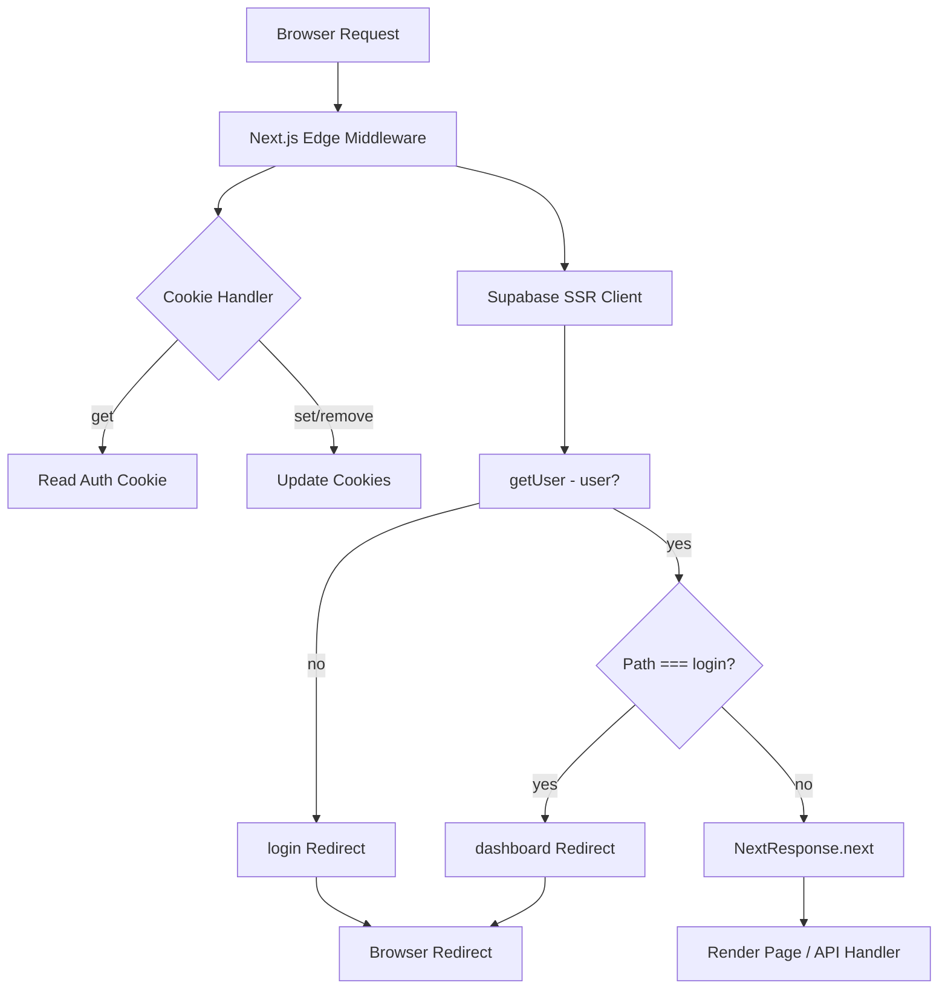

## Architecture & Data Flow (For Contributors) - Authentication Guard / Middleware Proxy

This section explains how NyxVaulta protects its authenticated routes at the edge using a custom middleware proxy. You’ll learn how server-side cookies are bridged into Supabase’s SSR client, how user sessions are validated, and how requests are routed or redirected.

### What It Does

- Acts as an **edge middleware** to guard `/dashboard` and `/login` routes.
- Bridges cookies between incoming requests and outgoing responses for SSR.
- Checks the authenticated user via Supabase’s `getUser()` API.
- Redirects unauthenticated users to **/login** and authenticated users away from **/login** to **/dashboard**.

### Core Implementation

The heart of the mechanism lives in `proxy.ts`, using `@supabase/ssr` and Next.js’s edge API  :

```ts
import { createServerClient, type CookieOptions } from '@supabase/ssr'
import { NextResponse, type NextRequest } from 'next/server'

export async function proxy(request: NextRequest) {
  // Initialize a passthrough response preserving headers
  let response = NextResponse.next({ request: { headers: request.headers } })

  // Create Supabase SSR client with custom cookie handlers
  const supabase = createServerClient(
    process.env.NEXT_PUBLIC_SUPABASE_URL!,
    process.env.NEXT_PUBLIC_SUPABASE_ANON_KEY!,
    {
      cookies: {
        // Read cookie from incoming request
        get(name: string) {
          return request.cookies.get(name)?.value
        },
        // Set cookie on both request context and response
        set(name: string, value: string, options: CookieOptions) {
          request.cookies.set({ name, value, ...options })
          response = NextResponse.next({ request: { headers: request.headers } })
          response.cookies.set({ name, value, ...options })
        },
        // Remove cookie by clearing its value
        remove(name: string, options: CookieOptions) {
          request.cookies.set({ name, value: '', ...options })
          response = NextResponse.next({ request: { headers: request.headers } })
          response.cookies.set({ name, value: '', ...options })
        },
      },
    }
  )

  // Fetch current user session
  const {
    data: { user },
  } = await supabase.auth.getUser()

  // Redirect logic
  if (!user && request.nextUrl.pathname.startsWith('/dashboard')) {
    return NextResponse.redirect(new URL('/login', request.url))
  }
  if (user && request.nextUrl.pathname === '/login') {
    return NextResponse.redirect(new URL('/dashboard', request.url))
  }
  return response
}

// Only apply to dashboard and login routes
export const config = {
  matcher: ['/dashboard/:path*', '/login'],
}
```

### SSR Cookie Bridging

This proxy uses a three-method cookie API to sync SSR sessions.

| Method | Purpose | Context |
| --- | --- | --- |
| **get** | Retrieve cookie by name from request | Incoming request |
| **set** | Store cookie on request & response | Both contexts |
| **remove** | Clear cookie value on request & response | Both contexts |


### User Check & Redirect Rules

1. **Unauthenticated → /login**

If no `user` and path starts with `/dashboard`, redirect to **/login**.

1. **Authenticated → /dashboard**

If `user` exists and path is exactly `/login`, redirect to **/dashboard**.

1. **Otherwise**

Continue with the original request, passing through headers and body.

### Matcher Configuration

The middleware only runs on the specified routes, avoiding unnecessary edge invocations and redirect loops :

```ts
export const config = {
  matcher: ['/dashboard/:path*', '/login'],
}
```

### Request Flow Diagram



### Common Failure Modes & Troubleshooting

| Issue | Symptom | Remedy |
| --- | --- | --- |
| **Infinite Redirect Loop** | `/login` ↔ `/dashboard` ping-pong | Clear cookies; ensure matcher only targets these routes; verify cookie bridging |
| **Missing Session** | Always treated as unauthenticated | Check `NEXT_PUBLIC_SUPABASE_URL/ANON_KEY` env vars; confirm Supabase callback sets cookies |
| **Cookie Not Persisting** | User logs in but loses session on refresh | Verify `set` and `remove` handlers update both `request.cookies` and `response.cookies` |
| **Unexpected Route Invocation** | Middleware runs on other pages | Adjust `matcher` scope to only relevant paths |


> **Tip:** Always test fresh sessions in an incognito window to isolate caching and cookie issues.

---

By following this guide, contributors can understand how the **Authentication Guard** works under the hood, maintain and extend it, and avoid common pitfalls.