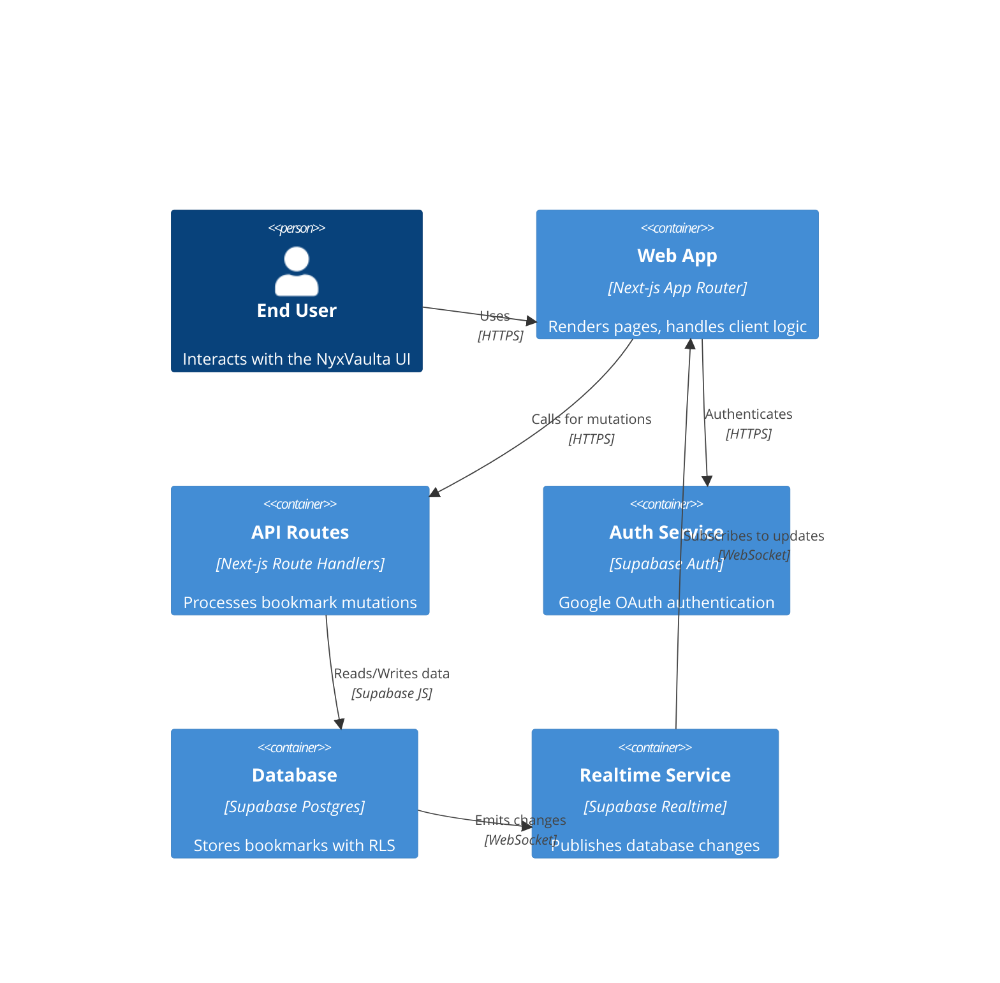

# Architecture & Data Flow (For Contributors)

This section provides a bird’s-eye view of NyxVaulta’s core architecture and how data flows through its layers. You’ll learn why we chose Next.js App Router for UI and route handling, how Supabase powers authentication, storage, and real-time updates, and why all mutations go through server-side route handlers.

## High-Level Architecture

NyxVaulta uses a **containerized** design where the frontend, API layer, and backend services interact over well-defined boundaries.



## Next.js App Router

The **App Router** orchestrates UI pages and server-side logic.

- Each folder under `/app` represents a route.
- Special files (`route.ts`) define serverless API handlers.
- **Middleware** guards authenticated routes at the edge for performance.

## Supabase Integration

NyxVaulta leverages Supabase for authentication, storage, security, and realtime sync.

- **Auth**: Google OAuth via Supabase Auth handles login and secure sessions.
- **Database**: A `bookmarks` table in Postgres stores each user’s data.
- **RLS**: Row-Level Security enforces that `auth.uid() = user_id` .
- **Realtime**: Postgres changes stream over WebSockets for cross-tab updates.

## API Routes for Mutations

Instead of direct client writes, all creates and updates go through **Next.js route handlers**. This enforces session checks and abstracts backend logic.

| Endpoint | Method | Purpose |
| --- | --- | --- |
| `/api/bookmarks` | POST | Create a new bookmark |
| `/api/bookmarks/[id]` | PATCH | Update fields of an existing record |


### POST /api/bookmarks

```api
{
    "title": "Create Bookmark",
    "description": "Adds a new bookmark for the authenticated user",
    "method": "POST",
    "baseUrl": "https://nyxvaulta.vercel.app",
    "endpoint": "/api/bookmarks",
    "headers": [
        {
            "key": "Content-Type",
            "value": "application/json",
            "required": true
        }
    ],
    "queryParams": [],
    "pathParams": [],
    "bodyType": "json",
    "requestBody": "{\n  \"title\": \"Next.js Docs\",\n  \"url\": \"https://nextjs.org\",\n  \"description\": \"Official documentation\",\n  \"tags\": [\"docs\",\"framework\"]\n}",
    "formData": [],
    "rawBody": "",
    "responses": {
        "200": {
            "description": "Bookmark created successfully",
            "body": "{\n  \"id\": \"uuid-1234\",\n  \"user_id\": \"user-uuid\",\n  \"title\": \"Next.js Docs\",\n  \"url\": \"https://nextjs.org\",\n  \"description\": \"Official documentation\",\n  \"tags\": [\"docs\",\"framework\"],\n  \"is_favorite\": false,\n  \"visit_count\": 0,\n  \"created_at\": \"2026-02-13T12:00:00Z\"\n}"
        },
        "400": {
            "description": "Validation error",
            "body": "{\n  \"error\": \"Title and URL are required\"\n}"
        },
        "401": {
            "description": "Unauthorized",
            "body": "{\n  \"error\": \"Unauthorized\"\n}"
        }
    }
}
```

This handler checks the session via `supabase.auth.getUser()`, validates inputs, then inserts into the `bookmarks` table .

### PATCH /api/bookmarks/[id]

```api
{
    "title": "Update Bookmark",
    "description": "Modifies existing bookmark fields",
    "method": "PATCH",
    "baseUrl": "https://nyxvaulta.vercel.app",
    "endpoint": "/api/bookmarks/{id}",
    "headers": [
        {
            "key": "Content-Type",
            "value": "application/json",
            "required": true
        }
    ],
    "queryParams": [],
    "pathParams": [
        {
            "key": "id",
            "value": "Bookmark UUID",
            "required": true
        }
    ],
    "bodyType": "json",
    "requestBody": "{\n  \"title\": \"Updated Title\",\n  \"is_favorite\": true\n}",
    "formData": [],
    "rawBody": "",
    "responses": {
        "200": {
            "description": "Bookmark updated successfully",
            "body": "{\n  \"id\": \"uuid-1234\",\n  \"user_id\": \"user-uuid\",\n  \"title\": \"Updated Title\",\n  \"is_favorite\": true,\n  \"updated_at\": \"2026-02-13T12:10:00Z\"\n}"
        },
        "401": {
            "description": "Unauthorized",
            "body": "{\n  \"error\": \"Unauthorized\"\n}"
        }
    }
}
```

The PATCH route merges provided fields, ensures the bookmark belongs to the user, and returns the updated row .

## Custom Hooks & Realtime Sync

On the client, the `useBookmarks` hook encapsulates fetching, deletion, and realtime updates.

```typescript
import { createClient } from '@/lib/supabaseClient'
import { useEffect, useState } from 'react'
export function useBookmarks() {
  const [bookmarks, setBookmarks] = useState<Bookmark[]>([])
  const supabase = createClient()

  const fetchBookmarks = async () => {
    const { data, error } = await supabase
      .from('bookmarks')
      .select('*')
      .order('created_at', { ascending: false })
    if (data) setBookmarks(data)
  }

  useEffect(() => {
    fetchBookmarks()
    const channel = supabase
      .channel('bookmarks')
      .on('postgres_changes', {
        event: '*',
        schema: 'public',
        table: 'bookmarks'
      }, fetchBookmarks)
      .subscribe()
    return () => supabase.removeChannel(channel)
  }, [])

  const deleteBookmark = async (id: string) => {
    await supabase.from('bookmarks').delete().eq('id', id)
  }

  return { bookmarks, deleteBookmark, refetch: fetchBookmarks }
}
```

- **Initial fetch**: Retrieves all bookmarks ordered by creation date.
- **Realtime**: Subscribes to all table changes and refetches on any event.
- **Cleanup**: Removes the channel on unmount to prevent memory leaks .

## Why Server-Side Mutations?

1. **Security**: Ensures every mutation checks a valid session.
2. **Separation of Concerns**: Keeps database logic on the server.
3. **SSR Compatibility**: Enables safe server-side rendering with `@supabase/ssr`.
4. **Centralized Validation**: Uniform error handling and data sanitization.

---

This high-level overview equips contributors with the understanding of NyxVaulta’s architectural pillars: Next.js for UI and routing, Supabase for Auth, storage, RLS, and realtime, and a clear separation between client logic and server-side mutations.