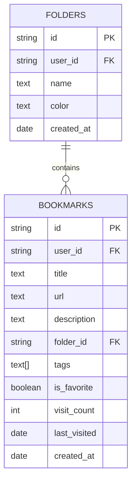

# Data Model & Database Schema – Schema Evolution: Initial Setup vs Enhanced Migration

A clear understanding of how the database schema evolves ensures smooth feature rollouts and maintains data integrity. This section contrasts the **minimum viable schema** established by `supabase-setup.sql` with the **enhanced schema** introduced by `supabase-migration-enhanced.sql`.

## Initial Setup (`supabase-setup.sql`)

The initial setup focuses on core bookmark storage and user-level isolation.

**Key Components:**

- A single **bookmarks** table
- Row Level Security (RLS) policies for user isolation
- Real-time updates on bookmark changes
- Basic indexing for performance

### Bookmarks Table

| Column | Type | Constraints |
| --- | --- | --- |
| **id** | UUID | Primary Key, `DEFAULT uuid_generate_v4()` |
| **user_id** | UUID | Foreign Key → `auth.users(id)`, `NOT NULL`, `ON DELETE CASCADE` |
| **title** | TEXT | `NOT NULL` |
| **url** | TEXT | `NOT NULL` |
| **created_at** | TIMESTAMP WITH TIME ZONE | `DEFAULT NOW()` |


```sql
CREATE TABLE IF NOT EXISTS bookmarks (
  id         UUID PRIMARY KEY DEFAULT uuid_generate_v4(),
  user_id    UUID REFERENCES auth.users(id) ON DELETE CASCADE NOT NULL,
  title      TEXT NOT NULL,
  url        TEXT NOT NULL,
  created_at TIMESTAMP WITH TIME ZONE DEFAULT NOW()
);
ALTER TABLE bookmarks ENABLE ROW LEVEL SECURITY;
```

### RLS Policies

Enforce that users can only interact with their own bookmarks.

```sql
-- View own bookmarks
CREATE POLICY "Users can view own bookmarks"
  ON bookmarks FOR SELECT
  USING (auth.uid() = user_id);

-- Insert own bookmarks
CREATE POLICY "Users can insert own bookmarks"
  ON bookmarks FOR INSERT
  WITH CHECK (auth.uid() = user_id);

-- Delete own bookmarks
CREATE POLICY "Users can delete own bookmarks"
  ON bookmarks FOR DELETE
  USING (auth.uid() = user_id);
```

### Real-time & Indexing

```sql
-- Enable realtime for bookmarks
ALTER PUBLICATION supabase_realtime ADD TABLE bookmarks;

-- Basic index for user lookup
CREATE INDEX IF NOT EXISTS bookmarks_user_id_idx
  ON bookmarks(user_id);
```

> **Why index **`**user_id**`**?** To speed up queries fetching a user’s bookmarks on dashboard load.

---

## Enhanced Migration (`supabase-migration-enhanced.sql`)

As features grow, the schema evolves to support tags, folders, favorites, analytics, and more.

**Enhancements Introduced:**

- **Rich metadata** for bookmarks
- **Folders** for organization
- **New indexes** tailored to search and filters
- **Edit** capability via UPDATE policy
- **Real-time** support for folders

### Expanded Bookmarks Table

New columns to support advanced features and future growth:

| Column | Type | Default / Notes |
| --- | --- | --- |
| **description** | TEXT | — |
| **folder_id** | UUID | Links to `folders.id` |
| **tags** | TEXT[] | Array of tags |
| **favicon_url** | TEXT | — |
| **visit_count** | INTEGER | `DEFAULT 0` |
| **last_visited** | TIMESTAMP WITH TIME ZONE | — |
| **is_favorite** | BOOLEAN | `DEFAULT false` |


```sql
ALTER TABLE bookmarks
  ADD COLUMN IF NOT EXISTS description TEXT,
  ADD COLUMN IF NOT EXISTS folder_id UUID,
  ADD COLUMN IF NOT EXISTS tags TEXT[],
  ADD COLUMN IF NOT EXISTS favicon_url TEXT,
  ADD COLUMN IF NOT EXISTS visit_count INTEGER DEFAULT 0,
  ADD COLUMN IF NOT EXISTS last_visited TIMESTAMP WITH TIME ZONE,
  ADD COLUMN IF NOT EXISTS is_favorite BOOLEAN DEFAULT false;
```

### Folders Table

> **Future-ready columns** like `favicon_url` and `visit_count` pave the way for analytics and richer UI.

A new entity to group bookmarks logically.

```sql
CREATE TABLE IF NOT EXISTS folders (
  id         UUID PRIMARY KEY DEFAULT uuid_generate_v4(),
  user_id    UUID REFERENCES auth.users(id) ON DELETE CASCADE NOT NULL,
  name       TEXT NOT NULL,
  color      TEXT DEFAULT '#3B82F6',
  created_at TIMESTAMP WITH TIME ZONE DEFAULT NOW()
);
ALTER TABLE folders ENABLE ROW LEVEL SECURITY;
```

#### Folders RLS Policies

```sql
CREATE POLICY "Users can view own folders"
  ON folders FOR SELECT
  USING (auth.uid() = user_id);

CREATE POLICY "Users can insert own folders"
  ON folders FOR INSERT
  WITH CHECK (auth.uid() = user_id);

CREATE POLICY "Users can update own folders"
  ON folders FOR UPDATE
  USING (auth.uid() = user_id);

CREATE POLICY "Users can delete own folders"
  ON folders FOR DELETE
  USING (auth.uid() = user_id);
```

### Bookmark UPDATE Policy

Enable in-place editing of bookmarks:

```sql
DROP POLICY IF EXISTS "Users can update own bookmarks" ON bookmarks;
CREATE POLICY "Users can update own bookmarks"
  ON bookmarks FOR UPDATE
  USING (auth.uid() = user_id);
```

### Real-time & Indexing

```sql
-- Realtime support for folders
ALTER PUBLICATION supabase_realtime ADD TABLE folders;

-- Indexes for enhanced queries
CREATE INDEX IF NOT EXISTS bookmarks_folder_id_idx
  ON bookmarks(folder_id);
CREATE INDEX IF NOT EXISTS bookmarks_tags_idx
  ON bookmarks USING GIN(tags);
CREATE INDEX IF NOT EXISTS bookmarks_is_favorite_idx
  ON bookmarks(is_favorite);
CREATE INDEX IF NOT EXISTS folders_user_id_idx
  ON folders(user_id);
```

**Index Rationale:**

- **GIN(tags):** Accelerates searches on tag arrays.
- **is_favorite:** Optimizes “favorites only” filters.
- **folder_id:** Speeds up folder-based groupings.
- **folders_user_id_idx:** Ensures fast retrieval of a user’s folders.

---

## Schema Relationship Diagram



This evolution—from a **minimal bookmarks table** to a **feature-rich schema**—lays the groundwork for NyxVaulta’s advanced organization, search, analytics, and real-time capabilities.