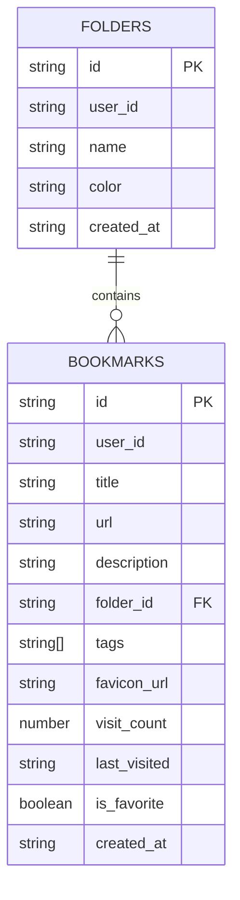

# Data Model & Database Schema – TypeScript Types and Supabase Table Typing

This section details how NyxVaulta defines its core data models in TypeScript and maps them to Supabase tables. We’ll explore the `Bookmark`, `Folder`, and `Database` interfaces, plus the specialized `Insert` and `Update` typings that ensure type-safe CRUD operations across clients and API routes.

## 📑 TypeScript Interfaces for Core Models

Each database table has a corresponding TypeScript interface. These definitions mirror the SQL schema and enforce strict types throughout the app.

### Bookmark Interface

Defines the shape of a user’s bookmark record.

| Field | Type | Description |
| --- | --- | --- |
| **id** | `string` | Primary key; UUID |
| **user_id** | `string` | References `auth.users(id)` |
| **title** | `string` | Bookmark title |
| **url** | `string` | Destination URL |
| **description** | `string?` | Optional details |
| **folder_id** | `string?` | Optional FK to a folder |
| **tags** | `string[]?` | Optional list of tags |
| **favicon_url** | `string?` | Optional icon URL |
| **visit_count** | `number` | Times visited |
| **last_visited** | `string?` | ISO timestamp of last visit |
| **is_favorite** | `boolean` | Marked as favorite |
| **created_at** | `string` | ISO timestamp of creation |


```ts
export interface Bookmark {
  id: string
  user_id: string
  title: string
  url: string
  description?: string
  folder_id?: string
  tags?: string[]
  favicon_url?: string
  visit_count: number
  last_visited?: string
  is_favorite: boolean
  created_at: string
}
```

### Folder Interface

Represents a user-defined container for bookmarks.

| Field | Type | Description |
| --- | --- | --- |
| **id** | `string` | Primary key; UUID |
| **user_id** | `string` | References `auth.users(id)` |
| **name** | `string` | Folder name |
| **color** | `string` | UI accent color |
| **created_at** | `string` | ISO timestamp of creation |


```ts
export interface Folder {
  id: string
  user_id: string
  name: string
  color: string
  created_at: string
}
```

## 🗄️ Supabase Database Interface

The `Database` interface ties TypeScript types to Supabase’s table definitions, enabling fully typed queries.

```ts
export interface Database {
  public: {
    Tables: {
      bookmarks: {
        Row: Bookmark
        Insert: Omit<Bookmark, 'id' | 'created_at' | 'visit_count'>
        Update: Partial<Omit<Bookmark, 'id' | 'user_id' | 'created_at'>>
      }
      folders: {
        Row: Folder
        Insert: Omit<Folder, 'id' | 'created_at'>
        Update: Partial<Omit<Folder, 'id' | 'user_id' | 'created_at'>>
      }
    }
  }
}
```

### ✏️ Insert and Update Typings

- **Insert**: Omits fields managed by the database (`id`, `created_at`, `visit_count`).
- **Update**: Makes all updatable fields optional and prevents changes to immutable keys (`id`, `user_id`, `created_at`).

This pattern leverages TypeScript’s `Omit` and `Partial` utilities to guard against invalid payloads in both frontend components and API routes.

## 🔌 Type-Safe Supabase Clients

To propagate our `Database` types into Supabase’s client, we wrap the vanilla `createBrowserClient` and `createServerClient` functions with generics.

### Browser Client

Used in React hooks and client-side code:

```ts
import { createBrowserClient } from '@supabase/ssr'
import { Database } from './types'

export const createClient = () =>
  createBrowserClient<Database>(
    process.env.NEXT_PUBLIC_SUPABASE_URL!,
    process.env.NEXT_PUBLIC_SUPABASE_ANON_KEY!
  )
```

### Server Client

Used in Next.js API routes and middleware, with cookie forwarding:

```ts
import { createServerClient, type CookieOptions } from '@supabase/ssr'
import { cookies } from 'next/headers'
import { Database } from './types'

export const createClient = async () => {
  const cookieStore = await cookies()
  return createServerClient<Database>(
    process.env.NEXT_PUBLIC_SUPABASE_URL!,
    process.env.NEXT_PUBLIC_SUPABASE_ANON_KEY!,
    {
      cookies: {
        getAll() {
          return cookieStore.getAll()
        },
        setAll(cookiesToSet) {
          cookiesToSet.forEach(({ name, value, options }) =>
            cookieStore.set(name, value, options)
          )
        },
      },
    }
  )
}
```

## 📈 Entity Relationship Diagram

Visualizing the relationship between **bookmarks** and **folders** helps clarify foreign-key links.



## 🎯 Benefits & Developer Experience

- **Compile-Time Safety**: Invalid fields in inserts/updates surface as errors before runtime.
- **Autocompletion**: Editors can suggest column names and types.
- **Single Source of Truth**: Synchronizes SQL schema with client and server code.

```card
{
    "title": "Type-Safety Benefits",
    "content": "Compile-time validation of queries prevents runtime errors and enhances developer productivity across components and API routes."
}
```