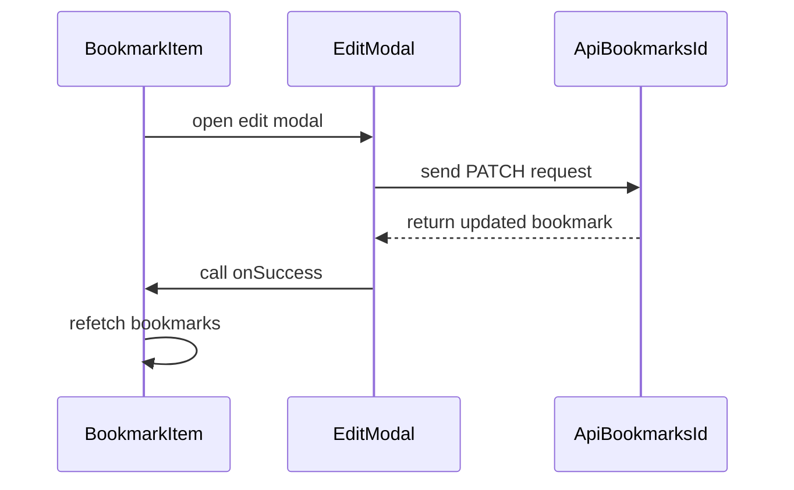

# Frontend Implementation (UI Modules) – Bookmark Rendering, Editing, and Micro-interactions

This section dives into the **UI modules** responsible for presenting, editing, and interacting with bookmarks in NyxVaulta. We cover:

- How the list adapts during loading and when empty
- Individual bookmark controls (edit, delete, copy, favorite)
- The edit modal’s UX, form fields, buttons, and API integration

## BookmarkList Component 🗂️

The `BookmarkList` component orchestrates three states: **loading**, **empty**, and **populated**. It leverages Framer Motion for smooth entrance animations and Tailwind CSS for layout.

```tsx
// components/BookmarkList.tsx
export default function BookmarkList({
  bookmarks,
  loading,
  onDelete,
  onUpdate
}: Props) {
  if (loading) {
    return (
      <div className="space-y-4">
        {[1,2,3].map(i => (
          <div key={i} className="card animate-pulse">
            <div className="h-6 bg-white/10 rounded w-3/4 mb-3"></div>
            <div className="h-4 bg-white/10 rounded w-1/2"></div>
          </div>
        ))}
      </div>
    )
  }

  if (bookmarks.length === 0) {
    return (
      <motion.div
        initial={{ opacity: 0, scale: 0.95 }}
        animate={{ opacity: 1, scale: 1 }}
        className="card text-center py-16"
      >
        <svg className="w-24 h-24 mx-auto mb-6 text-gray-600" …/>
        <p className="text-gray-400 text-lg mb-2">No bookmarks yet</p>
        <p className="text-gray-500 text-sm">
          Add your first bookmark above to get started
        </p>
      </motion.div>
    )
  }

  return (
    <motion.div initial={{ opacity: 0 }} animate={{ opacity: 1 }} className="space-y-4">
      {bookmarks.map((bookmark, idx) => (
        <motion.div
          key={bookmark.id}
          initial={{ opacity: 0, y: 20 }}
          animate={{ opacity: 1, y: 0 }}
          transition={{ delay: idx * 0.1 }}
        >
          <BookmarkItem
            bookmark={bookmark}
            onDelete={onDelete}
            onUpdate={onUpdate}
          />
        </motion.div>
      ))}
    </motion.div>
  )
}
```

- **Loading State**: Displays three pulsing “skeleton” cards using `animate-pulse` to indicate data fetching.
- **Empty State**: Fades and scales in a centered card with an icon and prompt text .
- **Data State**: Staggers each bookmark’s entry by index, providing a cascading animation for a polished UX .

---

## BookmarkItem Component 🔖

Each `BookmarkItem` encapsulates display, micro-interactions, and controls for a single bookmark.

### State Hooks & Utility Functions

```ts
const [isEditOpen, setIsEditOpen] = useState(false)
const [showCopied, setShowCopied] = useState(false)
const [togglingFav, setTogglingFav] = useState(false)

const copyUrl = () => {
  navigator.clipboard.writeText(bookmark.url)
  setShowCopied(true)
  setTimeout(() => setShowCopied(false), 2000)
}

const toggleFavorite = async () => {
  try {
    setTogglingFav(true)
    const res = await fetch(`/api/bookmarks/${bookmark.id}`, {
      method: 'PATCH',
      headers: { 'Content-Type': 'application/json' },
      body: JSON.stringify({ is_favorite: !bookmark.is_favorite })
    })
    const data = await res.json()
    if (!res.ok) throw new Error(data.error)
    toast.success(bookmark.is_favorite ? 'Removed from favorites' : 'Added to favorites')
    onUpdate()
  } catch (e) {
    toast.error(e.message)
  } finally {
    setTogglingFav(false)
  }
}
```

- **isEditOpen**: Toggles the edit modal visibility.
- **showCopied**: Flags copy-to-clipboard feedback.
- **togglingFav**: Disables favorite toggle during API calls.
- **copyUrl()**: Writes URL to clipboard and shows feedback badge.
- **toggleFavorite()**: Sends a `PATCH` request, updates UI on success, and handles loading/toasts .

### Interactive Controls

| Control | Icon Color | Behavior |
| --- | --- | --- |
| ✏️ **Edit** | `text-gray-400 → hover:text-purple-300` | Opens the `EditModal` (`setIsEditOpen(true)`) with `whileHover` and `whileTap` effects. |
| 🗑️ **Delete** | `text-red-400 → hover:text-red-300` | Calls `onDelete(bookmark.id)`, with hover/tap scaling. |
| 📋 **Copy** | (Clipboard icon) | Invokes `copyUrl()`, shows “Copied!” badge for 2 seconds. |
| ⭐ **Favorite** | (Star icon) | Toggles `is_favorite` via API; button disabled during toggle. |


```tsx
<motion.button
  whileHover={{ scale: 1.1 }}
  whileTap={{ scale: 0.9 }}
  onClick={() => setIsEditOpen(true)}
  className="text-gray-400 hover:text-purple-300 px-2 py-1 rounded-lg glass hover:bg-purple-500/10 transition-all"
  title="Edit"
>
  <svg …>…</svg>
</motion.button>
<motion.button
  whileHover={{ scale: 1.1 }}
  whileTap={{ scale: 0.9 }}
  onClick={() => onDelete(bookmark.id)}
  className="text-red-400 hover:text-red-300 px-2 py-1 rounded-lg glass hover:bg-red-500/10 transition-all"
  title="Delete"
>
  <svg …>…</svg>
</motion.button>
```

All buttons use `whileHover`/`whileTap` for tactile feedback and Tailwind “glass” style .

---

## EditModal Component ✍️

The `EditModal` provides an overlay form to update a bookmark’s title, URL, and description.

```tsx
// components/EditModal.tsx
export default function EditModal({
  bookmark,
  isOpen,
  onClose,
  onSuccess
}: Props) {
  const [title, setTitle] = useState(bookmark.title)
  const [url, setUrl] = useState(bookmark.url)
  const [description, setDescription] = useState(bookmark.description || '')
  const [loading, setLoading] = useState(false)

  const handleSubmit = async (e: React.FormEvent) => {
    e.preventDefault()
    try {
      setLoading(true)
      const res = await fetch(`/api/bookmarks/${bookmark.id}`, {
        method: 'PATCH',
        headers: { 'Content-Type': 'application/json' },
        body: JSON.stringify({ title, url, description })
      })
      if (!res.ok) throw new Error('Failed to update')
      toast.success('Bookmark updated')
      onSuccess()
      onClose()
    } catch (e) {
      toast.error(e.message)
    } finally {
      setLoading(false)
    }
  }

  return (
    <AnimatePresence>
      {isOpen && (
        <>
          <motion.div
            initial={{ opacity: 0 }}
            animate={{ opacity: 1 }}
            exit={{ opacity: 0 }}
            onClick={onClose}
            className="fixed inset-0 bg-black/60 backdrop-blur-sm z-50"
          />
          <div className="fixed inset-0 flex items-center justify-center z-50 p-4">
            <motion.div
              initial={{ opacity: 0, scale: 0.95 }}
              animate={{ opacity: 1, scale: 1 }}
              exit={{ opacity: 0, scale: 0.95 }}
              className="card max-w-lg w-full"
            >
              <h2 className="text-2xl font-bold bg-gradient-to-r from-blue-400 to-purple-400 bg-clip-text text-transparent mb-6">
                Edit Bookmark
              </h2>
              <form onSubmit={handleSubmit} className="space-y-4">
                <input
                  type="text"
                  placeholder="Title"
                  value={title}
                  onChange={e => setTitle(e.target.value)}
                  className="input"
                  required
                />
                <input
                  type="url"
                  placeholder="URL"
                  value={url}
                  onChange={e => setUrl(e.target.value)}
                  className="input"
                  required
                />
                <textarea
                  placeholder="Description (optional)"
                  value={description}
                  onChange={e => setDescription(e.target.value)}
                  className="input min-h-[100px]"
                  rows={3}
                />
                <div className="flex gap-3">
                  <button
                    type="submit"
                    disabled={loading}
                    className="btn-primary flex-1"
                  >
                    {loading ? 'Saving...' : 'Save Changes'}
                  </button>
                  <button
                    type="button"
                    onClick={onClose}
                    className="btn-secondary"
                  >
                    Cancel
                  </button>
                </div>
              </form>
            </motion.div>
          </div>
        </>
      )}
    </AnimatePresence>
  )
}
```

- **Modal Backdrop**: Click outside to close.
- **Entrance/Exit**: Scales and fades via `initial`/`animate`/`exit`.
- **Form Fields**: Controlled inputs for `title`, `url`, `description`.
- **Action Buttons**: Primary “Save Changes” with loading state; secondary “Cancel” .

---

## Interaction Flow



This diagram illustrates the **edit** interaction: from opening the modal to the API call and final UI update.

---

**Key Takeaways:**

- The UI modules leverage **Framer Motion** for entrance and micro-interactions.
- **Tailwind CSS** ensures consistent styling and responsive design.
- Each component integrates tightly with the **API** routes (`/api/bookmarks`) for CRUD operations.
- Thoughtful loading, empty, and feedback states elevate the user experience.