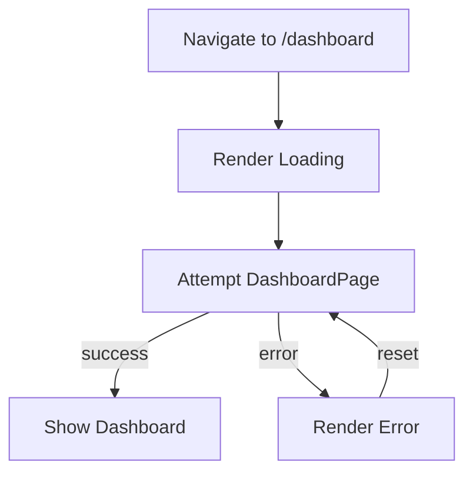

# Frontend Implementation (UI Modules) – Loading and Error States

The **Loading** and **Error** modules under the `app/dashboard` route provide a consistent, route-level user experience during data fetches and runtime failures. These “segment boundaries” plug into Next.js App Router, ensuring that as users navigate to or interact with the dashboard, they see meaningful feedback rather than blank screens or uncaught exceptions.

---

## File Summary

| File | Purpose |
| --- | --- |
| **app/dashboard/loading.tsx** | Displays a centered spinner while the dashboard segment loads |
| **app/dashboard/error.tsx** | Catches render errors under `/dashboard`, shows message and retry button |


---

## Loading State

When a user navigates to or lazily loads the dashboard segment, Next.js will render this component until the segment is ready.

```tsx
// app/dashboard/loading.tsx
export default function Loading() {
  return (
    <div className="min-h-screen flex items-center justify-center">
      <div className="animate-spin rounded-full h-12 w-12 border-b-2 border-blue-600"></div>
    </div>
  )
}
```

- **Purpose**
- Provide immediate feedback during server-side rendering or client-side navigation.
- Prevent layout shifts by filling the full viewport.

- **What to include**
- A simple spinner or skeleton that roughly matches the eventual layout.
- Tailwind utility classes for centering and animation.

- **Extending**
- Replace with **skeleton cards** mimicking the dashboard’s stats grid.
- Wrap complex UI areas in inner `<Suspense>` boundaries with custom loaders.

```card
{
    "title": "Tip: Skeleton UX",
    "content": "Use skeleton rectangles matching card sizes to reduce perceived load time."
}
```

---

## Error Boundary

If any error is thrown during rendering or data fetching in the `/dashboard` segment, Next.js will render this fallback.

```tsx
// app/dashboard/error.tsx
'use client'
export default function Error({
  error,
  reset,
}: {
  error: Error & { digest?: string }
  reset: () => void
}) {
  return (
    <div className="min-h-screen flex items-center justify-center">
      <div className="card max-w-md text-center space-y-4">
        <h2 className="text-2xl font-bold text-red-600">Something went wrong!</h2>
        <p className="text-gray-600">{error.message}</p>
        <button onClick={reset} className="btn-primary">
          Try again
        </button>
      </div>
    </div>
  )
}
```

- **Purpose**
- Surface render or fetch errors at this route level.
- Give users context (`error.message`) and recovery via `reset()`.

- **What to include**
- A clear headline, concise error description, and a retry button.
- Minimal UI flair to keep focus on recovery.

- **Patterns for Recoverable UI**
- `**reset()**`: Calls the nearest boundary to re-render the segment.
- **Granular Boundaries**: If only part of the dashboard can fail (e.g., analytics widget), wrap that widget in its own error boundary.
- **Logging**: Integrate with Sentry or LogRocket inside the `Error` component to capture exceptions.

```card
{
    "title": "Best Practice",
    "content": "Keep error boundaries close to components that can fail, not only at the top level."
}
```

---

## State Flow Diagram



---

## Extending & Maintaining

- **Consistency Across Routes**
- Follow the same structure (`loading.tsx` + `error.tsx`) for other app segments (e.g., `app/bookmarks`).

- **Theming & Styling**
- Extract spinner or error card into shared components to unify look and feel.

- **Testing**
- Write tests to simulate slow network (`cy.intercept`) and error throws to validate fallback UIs.

- **Documentation**
- Update this section whenever the dashboard layout changes (e.g., new charts require skeletons).

By leveraging these route-level boundaries, NyxVaulta ensures that users always have visual feedback during loading and clear paths to recover from errors, resulting in a polished, resilient dashboard experience.